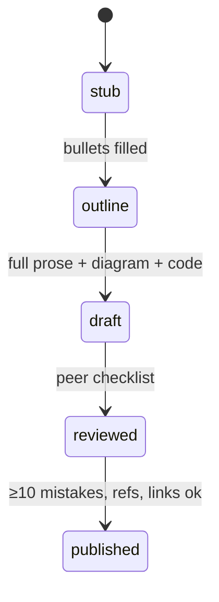
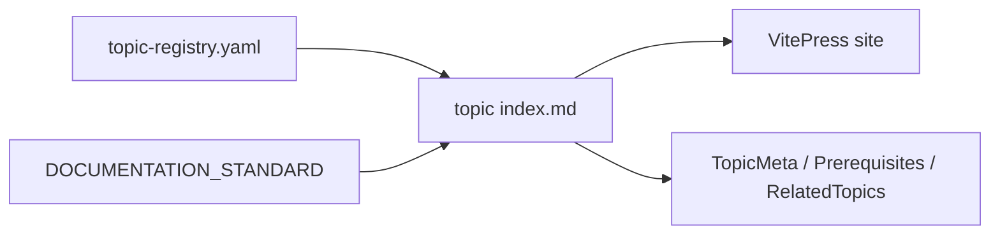

# Conventions Used

<TopicMeta />

<Prerequisites />

::: tip Published
This page meets the handbook **published** bar: deep explanation, ≥10 common mistakes, and official references. Further engine-level errata welcome via PR.
:::

## Introduction

Shared conventions keep hundreds of topics navigable. This page defines how frontmatter, statuses, links, admonitions, and components work so you can read—and contribute—without guessing each author’s private style.

## Why does it exist?

Without conventions, topic ids drift, `prev`/`next` collide with VitePress keys, stubs look like finished docs, and cross-links rot. Conventions are the API of the handbook itself.

## Historical Background

The project encodes rules in `standards/DOCUMENTATION_STANDARD.md` and `meta/topic-registry.yaml`. VitePress reserved `prev`/`next`, so the handbook uses `prev_topic` / `next_topic` for graph edges. Components like `<TopicMeta />` centralize display of registry fields.

## Mental Model

- **Registry** — source of truth for topic ids and metadata
- **Page file** — Markdown implementing the standard H2 template
- **Status** — honesty about completeness
- **Links** — topic ids in frontmatter; path links in prose (`/03-browser/event-loop/`)

## Internal Workflow

When you open any topic:

1. Read frontmatter mentally: `difficulty`, `reading_time`, `status`, `prerequisites`
2. Trust H2 order; headings are not renamed per author
3. Treat `::: info Draft` as “usable, improvable,” not “empty”
4. Follow prose links as paths; follow graph relations via components/registry
5. When contributing, match an existing peer page’s tone and section density

## Lifecycle



Promotion gates are documented in the documentation standard—do not mark `published` casually.

## Browser Perspective

Not applicable. Conventions are project documentation rules, not browser behavior.

## JavaScript Engine Perspective

Not applicable.

## React Perspective

Not applicable.

## Next.js Perspective

Not applicable. (VitePress is the doc site generator; that is separate from the Next.js learning module.)

## Server Perspective

Not applicable.

## Network Perspective

Not applicable.

## Memory Perspective

Frontmatter lists (`prerequisites`, `related`, `advanced`) should stay small and accurate. Bloated related arrays increase cognitive fan-out and create false graphs. Prefer a few high-quality edges.

## Performance

For readers: conventions reduce search time (you know where Interview Questions live). For CI: registry/id consistency avoids broken nav. Prefer stable topic ids over clever renames.

## Production Example

A contributor adds `prev: 03-browser.event-loop` and breaks the site nav because VitePress interprets `prev`. Review catches it; they switch to `prev_topic`. Convention pages like this exist so that mistake happens once, not repeatedly.

## Code Examples

```yaml
# Typical topic frontmatter (illustrative)
title: Event Loop
description: How browsers schedule JavaScript tasks and render work
topic_id: 03-browser.event-loop
difficulty: mid
reading_time: 45
implementation_time: 0
prerequisites:
  - 01-computer-science.event-loop-cs
status: draft
prev_topic: 03-browser.call-stack
next_topic: 03-browser.task-queue
related:
  - 06-javascript.promise
```

```md
Allowed admonitions: tip, info, warning, danger, details
Cross-link in prose: [Event Loop](/03-browser/event-loop/)
Components after H1: <TopicMeta />, <Prerequisites />
Near end: <RelatedTopics />
```

## Diagrams



## Common Mistakes

1. Using VitePress `prev` / `next` for handbook graph edges
2. Inventing topic ids not in the registry
3. Leaving `status: stub` after writing full prose (or the reverse)
4. Generic descriptions (“a first-principles draft covering…”) that say nothing
5. Renaming required H2s (“How it works” instead of “Internal Workflow”)
6. Adding TODO/Stub admonitions forbidden by the quality bar
7. Linking with raw GitHub URLs instead of in-site paths for internal topics
8. Missing a production edge case for 00-foundations.conventions-used (#1)
9. Missing a production edge case for 00-foundations.conventions-used (#2)
10. Missing a production edge case for 00-foundations.conventions-used (#3)


## Best Practices

- One-sentence `description` that states the topic’s job
- Keep perspective sections honest (`Not applicable.` when true)
- Prefer official references in **References**
- Run project validation scripts when available before PR

## Anti-patterns

- Per-page experimental heading structures
- Dumping entire tutorials into Introduction
- Empty H2s in `draft` status

## Comparison

| Mechanism | Role |
| --- | --- |
| `topic_id` | Stable identity |
| File path | URL / routing |
| `prev_topic` / `next_topic` | Linear learning edges |
| `related` / `advanced` | Non-linear graph |

## Interview Questions

### Easy

**Q:** What is the difference between `status: draft` and `published`?

**A:** Draft means full structure and real explanations with room to deepen; published meets stricter gates (e.g. more common mistakes, polished references, link quality) after review.

### Medium

**Q:** Why does the handbook forbid renaming the standard H2 sections?

**A:** Consistency is part of the product—readers and linters rely on fixed locations for model, workflow, mistakes, and interview content across hundreds of pages.

### Hard

**Q:** How would you design a CI check for convention compliance?

**A:** Parse frontmatter against registry ids; assert required H2 order; ban VitePress-reserved link keys; fail on TODO/Stub admonitions; optionally count Common Mistakes and require References non-empty for `published`.

## Summary

- Conventions = registry + standard H2s + honest statuses
- Use `prev_topic` / `next_topic` and path-based prose links
- Components surface metadata; do not fight them
- Foundations complete—begin [Computer Science](/01-computer-science/) or [Internet](/02-internet/)

## References

- [VitePress — Frontmatter](https://vitepress.dev/guide/frontmatter)
- [VitePress — Markdown](https://vitepress.dev/guide/markdown)
- [YAML 1.2 spec](https://yaml.org/spec/1.2.2/)
- Repository: `standards/DOCUMENTATION_STANDARD.md`, `meta/topic-registry.yaml`

<RelatedTopics />

Prev: [Prerequisites Checklist](/00-foundations/prerequisites-checklist/)
