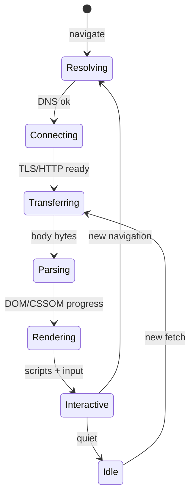
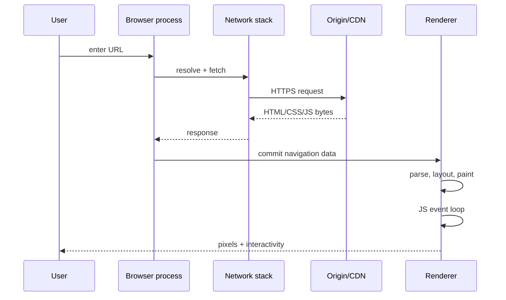

# How the Web Works Map

<TopicMeta />

<Prerequisites />

::: tip Published
This page meets the handbook **published** bar: deep explanation, ≥10 common mistakes, and official references. Further engine-level errata welcome via PR.
:::

## Introduction

When you type a URL or click a link, dozens of systems cooperate before you see UI. This page is a **single mental map** of that pipeline so later modules ([DNS](/02-internet/dns/), [HTTP](/02-internet/http/), [Critical Rendering Path](/03-browser/critical-rendering-path/), [Event Loop](/03-browser/event-loop/)) attach to a place you already know.

You are not expected to memorize every protocol detail here—only the order of stages and what each stage can break.

## Why does it exist?

Without a map, learners treat symptoms as root causes: “React is slow” when the main thread is blocked by parsing; “API is down” when DNS failed; “hydration mismatch” when SSR HTML and client JS disagree. The map exists to force **localization**: name the stage before you reach for a framework fix.

## Historical Background

The web began as document fetch + layout (HTTP/0.9–1.0, simple HTML). Scripts, CSS, XHR/fetch, SPAs, HTTP/2/3, and multi-process browsers layered on without replacing the core: resolve a name, open a connection, exchange bytes, turn bytes into a document and pixels, run event-driven script. Modern frameworks sit on that same spine.

## Mental Model

Five coarse stages:

1. **Resolve & connect** — DNS, IP, TCP or QUIC, TLS
2. **Request & response** — HTTP semantics, caching, redirects
3. **Browser assemble** — navigation in browser/network service; bytes to renderer
4. **Parse & render** — HTML/CSS → DOM/CSSOM → render tree → layout → paint → composite
5. **Run & interact** — JS on the call stack; tasks/microtasks; input and animation frames

Frameworks change *where* HTML/JS are generated (SSR, RSC), not the fact that a browser still parses, renders, and schedules.

## Internal Workflow

Concrete navigation (simplified Chromium-shaped story):

1. User commits a URL → browser process handles UI and starts navigation
2. DNS lookup (unless cached) → connect (TCP+TLS or QUIC) → HTTP request
3. Response headers/body stream in; service workers/cache may intercept
4. Renderer receives data; HTML parser builds DOM, may preload scanner fetch subresources
5. CSS → CSSOM; combined render tree; style/layout/paint/composite
6. Scripts run according to `async`/`defer`/module rules; event loop drives later work
7. Load events fire; further fetch/XHR/WS keep the page alive

## Lifecycle



## Browser Perspective

Browsers split work across processes (browser, network, GPU, multiple renderers) for security and stability—see [Multi-Process Model](/03-browser/multi-process-model/). Your page’s JS usually runs in a renderer process on the **main thread**, sharing it with style, layout, and paint. That is why a long script delays clicks and frames.

## JavaScript Engine Perspective

Engines (V8, SpiderMonkey, JavaScriptCore) parse/compile/execute script once the browser delivers source. They do not perform DNS or layout. They expose the event loop *host* hooks the browser fills with timers, I/O callbacks, and rendering opportunities. Details: [JavaScript Engine](/03-browser/javascript-engine/), [Event Loop (CS)](/01-computer-science/event-loop-cs/).

## React Perspective

React runs *inside* stage 5: it schedules updates and commits DOM/host mutations. SSR/RSC move some work to stage 2’s response body (HTML/Flight payload), but the browser still hydrates and runs client JS on the event loop. React never replaces DNS or layout.

## Next.js Perspective

Next.js chooses how the HTTP response is produced (static files, server render, streaming). The map still applies: CDN/cache may satisfy stage 2; streaming changes when HTML chunks arrive in stage 4; hydration is still stage 5.

## Server Perspective

Origin servers, edge workers, and CDNs implement stage 2’s other side. TTFB, cache HIT/MISS, and compression alter when stage 4 starts—not whether it exists.

## Network Perspective

Latency compounds: DNS + connect + TLS + request/response RTTs. HTTP/2/3 multiplex streams on one connection; caches and CDNs remove RTTs entirely on hits. Frontend “performance work” often starts here before micro-optimizing JS.

## Memory Perspective

Each stage retains data: DNS cache, socket buffers, HTTP disk/memory cache, DOM/CSSOM, JS heap, GPU textures. Leaks and bloat usually appear in renderer memory (detached DOM, unbounded caches), but huge responses also pressure network and parser buffers.

## Performance

Map user-visible metrics to stages:

| Metric | Dominant stages |
| --- | --- |
| TTFB | Resolve/connect/transfer (server) |
| FCP/LCP | Transfer + parse/render (+ images) |
| INP/TBT | Interactive (main thread) |
| CLS | Rendering (layout shifts) |

Optimize the stage the metric blames; do not minify JS to fix DNS.

## Production Example

A marketing site’s LCP is poor. The team assumes React bundle size. A waterfall shows 400ms DNS+TLS to a third-party image host and a blocking font CSS. Fixes: preconnect, self-host critical font, CDN image—LCP drops before any React refactor. The map prevented a wrong rewrite.

## Code Examples

```bash
# Trace connect + TLS + TTFB (rough)
curl -s -o /dev/null -w "dns:%{time_namelookup} connect:%{time_connect} tls:%{time_appconnect} ttfb:%{time_starttransfer} total:%{time_total}\n" https://example.com/
```

```text
Pseudocode — navigation stages

function navigate(url):
  ip = dnsLookup(url.host)            // stage 1
  conn = connectAndTLS(ip)            // stage 1
  res = httpExchange(conn, request)   // stage 2
  document = parseHTML(res.body)      // stage 4
  render(document)                    // stage 4
  runScriptsAndEventLoop(document)    // stage 5
```

## Diagrams




## Common Mistakes

1. Blaming the framework before reading the network waterfall
2. Confusing TTFB (server/network) with hydration cost (main thread)
3. Ignoring DNS/TLS because “the API is fast in Postman on office Wi‑Fi”
4. Thinking SPAs skip HTTP—first load and data fetches still use the map
5. Forgetting service workers can sit between stages 2 and 4
6. Assuming one connection failure mode (timeout) covers DNS, TLS, and 5xx
7. Measuring only localhost and declaring production “fine”
8. Missing a production edge case for 00-foundations.how-the-web-works-map (#1)
9. Missing a production edge case for 00-foundations.how-the-web-works-map (#2)
10. Missing a production edge case for 00-foundations.how-the-web-works-map (#3)


## Best Practices

- Draw the five stages when debugging any load or interaction issue
- Keep one canonical waterfall screenshot per incident
- Learn preload/preconnect as map tools, not magic attributes
- Cross-link deep modules instead of turning this page into a full protocol book

## Anti-patterns

- “Optimize everything” across all stages at once
- Cargo-culting `defer`/`async` without knowing parser blocking
- Treating the map as optional once you know React Router

## Comparison

| Mental model | Useful for | Misses |
| --- | --- | --- |
| This five-stage map | Debugging load & jank | Detailed GC / CPU microarch |
| OSI 7-layer only | Academic networking | Browser rendering & JS |
| “Just React tree” | Component design | Network and pixels |

## Interview Questions

### Easy

**Q:** List the main steps from entering a URL to seeing a page.

**A:** DNS → connect/TLS → HTTP response → parse HTML/CSS → render (layout/paint) → run JS and handle events on the event loop.

### Medium

**Q:** Why can a fast API still yield a slow LCP?

**A:** LCP depends on when the largest contentful element paints—HTML delay, render-blocking CSS, font strategy, image discovery/priority, and main-thread contention can dominate even if JSON APIs are quick.

### Hard

**Q:** Where would you instrument a streaming SSR app to distinguish server generation delay from client hydration delay?

**A:** Server: TTFB and time-to-first-byte-chunk / flight stream metrics. Client: PerformanceNavigatorTiming, LCP, hydration markers, long tasks during hydrate. Compare CDN HIT vs origin. Attribute by stage before changing React code.

## Summary

- One map: resolve → transfer → parse/render → interact
- Later modules deepen each box; this page keeps order and blame boundaries
- Frameworks relocate work; they do not delete networking or rendering
- Next: [How to Read This Handbook](/00-foundations/how-to-read-this-handbook/)

## References

- [MDN — How the Web works](https://developer.mozilla.org/en-US/docs/Learn_web_development/Getting_started/Web_standards/How_the_web_works)
- [MDN — Navigation and resource timing](https://developer.mozilla.org/en-US/docs/Web/API/Performance_API)
- [HTML Living Standard — Networking](https://html.spec.whatwg.org/multipage/browsers.html)
- [RFC 9110 — HTTP Semantics](https://www.rfc-editor.org/rfc/rfc9110)
- [web.dev — Navigation and loading](https://web.dev/articles/navigation-and-resource-timing)

<RelatedTopics />

Prev: [Start Here](/00-foundations/start-here/) · Next: [How to Read This Handbook](/00-foundations/how-to-read-this-handbook/)
