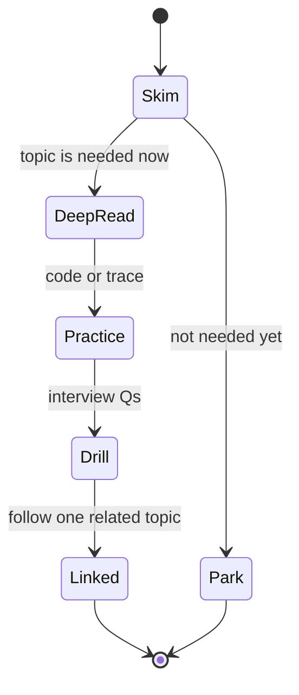
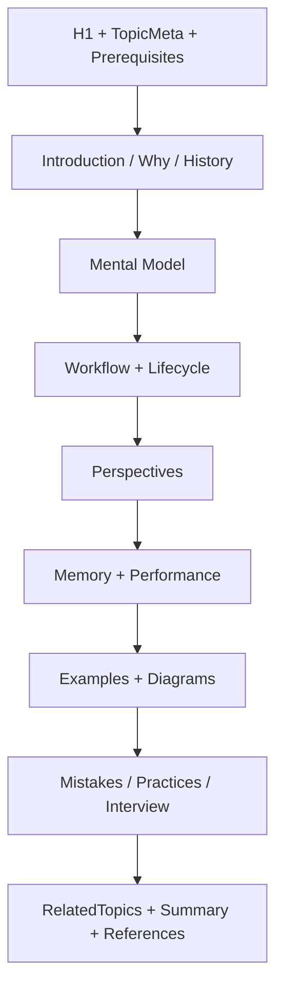

# How to Read This Handbook

<TopicMeta />

<Prerequisites />

::: tip Published
This page meets the handbook **published** bar: deep explanation, ≥10 common mistakes, and official references. Further engine-level errata welcome via PR.
:::

## Introduction

Every topic page uses the same H2 skeleton (see `standards/DOCUMENTATION_STANDARD.md`). That repetition is intentional: once you learn how to read one page, you can skim any module efficiently and know where answers live—history vs workflow vs interview drills.

## Why does it exist?

Inconsistent docs force rereading. A fixed shape lets you:

- jump to **Mental Model** when you need intuition
- jump to **Internal Workflow** when debugging
- jump to **Common Mistakes** / **Interview Questions** when preparing
- trust that **References** point at primaries (MDN, specs, RFCs)

## Historical Background

Engineer handbooks that last (language standards, RFCs, classical CS texts) separate motivation, model, mechanism, and exercises. This project applies that to frontend topics so stub → draft → published promotions do not reshape headings every time.

## Mental Model

Read each topic as four passes of increasing depth:

1. **Title + Introduction + Why** — should I care today?
2. **Mental Model + Diagrams** — can I explain it on a whiteboard?
3. **Workflow + Lifecycle + Perspectives** — can I debug it?
4. **Mistakes + Interview + Summary** — can I teach it?

`<TopicMeta />` and `<Prerequisites />` under the H1 tell you difficulty, time, and what to finish first. `<RelatedTopics />` near the end widens the graph without derailing pass 1–2.

## Internal Workflow

Recommended reading loop per topic:

1. Check `prerequisites`—open them if you cannot paraphrase them
2. Read through **Lifecycle** without coding
3. Reproduce **Code Examples** or pseudocode
4. Skim perspectives; read fully only those that apply to your stack
5. Answer Easy interview question aloud; peek at the answer; retry
6. Add one note: “failure mode I will recognize in prod”

## Lifecycle



Statuses in frontmatter: `stub` < `outline` < `draft` < `reviewed` < `published`. Drafts are usable; published pages meet a stricter mistakes/references bar.

## Browser Perspective

When a page’s Browser Perspective is not “Not applicable.”, treat it as the DevTools angle: which panel (Network, Performance, Memory, Application) would prove the mental model. If you cannot name a panel, your understanding is still abstract.

## JavaScript Engine Perspective

Use it to separate language semantics (ECMAScript) from host scheduling (browser/Node). If both Browser and Engine perspectives apply, read Engine second—engines execute; browsers host.

## React Perspective

If it says **Not applicable.**, do not force a React analogy. If it applies, map the topic to render/commit/effects without replacing the underlying CS/browser fact.

## Next.js Perspective

Same rule: only for topics that change across Server/Client/Edge runtimes. “Not applicable.” means do not invent an App Router story.

## Server Perspective

Relevant for HTTP, auth, SSR, caching, deployment. Otherwise skip.

## Network Perspective

Relevant for latency, TLS, CDN, APIs. Otherwise skip.

## Memory Perspective

Always present by standard. For conceptual pages, it may discuss cognitive load or retained structures in examples—still read it; memory bugs are a top production class.

## Performance

Always present. Look for *what to measure*, not generic “be fast.” Good pages name metrics or complexity classes.

## Production Example

Read this as a short postmortem seed. Ask: “Have I seen this failure?” If yes, annotate with your team’s symptom names.

## Code Examples

```md
Reading checklist for any topic page

- [ ] Paraphrase Mental Model in 3 bullets
- [ ] Draw or redraw one Mermaid diagram from memory
- [ ] Run or hand-simulate Code Examples
- [ ] Answer Easy + Medium interview questions
- [ ] Open at most ONE related topic afterward
```

```js
// Example of using status to choose depth
const page = { status: 'draft', topic: 'event-loop' }
if (page.status === 'stub') {
  // learn headings only; do not rely on prose
} else {
  // study fully; note gaps for contribution
}
```

## Diagrams



## Common Mistakes

1. Reading only code blocks and skipping Mental Model
2. Ignoring prerequisites then feeling “the page is confusing”
3. Treating every perspective as mandatory reading in order
4. Confusing `draft` with “wrong” and avoiding the page
5. Following every related link before finishing the page
6. Memorizing interview answers without the workflow section
7. Skimming References and citing blogs over specs in discussions
8. Missing a production edge case for 00-foundations.how-to-read-this-handbook (#1)
9. Missing a production edge case for 00-foundations.how-to-read-this-handbook (#2)
10. Missing a production edge case for 00-foundations.how-to-read-this-handbook (#3)


## Best Practices

- Time-box a first pass (reading_time in frontmatter is a hint)
- Keep a personal “failure mode” note per module
- Prefer contributing fixes to drafts over abandoning them
- Use module index pages for ordering; topic pages for depth

## Anti-patterns

- Highlight-driven reading with no paraphrase
- Tab explosion across the knowledge graph
- Only studying Interview Questions modules

## Comparison

| Strategy | Outcome |
| --- | --- |
| Fixed H2 passes | Predictable retention |
| Random scroll | Illusion of progress |
| Video-only parallel | Weak debugging language |

## Interview Questions

### Easy

**Q:** Why does every topic share the same section headings?

**A:** So readers know where to find motivation, model, mechanism, pitfalls, and references without relearning each author’s structure—and so contributions stay reviewable.

### Medium

**Q:** How do you use prerequisites vs related topics differently?

**A:** Prerequisites are blockers for understanding; finish or review them first. Related topics are optional expansions after you can explain the current mental model.

### Hard

**Q:** You must ramp a hire in five days across Browser + React. How do you use this handbook’s structure?

**A:** Pick a critical path of topics; require Mental Model + Workflow + one Easy/Medium question each; park Advanced links; map each production bug of the week back to a stage on the [web works map](/00-foundations/how-the-web-works-map/). Measure by debugging narratives, not pages opened.

## Summary

- Same H2 order everywhere—learn the shape once
- Four-pass reading: care → model → debug → drill
- Respect prerequisites; ration related links
- Next: [Prerequisites Checklist](/00-foundations/prerequisites-checklist/)

## References

- [Documentation Standard (repo)](https://github.com/search?q=repo%3AFrontend-Engineering-Handbook+DOCUMENTATION_STANDARD)
- [MDN — Getting started learning path](https://developer.mozilla.org/en-US/docs/Learn_web_development)
- [VitePress — Markdown extensions](https://vitepress.dev/guide/markdown)

<RelatedTopics />

Prev: [How the Web Works Map](/00-foundations/how-the-web-works-map/) · Next: [Prerequisites Checklist](/00-foundations/prerequisites-checklist/)
