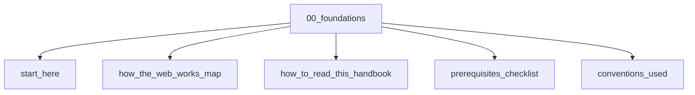

# Foundations

## Scope

How to read this handbook and orient yourself in the web stack

## Prerequisites

See the learning paths and each topic's prerequisites in the registry.

## Topics in order

- [Start Here](/00-foundations/start-here/) — beginner, ~15 min
- [How the Web Works Map](/00-foundations/how-the-web-works-map/) — beginner, ~25 min
- [How to Read This Handbook](/00-foundations/how-to-read-this-handbook/) — beginner, ~15 min
- [Prerequisites Checklist](/00-foundations/prerequisites-checklist/) — beginner, ~10 min
- [Conventions Used](/00-foundations/conventions-used/) — beginner, ~10 min

## Module knowledge graph

## Suggested learning paths

Browse [Learning Paths](/learning-paths/).
