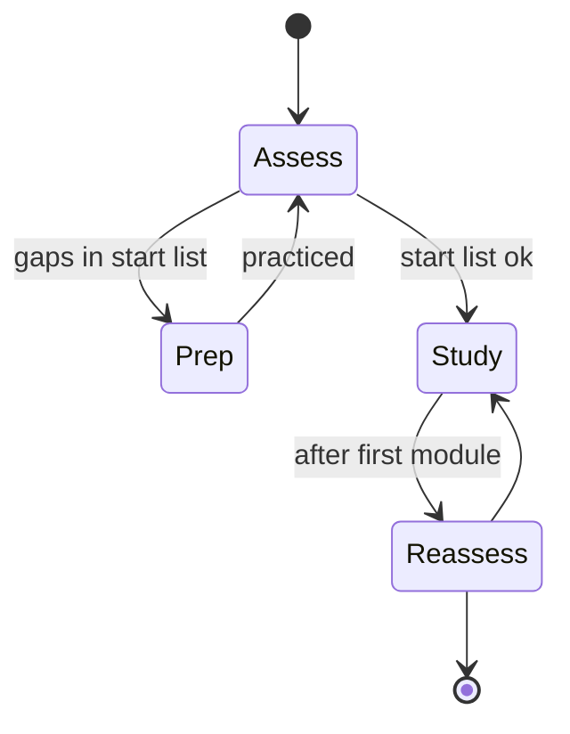
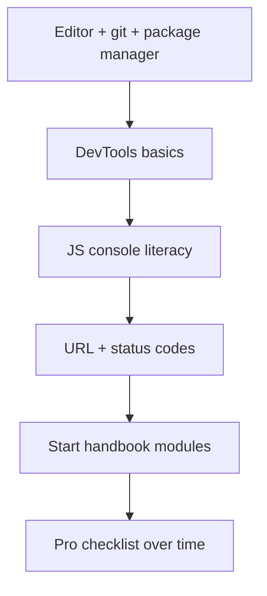

# Prerequisites Checklist

<TopicMeta />

<Prerequisites />

::: tip Published
This page meets the handbook **published** bar: deep explanation, ≥10 common mistakes, and official references. Further engine-level errata welcome via PR.
:::

## Introduction

Topic pages list *handbook* prerequisites (other topic ids). This page lists *human* prerequisites: skills and tools that make those topics absorbable. Tick what you can do today; gaps become a short prep queue—not a reason to quit.

## Why does it exist?

Readers stall when a CS page assumes they can open DevTools, or an HTTP page assumes they have used `curl` once. Explicit checklists convert vague “I’m not ready” into actionable prep, and prevent false confidence (“I use React, so I know the event loop”).

## Historical Background

Apprenticeship models in engineering always had gate skills: use the editor, run the program, read an error. Web bootcamps sometimes skipped tooling literacy; this checklist restores a minimal bar aligned with professional frontend work.

## Mental Model

Three columns:

| Column | Meaning |
| --- | --- |
| **Required to start** | Do these before CS/Internet deep dives |
| **Required to go pro** | Do these before Performance/Security modules |
| **Nice early** | Accelerate everything if present |

Honest self-scoring beats aspirational checking.

## Internal Workflow

1. Print or copy the lists below
2. Mark each item: ✅ can teach / 🟡 can do with notes / ❌ cannot
3. Spend 1–3 days converting ❌ → 🟡 for “start” items
4. Begin [Binary](/01-computer-science/binary/) or [What is the Internet](/02-internet/what-is-the-internet/)
5. Revisit this checklist at 30 days

## Lifecycle



## Browser Perspective

You should be able to open Chromium DevTools, inspect a DOM node, read the Network panel waterfall, and take a Performance trace snapshot. Without that, browser modules stay theoretical.

## JavaScript Engine Perspective

Not applicable. You only need to run JS in a browser console or Node REPL to experiment.

## React Perspective

Not required to start the handbook. If you already know React, still complete CS/browser checklists—do not skip ahead solely because you can write components.

## Next.js Perspective

Not applicable for starting. Add App Router literacy before the Next.js module.

## Server Perspective

Not applicable. Basic awareness that “backends exist” is enough initially.

## Network Perspective

You should recognize URL parts (`scheme`, host, path, query) and that HTTPS wraps HTTP in TLS. Deeper DNS/TCP comes in-module.

## Memory Perspective

Checklist overhead should stay small: a single note file. Avoid building an elaborate second learning system that competes with the handbook.

## Performance

Prep time has diminishing returns. Cap tool onboarding at a few days; learning DNS from the Internet module beats another round of editor customization.

## Production Example

A self-taught candidate fails a take-home that asks for waterfall interpretation. They knew React hooks but had never used Network throttling. After a weekend on this checklist’s DevTools items, they pass a retry focused on performance debugging—not more hook trivia.

## Code Examples

```text
START LIST (need 🟡+ before deep study)
[ ] Install a Chromium-based browser + Firefox briefly available
[ ] Open DevTools; use Elements + Network
[ ] Run snippets in console; understand console.log / errors
[ ] Edit a file; run a package.json script (pnpm/npm/yarn)
[ ] Use git: clone, status, commit, branch (local)
[ ] Explain var/let/const and function vs => at a basic level
[ ] Read a stack trace well enough to open the top frame
[ ] Identify HTML elements vs text vs attributes
```

```text
PRO LIST (before performance/security/architecture)
[ ] Performance panel: record, find a long task
[ ] Application panel: cookies, localStorage
[ ] fetch + async/await error handling
[ ] Read response status codes 200/301/304/401/403/404/500
[ ] Basic regex literacy; JSON.parse/stringify
[ ] Comfortable with map/filter/reduce and references vs values
```

```bash
# Minimal tooling smoke test
node -e "console.log('node ok', 1+1)"
git --version
```

## Diagrams



## Common Mistakes

1. Treating React portfolio work as a substitute for DevTools skills
2. Checking ✅ on items you only watched in a video
3. Spending weeks on terminal rice before learning HTTP
4. Skipping git until “later” and blocking contribution
5. Avoiding Firefox/WebKit entirely (engine differences surprise you)
6. Waiting to be “ready” forever instead of starting Binary/Internet with 🟡s
7. Ignoring stack traces and debugging only by console.log spam
8. Missing a production edge case for 00-foundations.prerequisites-checklist (#1)
9. Missing a production edge case for 00-foundations.prerequisites-checklist (#2)
10. Missing a production edge case for 00-foundations.prerequisites-checklist (#3)


## Best Practices

- Pair each ❌ with a 60-minute exercise, not a course binge
- Keep proofs: a saved HAR, a trace, a tiny repo
- Re-score monthly during job hunt or role change

## Anti-patterns

- Infinite prep loops (new course every week)
- Checklist theater shared on socials without skill
- Only learning inside Create React App without Network panel

## Comparison

| Signal | Reliable? |
| --- | --- |
| Can explain a waterfall | Yes |
| Years of React listed on CV | Weak alone |
| Completed checklist with artifacts | Yes |

## Interview Questions

### Easy

**Q:** Name three tools you use to debug a slow page load.

**A:** Network panel (waterfall, TTFB), Performance/Lighthouse, and optionally `curl`/WebPageTest—plus knowing what each measures.

### Medium

**Q:** What handbook areas should wait until you can read a stack trace and a Network panel?

**A:** Deep browser rendering, performance, and most production incident topics—otherwise examples will not stick. CS binary/memory can start earlier.

### Hard

**Q:** Design a 48-hour ramp for a hire who knows React but fails this checklist.

**A:** Day 1: DevTools Network + Performance exercises on a real site; git/package scripts; fetch lab with intentional 404/500. Day 2: JS references/closures mini-lab; HTTP status/caching reading; then Start Here → Web Works Map → Event Loop pages with aloud explanations. Ship a short writeup of one bug localized by stage.

## Summary

- Separate human prerequisites from topic-id prerequisites
- Convert ❌ → 🟡 on the start list, then begin modules
- Grow into the pro list as you approach production topics
- Next: [Conventions Used](/00-foundations/conventions-used/)

## References

- [MDN — DevTools tutorials](https://developer.mozilla.org/en-US/docs/Learn_web_development/Howto/Tools_and_setup)
- [Chrome DevTools docs](https://developer.chrome.com/docs/devtools/)
- [Git documentation](https://git-scm.com/doc)
- [Node.js docs](https://nodejs.org/docs/latest/api/)

<RelatedTopics />

Prev: [How to Read This Handbook](/00-foundations/how-to-read-this-handbook/) · Next: [Conventions Used](/00-foundations/conventions-used/)
