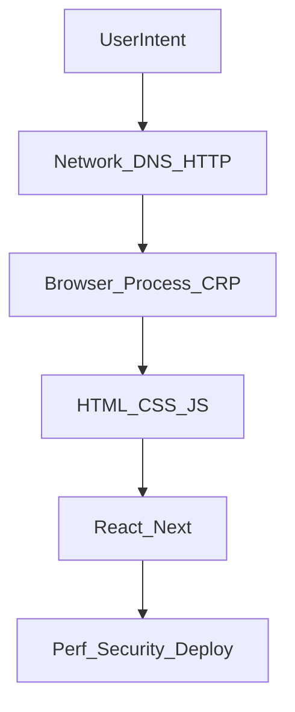
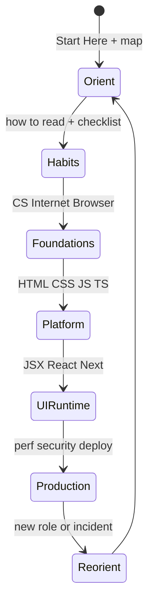
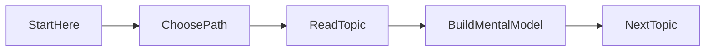

# Start Here

<TopicMeta />

<Prerequisites />

::: tip Published
This page meets the handbook **published** bar: deep explanation, ≥10 common mistakes, and official references. Further engine-level errata welcome via PR.
:::

## Introduction

This handbook teaches **how the modern web works**: from bits and packets, through browser internals, to React, Next.js, and production systems. It is deliberately not “React in 20 minutes.” Frameworks appear only after the platforms they run on.

If you can explain what happens between typing a URL and seeing pixels—and name failures like “main-thread long task,” “DNS miss,” or “retained heap”—every library API becomes easier to learn and easier to distrust when it leaks abstractions.

## Why does it exist?

Most frontend material starts at components. That produces developers who can ship UI but cannot diagnose jank, hydration bugs, cache headers, or security boundaries. This page exists to set the contract: **fundamentals first, frameworks second, production judgment always.**

Without a shared start, learners and contributors invent incompatible shortcuts: one person “knows React,” another “knows CSS,” neither can localize a slow LCP to network vs render vs hydration.

## Historical Background

Web education moved from “View Source” and HTML primers, to jQuery snippets, to SPA bootcamps. Each wave optimized for speed-to-demo. As SPAs, SSR, and edge runtimes grew, teams rediscovered that browser internals, networking, and asymptotic thinking matter for day-to-day bugs.

This repository follows that correction: MDN-, web.dev-, and engine-blog-level depth, organized as a curriculum—same spirit as systems texts, aimed at people who ship UI.

## Mental Model

Treat the stack as layers you climb when learning and descend when debugging:



Handbook modules roughly follow that order (`00` foundations → `01` CS → `02` Internet → `03` Browser → languages → UI → production). Your job as a reader is to finish mental models before collecting APIs.

## Internal Workflow

A practical first session:

1. Finish this page, then [How the Web Works Map](/00-foundations/how-the-web-works-map/).
2. Read [How to Read This Handbook](/00-foundations/how-to-read-this-handbook/) so the fixed H2 shape feels familiar.
3. Tick the [Prerequisites Checklist](/00-foundations/prerequisites-checklist/) (DevTools, git, basic JS).
4. Skim [Conventions Used](/00-foundations/conventions-used/) (statuses, `prev_topic`, admonitions).
5. Pick a [learning path](/learning-paths/) or enter [Binary](/01-computer-science/binary/) / [What is the Internet](/02-internet/what-is-the-internet/).
6. For every topic afterward, answer “why does it exist?” before memorizing APIs.

## Lifecycle



- **Orient** — know the product and your goal  
- **Study** — follow topic prerequisites; do not skip marked blockers  
- **Reorient** — when interviews or outages expose a gap, return to the map  

## Browser Perspective

Open Chromium DevTools while learning. The handbook’s [Browser](/03-browser/) module maps to Network, Performance, Memory, and Elements. Foundations pages only point; browser architecture pages teach the machinery.

## JavaScript Engine Perspective

Not applicable.

## React Perspective

Not applicable yet — arrive at React only after language and browser foundations, then [JSX and Fiber](/08-jsx-and-react-runtime/). React is a library inside a runtime, not a substitute for the event loop or HTTP.

## Next.js Perspective

Not applicable.

## Server Perspective

Not applicable on day one. Remember that “frontend” still includes server-rendered HTML and APIs; those topics appear later without changing this start order.

## Network Perspective

Every “frontend” bug that is actually DNS, TLS, or caching starts in [Internet](/02-internet/). The web works map names the stages; deep RFCs wait until you need them.

## Memory Perspective

Learning has a working-set cost: holding too many unfinished modules creates thrashing. Finish one topic’s Mental Model and Internal Workflow before opening five related tabs. You will learn stack vs heap before closures—that order is intentional.

## Performance

Skipping fundamentals feels faster and becomes slower: you re-learn them during outages. Prefer durable throughput:

- one topic to draft depth (all H2s, one diagram, one code/pseudocode block)
- one small experiment (DevTools, Node REPL, or paper trace)
- one interview question answered aloud

## Production Example

A junior is asked why LCP regressed after a Next.js upgrade. Engineers who started here check HTML streaming, font loading, and cache headers—and read a waterfall—before tweaking random React memos. Another hire who skipped foundations spends a week “optimizing components” while DNS+TLS to an image host dominates LCP.

## Code Examples

```bash
# Run the docs locally while reading
npx pnpm@9.15.0 install
npx pnpm@9.15.0 dev
```

```js
// Meta-check: explain without framework jargon
console.log('start')
setTimeout(() => console.log('timeout'), 0)
Promise.resolve().then(() => console.log('microtask'))
console.log('end')
// Expected: start, end, microtask, timeout
```

```text
Suggested first-week path (beginner)

Day 1: Start Here → Web Works Map → How to Read → Checklist → Conventions
Day 2–3: Binary → Bits/Bytes → CPU → Memory → Stack → Heap
Day 4: Process → Thread → Event Loop (CS) → skim Browser Event Loop
Day 5: Internet overview → DNS → HTTP → HTTPS (map-level)
```

## Diagrams



## Common Mistakes

1. Jumping straight to the React module because “that’s the job”
2. Reading without running DevTools experiments
3. Skimming “Why does it exist?” and only copying code blocks
4. Treating interview pages as a substitute for canonical topics
5. Trying to read every module linearly without a path
6. Opening every related link in the first hour and retaining nothing
7. Assuming years of framework use replace stack/heap and HTTP literacy
8. Missing a production edge case for 00-foundations.start-here (#1)
9. Missing a production edge case for 00-foundations.start-here (#2)
10. Missing a production edge case for 00-foundations.start-here (#3)


## Best Practices

- Follow a persona path for your first pass
- Keep notes as diagrams, not API lists
- When confused, go one layer down—not sideways into another framework
- Respect each page’s `prerequisites` before deep reading
- Revisit Start Here when you change roles (junior → mid) to pick a new depth target

## Anti-patterns

- Tutorial hopping across conflicting mental models
- Memorizing buzzwords (hydration, RSC, INP) without definitions
- Passive video binge with zero paper traces or DevTools sessions

## Comparison

| Approach | Outcome |
| --- | --- |
| Framework-first tutorials | Fast demos, fragile debugging |
| This handbook’s order | Slower start, durable intuition |
| Interview-only grind | Short-term quiz wins, hollow production judgment |

## Interview Questions

### Easy

**Q:** What should you learn before React?

**A:** HTML/CSS/JS fundamentals plus how the browser parses, lays out, paints, and runs the event loop—and enough HTTP to read a waterfall.

### Medium

**Q:** Why do backend engineers still need browser internals?

**A:** SSR, caching, cookies, CORS, and performance budgets all cross the network/browser boundary; blaming “the frontend framework” without those models wastes time.

### Hard

**Q:** How would you structure a 6-week frontend ramp for a mid-level backend hire?

**A:** Week-by-week: HTTP/TLS → CRP/event loop → JS async/memory → React model → Next rendering strategies → one production debugging project. Measure by localized incident writeups, not pages opened.

## Summary

- Start with paths and the stack map, not random topics
- Fundamentals before frameworks; debug downward through layers
- Depth beats breadth early; finish mental models before collecting APIs
- Next: [How the Web Works Map](/00-foundations/how-the-web-works-map/)

## References

- [MDN Web Docs](https://developer.mozilla.org/)
- [MDN — Learn web development](https://developer.mozilla.org/en-US/docs/Learn_web_development)
- [web.dev](https://web.dev/)
- [ECMAScript Language Specification](https://tc39.es/ecma262/)
- [HTML Living Standard](https://html.spec.whatwg.org/)

<RelatedTopics />

Next: [How the Web Works Map](/00-foundations/how-the-web-works-map/)
