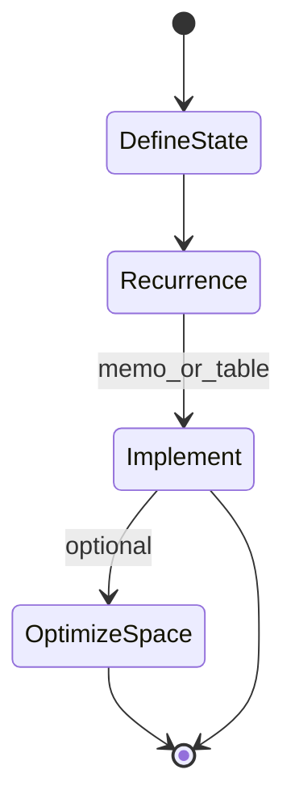
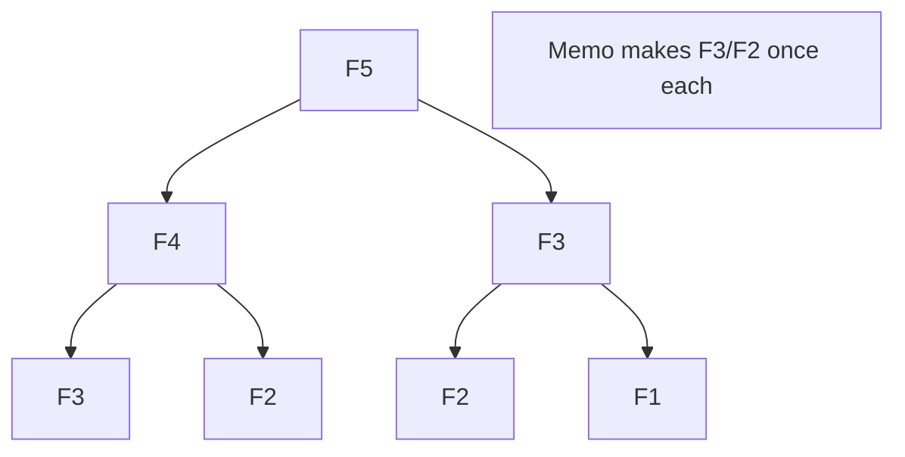
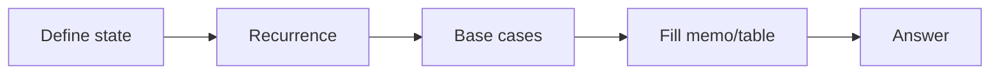

# Dynamic Programming Intro

<TopicMeta />

<Prerequisites />

::: tip Published
This page meets the handbook **published** bar: deep explanation, ≥10 common mistakes, and official references. Further engine-level errata welcome via PR.
:::

## Introduction

**Dynamic programming (DP)** solves problems by combining answers to overlapping subproblems, storing results so each subproblem is computed once. It needs **optimal substructure** (best solution built from best sub-solutions) and **overlapping subproblems** (the recursion tree repeats work). This intro builds the reflex: recognize → define state → recurrence → memoize/tabulate.

## Why does it exist?

Naive [recursion](/01-computer-science/algorithms/recursion/) can be exponential. DP restores polynomial time for a wide class of problems (paths, knapsacks, edit distance, scheduling). Frontend interviews love DP; production uses it in diffing, layout packing, and text layout more often than in React widgets.

## Historical Background

Bellman coined “dynamic programming” in the 1950s. Memoization (top-down) and tabulation (bottom-up) are twin presentations of the same idea. React’s reconciliation is *not* classical DP, but caching subtrees shares the “don’t recompute” spirit.

## Mental Model

Checklist:

1. Define **state** (`dp[i]`, `dp[i][j]`, …) — what question does it answer?
2. Write **recurrence** — how to compute from smaller states
3. Set **base cases**
4. Choose **top-down memo** or **bottom-up table**
5. Reconstruct solution if needed (parent pointers)

Fibonacci: \(F(n)=F(n-1)+F(n-2)\) — overlapping central example.

## Internal Workflow

Top-down:

1. Function receives state key
2. If key in memo → return
3. Compute via recurrence; store; return

Bottom-up:

1. Allocate table sized by state space
2. Fill in dependency order
3. Answer at target state

Time ≈ `#states × work per state`; space ≈ table size (often optimizable).

## Lifecycle



## Browser Perspective

Heavy DP on the main thread (e.g. huge edit-distance) blocks UI—run in Workers. Browser text/layout engines use DP-like algorithms internally; you rarely reimplement them.

## JavaScript Engine Perspective

Memo `Map`s allocate heap objects; numeric arrays are denser for rectangular DP. Recursion+memo still risks stack overflows—prefer iterative tabulation for large dimensions.

## React Perspective

`useMemo` is not DP—it caches one expression under dependencies. True DP needs an explicit state space. List virtualization/`cell` measurement caches are closer cousins.

## Next.js Perspective

Not applicable specifically—run DP on server for heavy jobs if needed.

## Server Perspective

Batch jobs (recommendations, alignment) use DP; watch memory for 2D tables \(O(nm)\).

## Network Perspective

Not applicable.

## Memory Perspective

2D tables dominate RAM: \(n=m=10^4\) → \(10^8\) entries. Use rolling arrays when recurrence only needs prior row. Memo maps hold sparse states better when few visited.

## Performance

Count states first. If state space is huge, DP may be wrong tool (need greedy, heuristics, approx). Micro-opt after correctness.

## Production Example

A diff viewer used naive recursive LCS and froze on 5k-line files. Switching to `O(nm)` DP with a cap/segmentation strategy restored interactivity; for full files, moved computation to a Worker.

## Code Examples

```js
// Top-down memo Fibonacci
function fib(n, memo = new Map()) {
  if (n <= 1) return n
  if (memo.has(n)) return memo.get(n)
  const v = fib(n - 1, memo) + fib(n - 2, memo)
  memo.set(n, v)
  return v
}

// Bottom-up
function fibBottom(n) {
  if (n <= 1) return n
  let a = 0, b = 1
  for (let i = 2; i <= n; i++) [a, b] = [b, a + b]
  return b // O(n) time, O(1) space
}

// Grid paths: dp[i][j] = paths to cell
function uniquePaths(m, n) {
  const dp = Array.from({ length: m }, () => Array(n).fill(0))
  for (let i = 0; i < m; i++) dp[i][0] = 1
  for (let j = 0; j < n; j++) dp[0][j] = 1
  for (let i = 1; i < m; i++)
    for (let j = 1; j < n; j++)
      dp[i][j] = dp[i - 1][j] + dp[i][j - 1]
  return dp[m - 1][n - 1]
}
```

```text
Pseudocode — knapsack 0/1 idea

dp[i][w] = max value using first i items with capacity w
dp[i][w] = max(dp[i-1][w],
               dp[i-1][w-weight[i]] + value[i]) // if weight fits
```

## Diagrams





## Common Mistakes

1. Memoizing without a clear state key (collisions/wrong answers)
2. Missing overlapping subproblems (DP cargo cult)
3. Wrong iteration order in bottom-up (using unready states)
4. Exploding memory on 2D tables
5. Off-by-one in indices/base cases
6. Using recursion+memo on depth that still overflows
7. Optimizing constants before proving polynomial state count
8. Missing a production edge case for 01-computer-science.algorithms-dynamic-programming-intro (#1)
9. Missing a production edge case for 01-computer-science.algorithms-dynamic-programming-intro (#2)
10. Missing a production edge case for 01-computer-science.algorithms-dynamic-programming-intro (#3)


## Best Practices

- Speak the recurrence aloud before coding
- Start with top-down for clarity; switch to bottom-up for control
- Record time/space in terms of state dimensions
- Add tiny golden tests for base cases

## Anti-patterns

- Nested loops that “look like DP” without recurrence meaning
- Global mutable memo without clearing between problems
- 3D DP in a UI click handler

## Comparison

| Approach | Pros | Cons |
| --- | --- | --- |
| Naive recursion | Simple | Exponential blowup |
| Memoization | Natural recurrence | Stack + map overhead |
| Tabulation | Predictable order | Harder to write first |
| Greedy | Fast | Wrong without proof |

## Interview Questions

### Easy

**Q:** What two properties suggest DP?

**A:** Optimal substructure and overlapping subproblems.

### Medium

**Q:** Convert recursive Fibonacci to \(O(n)\) time \(O(1)\) space.

**A:** Iteratively keep the last two values—rolling variables instead of a full array.

### Hard

**Q:** Outline edit distance DP.

**A:** `dp[i][j]` = min edits to transform `a[:i]` to `b[:j]`; transitions insert/delete/replace; base `dp[i][0]=i`, `dp[0][j]=j`; time/space \(O(nm)\) with optional rolling rows.

## Summary

- DP caches answers to overlapping subproblems via a recurrence
- State definition is the hard part; coding follows
- Watch stack and table memory on real sizes
- Module complete—return to [Algorithms](/01-computer-science/algorithms/) or continue the handbook graph

## References

- CLRS — Dynamic Programming
- [Wikipedia — Dynamic programming](https://en.wikipedia.org/wiki/Dynamic_programming)
- [MDN — Map](https://developer.mozilla.org/en-US/docs/Web/JavaScript/Reference/Global_Objects/Map) (memo tables)

<RelatedTopics />

Prev: [Recursion](/01-computer-science/algorithms/recursion/)
