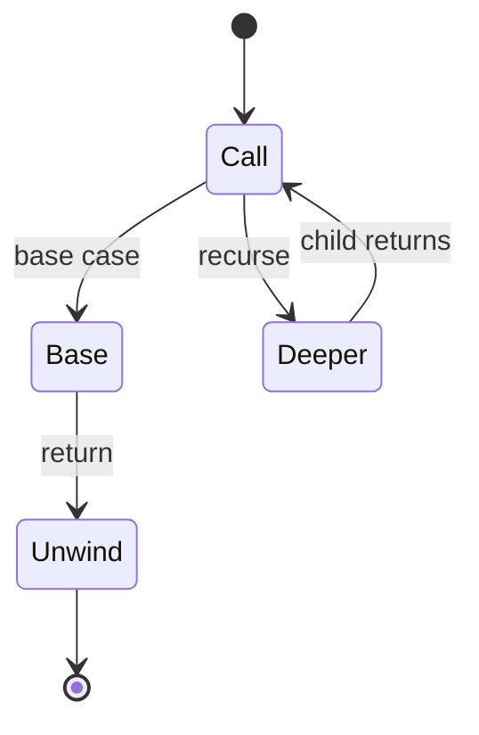
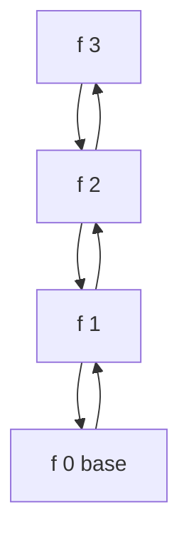

# Recursion

<TopicMeta />

<Prerequisites />

::: tip Published
This page meets the handbook **published** bar: deep explanation, ≥10 common mistakes, and official references. Further engine-level errata welcome via PR.
:::

## Introduction

**Recursion** solves a problem by calling the same function on a smaller instance until a **base case** stops the chain. It maps naturally to [trees](/01-computer-science/data-structures/tree/) and divide-and-conquer. Each call consumes [stack](/01-computer-science/stack/) space—so recursion is both a design tool and a crash risk.

## Why does it exist?

Inductive structure (lists, trees, graphs via DFS) is awkward with only flat loops. Recursion expresses “do this to the children” directly. Compilers and UI walks are recursive in spirit even when written iteratively.

## Historical Background

Mathematical induction and Lisp made recursion central. Many languages optimize tail calls; JavaScript generally does **not** guarantee TCO—plan for stack limits.

## Mental Model

Three parts:

1. **Base case** — trivial input returns directly
2. **Recursive case** — smaller subproblem(s)
3. **Combine** — build answer from sub-answers

Depth \(d\) ⇒ \(O(d)\) stack frames unless transformed.

## Internal Workflow

Engine steps on recursive call:

1. Evaluate args
2. Push frame (locals, return addr)
3. Execute callee
4. Pop frame; continue caller

Infinite recursion without base case → `RangeError: Maximum call stack size exceeded`.

## Lifecycle



## Browser Perspective

Deep DOM recursion (e.g. walking every node recursively) can overflow on pathological pages—prefer iterative TreeWalker patterns for untrusted depth.

## JavaScript Engine Perspective

No portable tail-call elimination. Async recursion (`await` in recursive function) does *not* keep native frames across awaits, but still can schedule unbounded async work.

## React Perspective

Component trees are conceptually recursive; React’s reconciler walks fibers (often iteratively). Recursive components (`Comment` rendering nested `Comment`) need bounds.

## Next.js Perspective

Not applicable uniquely—same stack limits during SSR recursion.

## Server Perspective

Recursive zip/path traversal without limits is a classic DoS. Cap depth.

## Network Perspective

Not applicable.

## Memory Perspective

Stack space \(O(depth)\); heap may grow with returned structures. Mutual recursion and closures retain environments carefully.

## Performance

Recursion adds call overhead; algorithms may still be optimal (mergesort). Convert hot deep recursion to explicit stacks. Memoization ([DP intro](/01-computer-science/algorithms/dynamic-programming-intro/)) can turn exponential recursive trees into polynomial time.

## Production Example

A markdown outline renderer recursed into nested lists from user content hundreds deep and crashed the tab. Switching to iterative stack walk with `maxDepth` made it safe.

## Code Examples

```js
function factorial(n) {
  if (n <= 1) return 1 // base
  return n * factorial(n - 1)
}

// Tree sum — recursive
function sumTree(node) {
  if (!node) return 0
  return node.value + sumTree(node.left) + sumTree(node.right)
}

// Same idea — iterative stack
function sumTreeIter(root) {
  let s = 0
  const st = [root]
  while (st.length) {
    const n = st.pop()
    if (!n) continue
    s += n.value
    st.push(n.left, n.right)
  }
  return s
}
```

```text
Pseudocode — must have base case

function f(n):
  if n == 0: return ...
  return g(f(n-1))
```

## Diagrams



## Common Mistakes

1. Missing or unreachable base case
2. Failing to shrink the problem (infinite recursion)
3. Assuming TCO in JavaScript
4. Recursing on user-controlled depth without caps
5. Exponential recursion without memo (Fib)
6. Shared mutable state across recursive calls unexpectedly
7. Confusing async recursion with parallel threads
8. Missing a production edge case for 01-computer-science.algorithms-recursion (#1)
9. Missing a production edge case for 01-computer-science.algorithms-recursion (#2)
10. Missing a production edge case for 01-computer-science.algorithms-recursion (#3)


## Best Practices

- Write base case first
- Document depth expectations
- Prefer iteration for large/untrusted depth
- Use memoization when subproblems overlap

## Anti-patterns

- Clever recursion that obscures simple loops
- Recursive deep clone of huge graphs without cycle care
- Production recursion without max depth guard on external data

## Comparison

| Style | Clarity on trees | Stack risk |
| --- | --- | --- |
| Recursion | High | Higher |
| Explicit stack | Medium | Controllable |
| Pure loops | High on arrays | Low |

## Interview Questions

### Easy

**Q:** What two ingredients does every recursive function need?

**A:** A base case and a recursive case that moves toward that base case.

### Medium

**Q:** Why can recursive Fibonacci be exponentially slow?

**A:** It recomputes the same subproblems many times—time \(\Theta(\phi^n)\) without memoization.

### Hard

**Q:** Convert a recursive DFS to an iterative one and discuss space.

**A:** Use an explicit stack of nodes/frames; space still \(O(n)\) worst-case for the structure, but heap-allocated stack avoids call-stack limits and can store extra state per frame.

## Summary

- Recursion = base case + smaller self-calls
- Costs stack depth; JS lacks guaranteed TCO
- Trees love recursion; untrusted depth loves iteration
- Next: [Dynamic Programming Intro](/01-computer-science/algorithms/dynamic-programming-intro/)

## References

- [MDN — Functions](https://developer.mozilla.org/en-US/docs/Web/JavaScript/Guide/Functions)
- [MDN — RangeError stack](https://developer.mozilla.org/en-US/docs/Web/JavaScript/Reference/Errors/Too_much_recursion)
- CLRS — recursion / divide-and-conquer

<RelatedTopics />

Prev: [Sorting](/01-computer-science/algorithms/sorting/) · Next: [Dynamic Programming Intro](/01-computer-science/algorithms/dynamic-programming-intro/)
