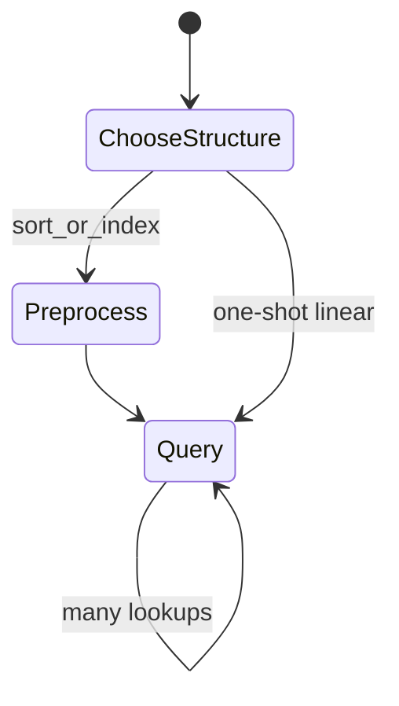
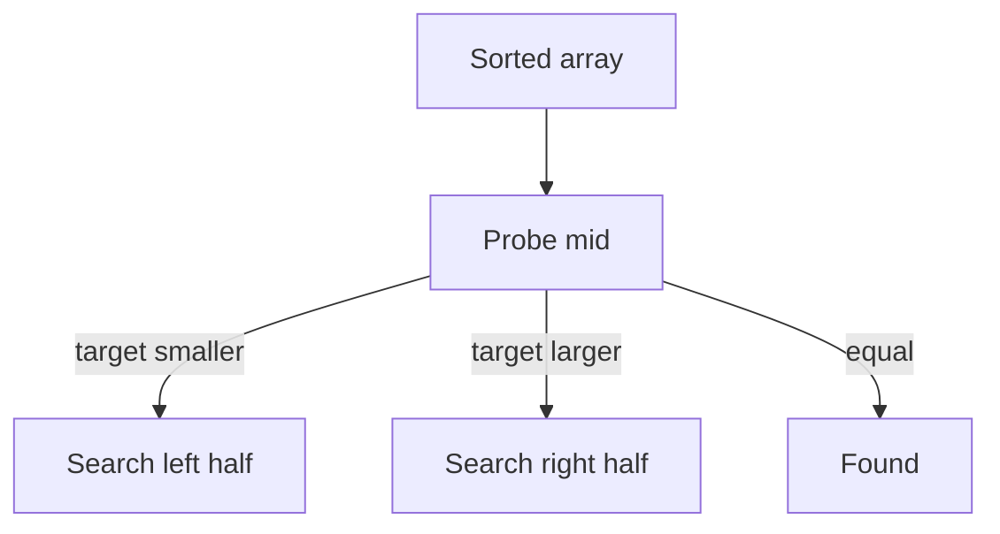

# Searching

<TopicMeta />

<Prerequisites />

::: tip Published
This page meets the handbook **published** bar: deep explanation, ≥10 common mistakes, and official references. Further engine-level errata welcome via PR.
:::

## Introduction

**Searching** finds a target in a collection—or reports absence. Unsorted arrays require **linear search** \(O(n)\). Sorted arrays unlock **binary search** \(O(\log n)\). Hash tables search by key in average \(O(1)\). Choosing a search strategy is really choosing a data structure and preprocessing budget.

## Why does it exist?

Lookup is the core of apps: find user by id, match a route, filter a list, hit a cache. Wrong search asymptotics make “simple” UIs fall over as data grows.

## Historical Background

Binary search is ancient in algorithmics; bugs in mid-point computation are famous. Modern engines implement `indexOf`, `includes`, and typed binary search in libraries; databases add B-trees/hashes.

## Mental Model

| Structure | Search |
| --- | --- |
| Unsorted array | Linear \(O(n)\) |
| Sorted array | Binary \(O(\log n)\) |
| Hash map | Average \(O(1)\) |
| BST balanced | \(O(\log n)\) |
| Trie | \(O(k)\) by key length |

Preprocessing (sort \(O(n\log n)\), build map \(O(n)\)) must be amortized across queries.

## Internal Workflow

Binary search:

1. Set `lo=0`, `hi=n-1`
2. While `lo ≤ hi`: mid = lo+⌊(hi-lo)/2⌋
3. Compare `a[mid]` to target; shrink half
4. Empty range → not found

Avoid `(lo+hi)>>1` overflow in fixed-width ints (JS safe for practical array lengths).

## Lifecycle



## Browser Perspective

Client-side search over large lists should debounce and ideally use indexes (or server search). DOM `querySelector` is a different “search” over trees.

## JavaScript Engine Perspective

`Array.prototype.includes` is linear. Engines optimize tiny cases; they won’t binary-search an unsorted array for you.

## React Perspective

Filtering in render is search per keystroke—combine with memoized indexes and virtualization. Don’t binary-search unsorted props.

## Next.js Perspective

Server-side search (DB/API) beats shipping 100k rows for linear filter on the client.

## Server Perspective

Databases own serious search (indexes). In-memory binary search appears in config tables and sorted caches.

## Network Perspective

Remote search trades latency for not downloading \(n\). Cache query results carefully.

## Memory Perspective

Indexes cost \(O(n)\) space for \(O(1)/O(\log n)\) queries. Keep both raw arrays and maps only when needed.

## Performance

One linear scan can beat building an index if you search once. Many searches → invest in sort/map/trie. Measure with realistic \(n\).

## Production Example

Admin UI filtered 80k rows with `.filter(r => r.name.includes(q))` each keystroke (multiple \(O(n)\)). Debounce + web worker + trigram index cut INP dramatically.

## Code Examples

```js
function linearSearch(a, target) {
  for (let i = 0; i < a.length; i++) if (a[i] === target) return i
  return -1
}

function binarySearch(a, target) {
  let lo = 0, hi = a.length - 1
  while (lo <= hi) {
    const mid = lo + ((hi - lo) >> 1)
    if (a[mid] === target) return mid
    if (a[mid] < target) lo = mid + 1
    else hi = mid - 1
  }
  return -1
}
```

```text
Pseudocode — lower_bound

function lowerBound(a, x):
  lo=0; hi=len(a)
  while lo<hi:
    mid = floor((lo+hi)/2)
    if a[mid] < x: lo = mid+1
    else: hi = mid
  return lo
```

## Diagrams



## Common Mistakes

1. Binary searching unsorted data
2. Off-by-one in `lo`/`hi` updates
3. Using linear search in hot nested loops
4. Case-sensitive string compare bugs in UI search
5. Forgetting locale/Unicode normalization
6. Shipping full datasets for trivial finds
7. Building indexes every keystroke instead of once per data change
8. Missing a production edge case for 01-computer-science.algorithms-searching (#1)
9. Missing a production edge case for 01-computer-science.algorithms-searching (#2)
10. Missing a production edge case for 01-computer-science.algorithms-searching (#3)


## Best Practices

- Define equality and sort order explicitly
- Debounce user-driven search
- Prefer server/indexed search past a few thousand rows
- Use `Map` for id lookup, not repeated `find`

## Anti-patterns

- Regex over huge strings on the main thread without need
- Sorting on every search to enable binary search once
- Blocking SSR while scanning massive arrays

## Comparison

| Algorithm | Needs sorted? | Time |
| --- | --- | --- |
| Linear | No | \(O(n)\) |
| Binary | Yes | \(O(\log n)\) |
| Hash lookup | Build map | \(O(1)\) avg |

## Interview Questions

### Easy

**Q:** When can you use binary search?

**A:** When the collection is ordered by the same comparison you use to probe mids (typically a sorted array).

### Medium

**Q:** Find the first element ≥ x in a sorted array.

**A:** Lower-bound binary search—return the first mid that is not `< x`.

### Hard

**Q:** Search in a rotated sorted array.

**A:** Modified binary search: determine which half is sorted, decide which side can contain target; still \(O(\log n)\).

## Summary

- Linear vs binary vs hash: structure decides complexity
- Preprocessing pays off across many queries
- UI search needs debounce, indexes, or server help
- Next: [Sorting](/01-computer-science/algorithms/sorting/)

## References

- [MDN — Array includes](https://developer.mozilla.org/en-US/docs/Web/JavaScript/Reference/Global_Objects/Array/includes)
- [MDN — Array find](https://developer.mozilla.org/en-US/docs/Web/JavaScript/Reference/Global_Objects/Array/find)
- CLRS — searching chapters

<RelatedTopics />

Prev: [Algorithms](/01-computer-science/algorithms/) · Next: [Sorting](/01-computer-science/algorithms/sorting/)
