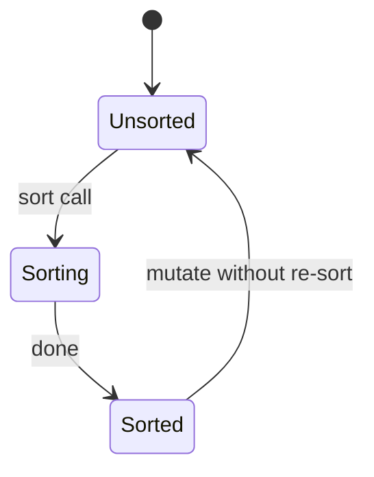
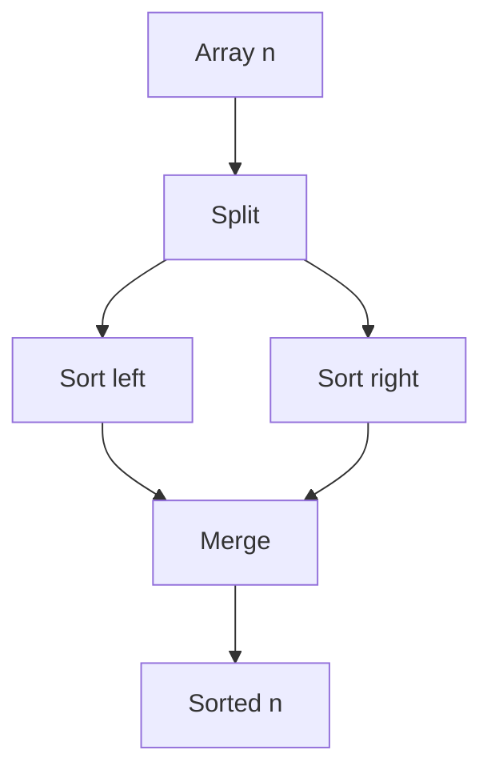

# Sorting

<TopicMeta />

<Prerequisites />

::: tip Published
This page meets the handbook **published** bar: deep explanation, ≥10 common mistakes, and official references. Further engine-level errata welcome via PR.
:::

## Introduction

**Sorting** orders elements by a comparator. Comparison-based sorts need \(\Omega(n\log n)\) comparisons in the worst case; specialized inputs allow \(O(n)\) (counting/radix). In JavaScript, `Array.prototype.sort` is your daily interface—know its complexity class, stability, and comparator pitfalls.

## Why does it exist?

Order enables binary search, merges, ranking UIs, deterministic displays, and many algorithms’ preconditions. Unsorted data forces linear scans forever.

## Historical Background

Quicksort, mergesort, heapsort—classics. Timsort (Python, and used by V8 historically for some cases) merges merge + insertion for real-world runs. JS historically sorted strings by code units by default—surprised many.

## Mental Model

| Algorithm | Avg time | Space | Stable? |
| --- | --- | --- | --- |
| Quicksort | \(O(n\log n)\) | \(O(\log n)\) | Usually no |
| Mergesort | \(O(n\log n)\) | \(O(n)\) | Yes |
| Heapsort | \(O(n\log n)\) | \(O(1)\) | No |
| Insertion | \(O(n^2)\) | \(O(1)\) | Yes |

Engine `sort` is implementation-defined but expected \(O(n\log n)\).

## Internal Workflow

Mergesort sketch:

1. Split array in half
2. Recursively sort halves
3. Merge two sorted runs in \(O(n)\)

Quicksort: partition around pivot; recurse; watch worst-case \(O(n^2)\) on bad pivots.

## Lifecycle



## Browser Perspective

Sorting huge arrays on the main thread blocks input—move to Worker or sort server-side. UI lists often only need sort of the visible window if data is pre-indexed.

## JavaScript Engine Perspective

`sort` comparator must be consistent (math order). Returning non-numeric values or lying about order → undefined behavior. Modern engines use efficient native sorts (often Timsort-like or quicksort variants).

## React Perspective

Don’t sort in render without memoization—\(O(n\log n)\) each render. Sort when data changes; keep sorted copy in state/selector.

## Next.js Perspective

Prefer ordering in SQL/`ORDER BY` or CMS queries; ship pre-sorted JSON when static.

## Server Perspective

DB indexes make sorted retrieval cheap. In-memory sorts of large result sets blow CPU/RAM—paginate.

## Network Perspective

Sorting doesn’t reduce bytes; filtering does. Don’t download n to sort for top-k—ask for top-k.

## Memory Perspective

Mergesort-like approaches use \(O(n)\) aux. In-place sorts save memory but may be unstable. Cloning before sort to keep immutability doubles peak space.

## Performance

For nearly-sorted data, adaptive sorts shine. For tiny n, insertion sort constants win. Always profile before rewriting `sort`.

## Production Example

A table re-sorted on every Redux tick with a new array reference, causing React re-renders and jank. Memoized sorted selector + stable comparator fixed FPS.

## Code Examples

```js
const users = [
  { name: 'b', age: 30 },
  { name: 'a', age: 20 },
]

// Numeric compare — never rely on default for numbers as strings
users.sort((a, b) => a.age - b.age)

// Locale-aware names
users.sort((a, b) => a.name.localeCompare(b.name, 'en'))

// Default sort: lexicographic string conversion — danger for numbers
;[10, 9, 2].sort() // [10, 2, 9]
;[10, 9, 2].sort((a, b) => a - b) // [2, 9, 10]
```

```text
Pseudocode — merge

function merge(L, R):
  i=j=0; out=[]
  while i<len(L) and j<len(R):
    if L[i] <= R[j]: out.push(L[i++])
    else out.push(R[j++])
  return out + L[i:] + R[j:]
```

## Diagrams



## Common Mistakes

1. Default `sort` on numbers → lexicographic order
2. Unstable expectations when stability matters
3. Sorting every render/keystroke
4. Inconsistent comparators (a<b and b<a both true)
5. Mutating arrays held in React state without copying when immutability expected
6. Assuming \(O(n\log n)\) is free at n=1e6 on mobile
7. Sorting strings without locale/case rules
8. Missing a production edge case for 01-computer-science.algorithms-sorting (#1)
9. Missing a production edge case for 01-computer-science.algorithms-sorting (#2)
10. Missing a production edge case for 01-computer-science.algorithms-sorting (#3)


## Best Practices

- Write explicit comparators
- Memoize sorted views
- Sort off main thread when heavy
- Prefer server ordering for large datasets

## Anti-patterns

- `JSON.stringify` compare hacks for deep sort keys in hot paths
- Multiple full sorts for multi-column without composite keys
- Relying on undocumented engine stability without tests (note: ES2019 requires stability)

## Comparison

| Need | Prefer |
| --- | --- |
| Stable + predictable | Mergesort / modern Array.sort |
| Low memory | Heapsort / in-place |
| Average fast | Quicksort variants |
| Integers in range | Radix/counting |

## Interview Questions

### Easy

**Q:** What is the typical time complexity of efficient general-purpose sorts?

**A:** \(O(n\log n)\) average/worst for mergesort/heapsort; quicksort average \(O(n\log n)\), worst \(O(n^2)\).

### Medium

**Q:** Why is comparison sorting \(\Omega(n\log n)\)?

**A:** There are \(n!\) permutations; each comparison has 2 outcomes, so height of decision tree is \(\log_2(n!) = \Theta(n\log n)\).

### Hard

**Q:** Sort 10 million 32-bit integers with limited RAM approaches?

**A:** External sort (chunk sort + k-way merge), or radix if fitting; discuss I/O, not only in-RAM quicksort.

## Summary

- Sorting enables order-based algorithms and UX
- JS `sort` needs real comparators; \(O(n\log n)\) class
- Memoize; prefer server for large n
- Next: [Recursion](/01-computer-science/algorithms/recursion/)

## References

- [MDN — Array sort](https://developer.mozilla.org/en-US/docs/Web/JavaScript/Reference/Global_Objects/Array/sort)
- [ECMAScript — Array.prototype.sort](https://tc39.es/ecma262/#sec-array.prototype.sort)
- CLRS — sorting chapters

<RelatedTopics />

Prev: [Searching](/01-computer-science/algorithms/searching/) · Next: [Recursion](/01-computer-science/algorithms/recursion/)
