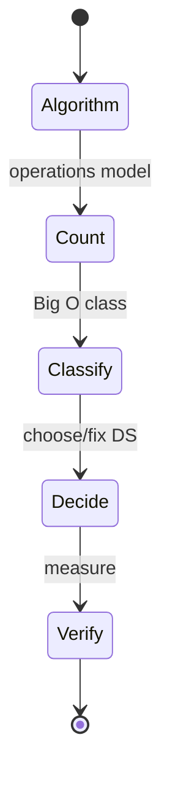
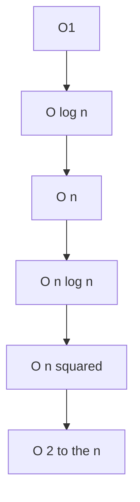

# Big O

<TopicMeta />

<Prerequisites />

::: tip Published
This page meets the handbook **published** bar: deep explanation, ≥10 common mistakes, and official references. Further engine-level errata welcome via PR.
:::

## Introduction

**Big O** notation describes an **upper bound** on how a function (usually time or space) grows as \(n \to \infty\), ignoring constants and lower-order terms. Saying “lookup is \(O(1)\) average” is shorthand from [time](/01-computer-science/time-complexity/) and [space](/01-computer-science/space-complexity/) analysis. Interviews obsess over it because it predicts scaling disasters.

## Why does it exist?

Engineers need a shared language to compare algorithms without quoting noisy benchmarks. Big O (with Ω and Θ) provides that vocabulary for asymptotic behavior.

## Historical Background

Bachmann–Landau notation entered algorithmics through Knuth and others. Informal “Big O talk” in industry often means “Θ of the dominant term” even when people say O.

## Mental Model

\(T(n) = O(f(n))\) means: there exist constants \(c > 0\) and \(n_0\) such that for all \(n \ge n_0\), \(0 \le T(n) \le c\cdot f(n)\).

- **O** — upper bound (“no worse than”)
- **Ω** — lower bound (“no better than”)
- **Θ** — tight bound (both)

Common classes: \(O(1), O(\log n), O(n), O(n\log n), O(n^2), O(2^n)\).

## Internal Workflow

1. Derive \(T(n)\) from loops/recursion ([time complexity](/01-computer-science/time-complexity/))
2. Drop constants (`3n² + 2n` → focus `n²`)
3. Write \(O(n^2)\) (and Θ when tight)
4. State case: best / average / worst when they differ
5. Cross-check with a quick experiment doubling \(n\)

## Lifecycle



## Browser Perspective

Event handlers and render paths need small Big O in \(n\) (DOM nodes, list length). \(O(n^2)\) layout thrashing (read/write interleaved) is a practical complexity bug.

## JavaScript Engine Perspective

Engine optimizations change \(c\), not the class, for straightforward algorithms. Pathological megamorphic code can worsen constants dramatically.

## React Perspective

Reconciling lists is roughly \(O(n)\) with keys; without stable keys, remounts amplify constants. Selecting all items with nested scans becomes \(O(n^2)\).

## Next.js Perspective

Build-time static generation over \(n\) pages is \(O(n)\) build work—Big O for CI minutes.

## Server Perspective

Per-request complexity × RPS = capacity planning. \(O(n)\) in request size needs body limits.

## Network Perspective

Protocols may be \(O(n)\) in payload; algorithmic Big O still applies to encode/decode.

## Memory Perspective

Quote space Big O separately: “\(O(n)\) time, \(O(1)\) aux space.” Hash maps trade \(O(n)\) space for faster time.

## Performance

Big O is necessary but not sufficient: for small \(n\), simpler \(O(n^2)\) can beat fancy \(O(n\log n)\) due to constants. Know your \(n\).

## Production Example

Autocomplete used linear scan over 200k products each keystroke (`O(n)` with large constant + React re-render). A trie/prefix index made per-keystroke \(O(k + m)\) for prefix length \(k\) and matches \(m\). Big O framed the redesign.

## Code Examples

```js
// Θ(n)
function linear(n) {
  let s = 0
  for (let i = 0; i < n; i++) s += i
  return s
}

// O(n²) upper bound; Θ(n²) tight
function quadratic(matrix) {
  const n = matrix.length
  let s = 0
  for (let i = 0; i < n; i++)
    for (let j = 0; j < n; j++) s += matrix[i][j]
  return s
}

// Binary search Θ(log n) comparisons on sorted array
function binarySearch(a, target) {
  let lo = 0, hi = a.length - 1
  while (lo <= hi) {
    const mid = (lo + hi) >> 1
    if (a[mid] === target) return mid
    if (a[mid] < target) lo = mid + 1
    else hi = mid - 1
  }
  return -1
}
```

```text
Pseudocode — drop lower terms

T(n) = 5n² + 100n + 1000
     = O(n²)   // also Θ(n²)
```

## Diagrams



## Common Mistakes

1. Saying \(O(n)\) when they mean Θ without knowing the difference
2. Claiming `Map` get is always \(O(1)\) worst-case (average for hash tables)
3. Ignoring that `Array.sort` is \(O(n\log n)\)
4. Using Big O to dismiss real 50ms constants on main thread
5. Forgetting multiple variables: \(O(nm)\) not everything is \(n\)
6. Summing nested loops as \(O(n+n)\) instead of \(O(n^2)\)
7. Confusing amortized vs worst-case (`push` in dynamic arrays)
8. Missing a production edge case for 01-computer-science.big-o (#1)
9. Missing a production edge case for 01-computer-science.big-o (#2)
10. Missing a production edge case for 01-computer-science.big-o (#3)


## Best Practices

- Always define \(n\)
- Prefer Θ when you know the tight bound
- Pair with measurements at realistic \(n\)
- Learn amortized analysis for resizable arrays/hash tables

## Anti-patterns

- Big-O theater in PRs without profiling or \(n\) stated
- Premature switch to exotic structures for \(n < 20\)
- “O(1)” caches that are actually \(O(n)\) scans

## Comparison

| Notation | Means |
| --- | --- |
| \(O(f)\) | ≤ \(c f\) eventually |
| \(\Omega(f)\) | ≥ \(c f\) eventually |
| \(\Theta(f)\) | both |

## Interview Questions

### Easy

**Q:** What does \(O(n)\) mean?

**A:** Runtime (or space) grows at most linearly with \(n\), up to a constant factor, for large \(n\).

### Medium

**Q:** Is \(n^2 + n = O(n^3)\)? Is it \(\Theta(n^3)\)?

**A:** Yes \(O(n^3)\) (upper bound holds). No not \(\Theta(n^3)\)—tight bound is \(\Theta(n^2)\).

### Hard

**Q:** Amortized \(O(1)\) `push` vs worst-case—why do interviews care?

**A:** Dynamic arrays occasionally resize (\(O(n)\) copy) but average cost per push over a sequence is \(O(1)\). Real-time UI may still hitch on a resize; know both views.

## Summary

- Big O upper-bounds growth; Θ is tight
- Drop constants/lower terms; define \(n\) and case
- Use with measurement for frontend decisions
- Next: [Data Structures](/01-computer-science/data-structures/)

## References

- [Wikipedia — Big O notation](https://en.wikipedia.org/wiki/Big_O_notation)
- CLRS — *Introduction to Algorithms*
- [MDN — Array sort complexity notes](https://developer.mozilla.org/en-US/docs/Web/JavaScript/Reference/Global_Objects/Array/sort)

<RelatedTopics />

Prev: [Space Complexity](/01-computer-science/space-complexity/) · Next: [Data Structures](/01-computer-science/data-structures/)
