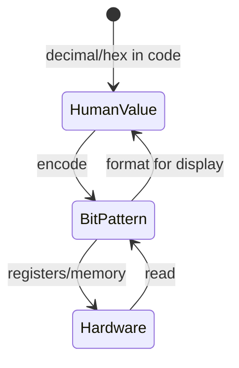
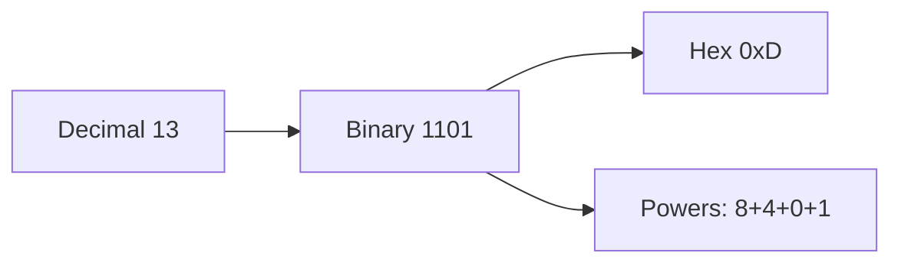

# Binary

<TopicMeta />

<Prerequisites />

::: tip Published
This page meets the handbook **published** bar: deep explanation, ≥10 common mistakes, and official references. Further engine-level errata welcome via PR.
:::

## Introduction

**Binary** is the base-2 number system: every digit is `0` or `1`. Digital hardware represents information as two stable physical states, so binary is the native language of CPUs, memory, and disks. Frontend engineers meet it in permissions bitmasks, color channels, `ArrayBuffer` views, and interview questions—even when day-to-day code stays in decimal and hex.

## Why does it exist?

Analog voltages are noisy; two clearly separated levels are robust. Encoding numbers, text, and instructions as patterns of bits lets one machine model (store, transmit, compute) serve every layer above. Without binary, there is no coherent story for [bits and bytes](/01-computer-science/bits-and-bytes/), addresses, or machine code.

## Historical Background

Binary arithmetic was formalized long before electronics (Boolean algebra, 19th century; binary analysis in earlier mathematics). Electronic computers from the mid-20th century standardized two-state logic. Hexadecimal (`0xFF`) later became the human-friendly grouping of four bits—still just binary underneath.

## Mental Model

Positional notation: digit value = digit × base^position.

```text
Decimal 13 = 1×10^1 + 3×10^0
Binary  1101 = 1×2^3 + 1×2^2 + 0×2^1 + 1×2^0 = 8+4+0+1 = 13
```

Groups:

- **1 bit** — yes/no
- **4 bits (nibble)** — one hex digit
- **8 bits (byte)** — common addressable unit (next topic)

Signed integers often use **two’s complement**: invert bits and add one for negation, so addition hardware stays simple.

## Internal Workflow

Converting decimal → binary (positive integers):

1. Divide by 2; record remainder
2. Repeat with quotient until 0
3. Read remainders bottom → top

Binary → decimal: sum `bit_i × 2^i`.

Bitwise ops (AND, OR, XOR, NOT, shifts) manipulate patterns without changing “number base”—they are Boolean ops on each bit position.

## Lifecycle



## Browser Perspective

DevTools and specs often show colors as `#RRGGBB` (hex) and permissions as bit flags. The browser does not “think in decimal”; encodings are binary in memory. Text codecs and WebAssembly are explicitly bit/byte oriented.

## JavaScript Engine Perspective

JavaScript numbers are IEEE-754 float64, but **bitwise operators** coerce to 32-bit signed integers, operate in two’s complement, then convert back. That surprises people who expect infinite-precision bit math. `BigInt` supports large integer bit ops without 32-bit wrap.

## React Perspective

Not applicable.

## Next.js Perspective

Not applicable.

## Server Perspective

Not applicable at the app layer beyond the same integer encodings in protocols and file formats.

## Network Perspective

Packets are bitstreams on the wire; hex dumps in Wireshark are binary grouped for humans. HTTP bodies are bytes (next topics), not “decimal numbers.”

## Memory Perspective

Each bit costs physical storage. Choosing compact encodings (flags in one byte vs twelve booleans) changes memory and cache behavior. Wrong signedness interpretations corrupt values when reading raw buffers.

## Performance

Bitsets and bit packing can be extremely fast (many flags per word, SIMD-friendly). Premature bit-twiddling in JS rarely beats clear algorithms—measure. Engine 32-bit coercion makes some bit tricks cheap, others wrong for values outside signed 32-bit range.

## Production Example

A feature-flag service returns an integer mask. The client checks `flags & FEATURE_NEW_CHECKOUT`. A bug used `&&` (logical) instead of `&` (bitwise), so any non-zero mask looked “fully on.” Fixing the operator restored per-flag behavior—binary literacy in one character.

## Code Examples

```js
// Decimal 13 as binary string
(13).toString(2) // "1101"

// Bit flags
const READ = 1 << 0 // 001
const WRITE = 1 << 1 // 010
const EXEC = 1 << 2 // 100
let perms = READ | WRITE // 011
const canWrite = (perms & WRITE) !== 0

// Two's complement surprise in JS bitwise
;(-1).toString(2) // lengthy two's complement via ToInt32 path in bit ops
(0xffffffff | 0) // -1  (signed 32-bit)
```

```text
Pseudocode — decimal to binary

function toBinary(n):
  if n == 0: return "0"
  digits = []
  while n > 0:
    digits.push(n mod 2)
    n = floor(n / 2)
  return reverse(digits).join("")
```

## Diagrams



## Common Mistakes

1. Confusing binary strings (`"10"`) with decimal ten
2. Using `&&`/`||` where `&`/`|` are required for flags
3. Forgetting JS bitwise ops use signed 32-bit integers
4. Misreading leading zeros as changing value (they don’t)
5. Assuming leftmost bit is always “the sign” without knowing width
6. Treating hex as unrelated to binary instead of 4-bit groups
7. Off-by-one when counting bit positions from 0
8. Missing a production edge case for 01-computer-science.binary (#1)
9. Missing a production edge case for 01-computer-science.binary (#2)
10. Missing a production edge case for 01-computer-science.binary (#3)


## Best Practices

- Prefer named flag constants and helpers over raw hex in app code
- Use hex in dumps; use binary when teaching powers of two
- Verify width (8/32/64) before shifting
- Learn two’s complement before debugging negative bit patterns

## Anti-patterns

- Encoding enums as overlapping bit flags without documentation
- Hand-rolled bit parsers for formats that have standard libraries
- Relying on `~` in JS without understanding 32-bit inversion

## Comparison

| Base | Digits | Role |
| --- | --- | --- |
| 2 binary | 0–1 | Hardware native |
| 10 decimal | 0–9 | Human default |
| 16 hex | 0–9A–F | Compact bit display |

## Interview Questions

### Easy

**Q:** Convert `10110`₂ to decimal.

**A:** 16+0+4+2+0 = **22**.

### Medium

**Q:** Why do JavaScript bitwise operators turn `0xffffffff` into `-1`?

**A:** Operands are converted to signed 32-bit two’s complement integers; all bits set is −1, not 2³²−1.

### Hard

**Q:** How would you store 10 boolean feature flags compactly and check one efficiently?

**A:** Pack into an integer/bitset; test with `(mask & (1 << k)) !== 0`; document bit assignments; consider `BigInt` if width exceeds 31 usable bits in JS signed ops—or use `Uint32Array`/explicit widths.

## Summary

- Binary is positional base-2; hardware’s native encoding
- Hex groups bits; flags use OR/AND masks
- JS bitwise ≠ math on unlimited integers
- Next: [Bits and Bytes](/01-computer-science/bits-and-bytes/)

## References

- [MDN — Bitwise operators](https://developer.mozilla.org/en-US/docs/Web/JavaScript/Guide/Expressions_and_operators#bitwise_operators)
- [ECMAScript — Number bitwise ops](https://tc39.es/ecma262/#sec-number-bitwise-ops)
- [IEEE 754 overview (MDN Number)](https://developer.mozilla.org/en-US/docs/Web/JavaScript/Reference/Global_Objects/Number)

<RelatedTopics />

Next: [Bits and Bytes](/01-computer-science/bits-and-bytes/)
