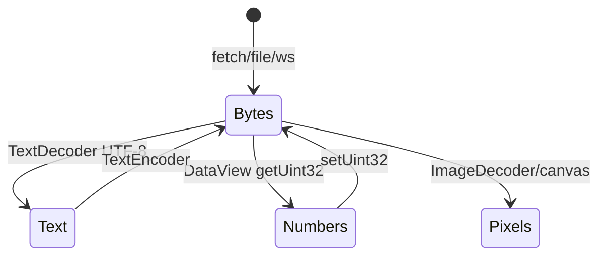
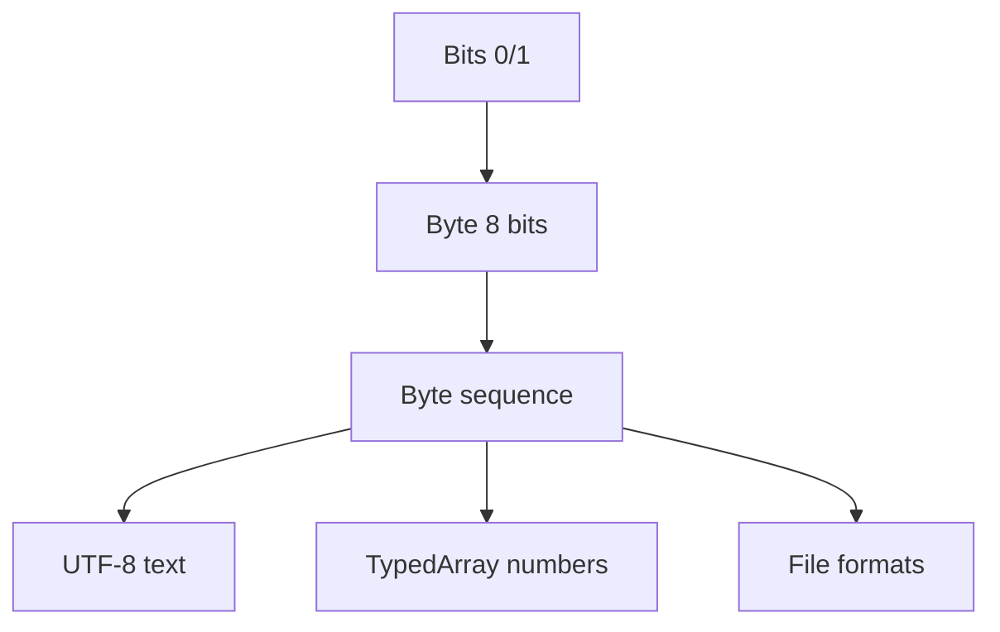

# Bits and Bytes

<TopicMeta />

<Prerequisites />

::: tip Published
This page meets the handbook **published** bar: deep explanation, ≥10 common mistakes, and official references. Further engine-level errata welcome via PR.
:::

## Introduction

A **bit** is one binary digit. A **byte** is eight bits—the standard addressable chunk in modern machines and the unit of almost every web API (`Content-Length`, `ArrayBuffer.byteLength`, disk sizes). This topic connects pure binary to the byte streams you actually ship and parse.

## Why does it exist?

Hardware and OSes needed a convention larger than one bit for addressing and buses. Eight-bit bytes won historically and stuck. Protocols, files, and JS binary APIs all speak bytes; confusing them with “characters” or “numbers” causes corruption and security bugs.

## Historical Background

Early computers used various word sizes. The 8-bit byte became dominant with microprocessors and networking. UTF-8 later encoded Unicode as a sequence of bytes, preserving ASCII compatibility—the text default of the web.

## Mental Model

```text
1 byte = 8 bits → values 0…255 (unsigned)
1 KiB = 1024 bytes (binary prefix)
1 KB = 1000 bytes (SI; storage marketing often mixes these)
```

Multi-byte integers need **endianness**: big-endian stores MSB first (network byte order); little-endian (x86/ARM userland common) stores LSB first. Strings need an **encoding** (UTF-8, UTF-16) mapping code points ↔ bytes.

## Internal Workflow

Typical frontend binary path:

1. Network/disk yields a byte sequence
2. Decide interpretation: text decode vs typed view
3. For multi-byte numbers, apply correct endianness
4. Operate with `Uint8Array` / `DataView` / `TextDecoder`
5. Re-encode to bytes before upload or WebSocket send

## Lifecycle



## Browser Perspective

`fetch` → `arrayBuffer()`, `Blob`, `File`, WebSockets with `ArrayBuffer`, WebGPU/WASM heaps—all byte-oriented. DevTools Network shows transferred bytes; gzip/br reduce wire bytes, not your logical UTF-8 size after decode.

## JavaScript Engine Perspective

Strings are sequences of UTF-16 code units internally (with complications for surrogate pairs). Binary data lives in `ArrayBuffer` backing stores viewed by TypedArrays. Engines manage buffer detachment (e.g. `postMessage` transfer) which makes views throw if used after transfer.

## React Perspective

Not applicable. Avoid stuffing large `ArrayBuffer`s into React state without need—retention follows component lifetime.

## Next.js Perspective

Not applicable beyond Node `Buffer` (Uint8Array subclass) on the server when reading files or responses.

## Server Perspective

Servers count bytes for bodies, multipart boundaries, and compression. Mismatch between `Content-Length` and actual bytes breaks clients.

## Network Perspective

Links move bits; APIs expose bytes. MTU and packetization are below you; application framing (HTTP body, WS messages) is in bytes. Endianness bites when implementing custom binary protocols.

## Memory Perspective

`byteLength` is the honest size. Base64 expands ~4/3; data URLs bloat further. Holding both compressed wire form and decoded strings doubles retention. Prefer streaming (`ReadableStream`) for large payloads.

## Performance

Copying buffers is expensive—use views, slicing carefully (slices may copy or share). Text encode/decode can dominate for large JSON-as-text; binary protocols or compression trade CPU for bandwidth.

## Production Example

A canvas export used `atob` on a large base64 PNG on the main thread, freezing input. Switching to `fetch` of a Blob URL + `createImageBitmap`, and measuring `byteLength`, removed the multi‑MB string inflate on the UI thread.

## Code Examples

```js
const buf = new ArrayBuffer(4)
const view = new DataView(buf)
view.setUint32(0, 0x01020304, false) // big-endian
;[...new Uint8Array(buf)] // [1, 2, 3, 4]

view.setUint32(0, 0x01020304, true) // little-endian
;[...new Uint8Array(buf)] // [4, 3, 2, 1]

const bytes = new TextEncoder().encode('前端')
new TextDecoder().decode(bytes)
```

```text
Pseudocode — interpret packet

function readPacket(bytes):
  type = bytes[0]
  length = u16_be(bytes[1], bytes[2])
  payload = bytes[3 : 3+length]
  return { type, payload }
```

## Diagrams



## Common Mistakes

1. Equating string `.length` with byte length (UTF-8 multibyte!)
2. Ignoring endianness in custom binary formats
3. Using `charCodeAt` hacks instead of `TextEncoder`
4. Confusing KiB/KB in budgets and alerts
5. Assuming Base64 is “binary safe storage” without size cost
6. Mutating a `Uint8Array` shared with a Worker after transfer
7. Parsing UTF-16LE as UTF-8 (mojibake)
8. Missing a production edge case for 01-computer-science.bits-and-bytes (#1)
9. Missing a production edge case for 01-computer-science.bits-and-bytes (#2)
10. Missing a production edge case for 01-computer-science.bits-and-bytes (#3)


## Best Practices

- Prefer `Uint8Array` + `DataView` for protocols
- Always specify encoding explicitly at boundaries
- Log `byteLength` in diagnostics for payloads
- Use compression metrics (wire vs decoded) separately

## Anti-patterns

- JSON-wrapping large binary as base64 by default
- Manual byte loops in JS for crypto (use Web Crypto)
- Silent truncation to “fit” fixed buffers

## Comparison

| Unit | Size | Typical use |
| --- | --- | --- |
| bit | 1 | Flags, masks |
| byte | 8 bits | Addressable storage, APIs |
| word | CPU-defined | Registers (see CPU) |

## Interview Questions

### Easy

**Q:** How many distinct values can one byte represent?

**A:** 2⁸ = **256** (e.g. 0–255 unsigned).

### Medium

**Q:** Why can `"🙂".length` be 2 in JavaScript while UTF-8 encoding is 4 bytes?

**A:** JS string length counts UTF-16 code units; many emoji are surrogate pairs (2 units). UTF-8 uses four bytes for that code point—different units.

### Hard

**Q:** Design a versioned binary message for WebSocket with minimal copying.

**A:** Header with version + length (explicit endian), payload as `Uint8Array` subarray view into the socket buffer when safe; use `DataView` for fields; transfer or stream large blobs; reject oversize `length` before allocate.

## Summary

- Bytes (8 bits) are the web’s working unit
- Endianness and text encoding define meaning
- TypedArrays/`DataView`/`TextEncoder` are the JS toolkit
- Next: [CPU](/01-computer-science/cpu/)

## References

- [MDN — ArrayBuffer](https://developer.mozilla.org/en-US/docs/Web/JavaScript/Reference/Global_Objects/ArrayBuffer)
- [MDN — TypedArray](https://developer.mozilla.org/en-US/docs/Web/JavaScript/Reference/Global_Objects/TypedArray)
- [MDN — TextEncoder](https://developer.mozilla.org/en-US/docs/Web/API/TextEncoder)
- [Unicode UTF-8](https://www.unicode.org/reports/tr36/) (see also UTF-8 standard docs)

<RelatedTopics />

Prev: [Binary](/01-computer-science/binary/) · Next: [CPU](/01-computer-science/cpu/)
