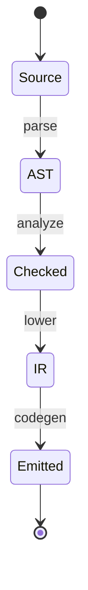

# Compiler

<TopicMeta />

<Prerequisites />

::: tip Published
This page meets the handbook **published** bar: deep explanation, ≥10 common mistakes, and official references. Further engine-level errata welcome via PR.
:::

## Introduction

A **compiler** translates programs from one representation to another—usually from human source code toward machine code or a lower intermediate form (IR)—performing analysis and optimizations along the way. Frontend engineers use compilers constantly: TypeScript → JS, JSX → calls, bundlers/minifyers, and JITs inside V8. This page is the CS backbone for [TypeScript Compiler](/07-typescript/compiler/) and [AST](/08-jsx-and-react-runtime/ast/) topics.

## Why does it exist?

CPUs execute machine instructions, not TypeScript. Compilers bridge abstraction and performance: catch errors early, optimize away redundancy, and target multiple platforms from one source. Without compilation/transforms, the modern TS/React toolchain would not exist.

## Historical Background

From mid-century machine code to assemblers to high-level language compilers (Fortran, C), then VMs with bytecode + JIT (Java, JS). Web toolchains added *source-to-source* compilers (transpilers) to ship compatible JS while editing newer syntax.

## Mental Model

Classic pipeline:

1. **Lex** — bytes → tokens
2. **Parse** — tokens → AST
3. **Semantic analysis** — types, scopes, bindings
4. **IR / transforms** — optimize, lower constructs
5. **Codegen** — emit machine code, bytecode, or JS text

AOT (ahead-of-time) vs JIT (just-in-time) differs *when* codegen runs, not the existence of analysis.

## Internal Workflow

Example: TypeScript `tsc`:

1. Parse `.ts` to AST
2. Typecheck against declarations
3. Emit `.js` (+ `.d.ts`) erasing types
4. Bundler may parse again, tree-shake, minify (more compiler passes)

Example: V8 TurboFan JIT:

1. Interpreter profiles hot functions
2. Optimizing compiler emits machine code for the [CPU](/01-computer-science/cpu/)
3. Deoptimize if assumptions fail → fall back

## Lifecycle



## Browser Perspective

Browsers compile JS/WASM for execution; they also parse HTML/CSS with separate engines. DevTools “Sources” may show mappings via **source maps**—a compiler artifact linking emitted code to originals.

## JavaScript Engine Perspective

Modern engines are compilers + [interpreters](/01-computer-science/interpreter/): Ignition bytecode then optimized tiers. Spec compliance constrains optimizations (observable semantics must hold).

## React Perspective

The JSX compiler (classic or automatic runtime) transforms markup syntax into `jsx()`/`createElement` calls. React Compiler (Forget) further memoizes under rules—still a compile-time transform.

## Next.js Perspective

Next’s build compiles app code with SWC/Turbopack/Webpack stacks—AOT for production bundles; server and client emit different graphs.

## Server Perspective

Build servers run compilers in CI; cold SSR may also compile or load precompiled bundles. Edge limits which transforms run at request time.

## Network Perspective

Compiler output size (minified/treeshaken) dominates download CPU/time. Dead code elimination is a network performance feature.

## Memory Perspective

Compiler processes themselves use heap for ASTs (large monorepos need memory headroom). At runtime, code objects and JIT tiers occupy memory; huge bundles increase both network and resident code.

## Performance

Optimize for: build time vs runtime speed vs safety. `skipLibCheck`, incremental builds, and SWC trade analysis depth for speed. Micro-optimizing source before measuring JIT/GC is usually waste.

## Production Example

A team’s Babel config double-compiled async (Babel + TS), inflating bundles and build times. Consolidating to TS + SWC cut CI by minutes and shrank output—compiler pipeline hygiene as performance work.

## Code Examples

```ts
// Input mental model
const add = (a: number, b: number) => a + b

// Emit erases types (illustrative)
// const add = (a, b) => a + b
```

```text
Pseudocode — compile pipeline

tokens = lex(source)
ast = parse(tokens)
check(ast, env)
ir = lower(ast)
opt = optimize(ir)
return codegen(opt)
```

## Diagrams


## Common Mistakes

1. Thinking TypeScript changes runtime semantics beyond emit (types erase)
2. Chaining redundant compilers that fight each other
3. Shipping without source maps then being unable to debug
4. Assuming JIT always makes naive code “fast enough”
5. Ignoring that `eval`/`with` limit optimization
6. Confusing bundler with typechecker responsibilities
7. Treating warnings as noise until production breaks
8. Missing a production edge case for 01-computer-science.compiler (#1)
9. Missing a production edge case for 01-computer-science.compiler (#2)
10. Missing a production edge case for 01-computer-science.compiler (#3)


## Best Practices

- One clear owner for transpile vs typecheck
- Keep source maps in staging; selective in prod
- Prefer standards-based emit targets knowingly
- Learn AST basics before writing codemods

## Anti-patterns

- Babel plugins that reparse minified code repeatedly
- Disabling typecheck in CI forever
- Hand-editing `dist/` outputs

## Comparison

| Kind | Input → Output | When |
| --- | --- | --- |
| AOT transpiler | TS → JS | Build time |
| Bundler | Modules → bundles | Build time |
| JIT | Bytecode → machine code | Runtime |
| Interpreter | Source/bytecode → execute | Runtime |

## Interview Questions

### Easy

**Q:** What does a compiler do?

**A:** It translates source into a lower or alternative form, often with analysis and optimization, so the program can run on a machine or VM.

### Medium

**Q:** How is TypeScript both a compiler and “just a typechecker”?

**A:** `tsc` parses and emits JS (compiler) and performs type analysis (checker). You can use `tsc --noEmit` for check-only, or other tools for emit.

### Hard

**Q:** Why might a function run slower after a “harmless” code change?

**A:** JIT assumptions (types, inline caches) may invalidate; megamorphic call sites; deoptimization loops; or bailouts from `try/catch` shapes—inspect with engine profilers, not only Big-O on source.

## Summary

- Compilers: lex → parse → analyze → transform → emit
- Web stacks layer AOT tools atop engine JITs
- Types erase; semantics live in emitted JS
- Next: [Interpreter](/01-computer-science/interpreter/)

## References

- [TypeScript Compiler Options](https://www.typescriptlang.org/tsconfig)
- [V8 — Ignition and TurboFan](https://v8.dev/docs/ignition)
- [ECMAScript specification](https://tc39.es/ecma262/)
- [SWC documentation](https://swc.rs/docs/getting-started)

<RelatedTopics />

Prev: [Event Loop (Runtime View)](/01-computer-science/event-loop-cs/) · Next: [Interpreter](/01-computer-science/interpreter/)
