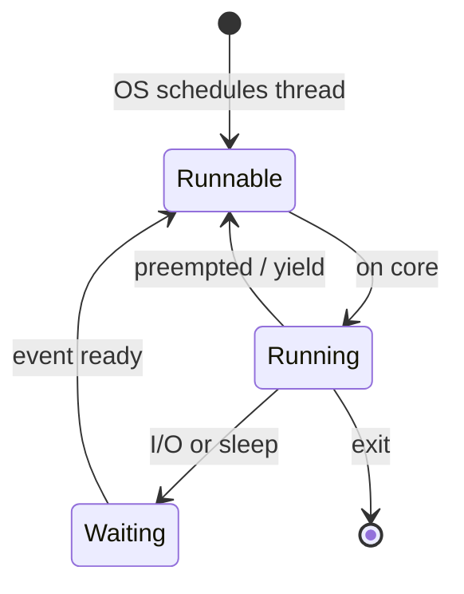
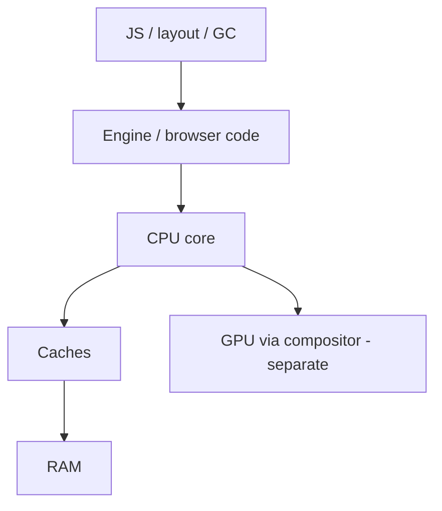

# CPU

<TopicMeta />

<Prerequisites />

::: tip Published
This page meets the handbook **published** bar: deep explanation, ≥10 common mistakes, and official references. Further engine-level errata welcome via PR.
:::

## Introduction

The **CPU (Central Processing Unit)** executes instructions: arithmetic, logic, branches, loads/stores. Your JavaScript, layout engine, and GC all eventually become CPU work on one or more cores. Understanding the CPU at a practical level explains why “100ms of JS” drops frames and why more cores do not automatically speed single-threaded React renders.

## Why does it exist?

Software is inert without a device that can fetch instructions and update machine state. The CPU concentrates general-purpose computation; GPUs and NPUs accelerate specialized workloads, but control flow, business logic, and most browser chrome still run on CPUs.

## Historical Background

From single-core frequency races to multi-core and wide superscalar designs, hardware shifted toward parallelism and cache hierarchies as clock scaling hit power walls. Browsers responded with multi-process/multi-thread architectures; JS remained largely single-threaded per realm, pushing heavy work to Workers or WASM.

## Mental Model

Classic cycle: **fetch → decode → execute → (memory access) → writeback**. Modern CPUs pipeline and speculate, but the programmer model is still: a core runs one instruction stream (a thread) at a time from its point of view.

Key ideas for frontend:

- **Core** — independent execution engine
- **Clock** — rough throughput budget; boost/throttle with thermals
- **Cache (L1/L2/L3)** — fast memory close to the core; misses go to RAM
- **Main thread** — one CPU thread where most page JS + style/layout run

## Internal Workflow

How a line of JS becomes CPU work (simplified):

1. Engine parses/compiles to bytecode or machine code ([compiler](/01-computer-science/compiler/), [interpreter](/01-computer-science/interpreter/))
2. CPU executes that code on a thread
3. Loads/stores hit caches or [memory](/01-computer-science/memory/)
4. Syscalls / host APIs trap into OS for I/O
5. Scheduler may preempt the thread; event loop resumes JS later

## Lifecycle



## Browser Perspective

Chromium assigns renderer main threads, compositor threads, and I/O to OS threads backed by CPU cores. A long JS task monopolizes the main thread’s core time → no input/paint handling → jank. Performance panel “CPU” timelines visualize this. See [Multi-Process Model](/03-browser/multi-process-model/).

## JavaScript Engine Perspective

Ignition/TurboFan (V8) etc. emit code the CPU runs. Speculative optimizations assume types; deoptimization burns CPU. GC pauses also consume CPU on mutator or helper threads depending on collector design.

## React Perspective

Render and commit are CPU-bound on the main thread (unless offloaded). Concurrent features time-slice work so the CPU can handle high-priority input. `useMemo` trades CPU now vs later—not free.

## Next.js Perspective

Server rendering consumes CPU on Node/Edge isolates. Cold start + SSR CPU can dominate TTFB; static generation shifts CPU to build time.

## Server Perspective

Request handlers compete for CPU with other tenants. CPU throttling in serverless shows up as higher latency variance.

## Network Perspective

Not applicable directly—networking waits are idle CPU unless you busy-poll (don’t).

## Memory Perspective

CPU and memory are coupled: poor locality → cache misses → stalled cycles. Large JS heaps increase GC CPU. Structure-of-arrays vs object graphs changes cache behavior.

## Performance

Budgets: ~16.7ms per frame at 60Hz for all main-thread work. Profile before optimizing. Prefer algorithmic fixes ([Big O](/01-computer-science/big-o/)) over micro-tweaks. Workers move CPU work off the main thread but add postMessage copy/transfer costs.

## Production Example

A dashboard sorted 50k rows on every keystroke on the main thread (heavy CPU). INP collapsed. Fix: debounce + sort in a Worker + incremental render. CPU time similar overall, but the main thread stayed responsive.

## Code Examples

```js
// Main-thread CPU hog (avoid in UI paths)
function busy(ms) {
  const end = performance.now() + ms
  while (performance.now() < end) {}
}

// Better: chunk work
async function chunked(items, process, signal) {
  const SIZE = 1000
  for (let i = 0; i < items.length; i += SIZE) {
    if (signal?.aborted) throw new DOMException('aborted', 'AbortError')
    items.slice(i, i + SIZE).forEach(process)
    await new Promise((r) => setTimeout(r, 0)) // yield to event loop
  }
}
```

```text
Pseudocode — instruction loop

loop:
  ir = fetch(pc)
  pc = pc + size(ir)
  execute(ir)
```

## Diagrams



## Common Mistakes

1. Believing more device cores speed single-threaded JS automatically
2. Busy-waiting instead of awaiting I/O
3. Optimizing cold microbenchmarks that engines optimize unrealistically
4. Ignoring CPU cost of JSON.parse on huge payloads
5. Running compression/crypto on the main thread synchronously
6. Confusing network latency with CPU time in traces
7. Assuming laptop turbo clocks match low-end mobile CPUs
8. Missing a production edge case for 01-computer-science.cpu (#1)
9. Missing a production edge case for 01-computer-science.cpu (#2)
10. Missing a production edge case for 01-computer-science.cpu (#3)


## Best Practices

- Attribute time with Performance profiles before changing code
- Keep interaction handlers under a few milliseconds when possible
- Move heavy CPU to Workers/WASM when justified
- Test on throttled CPU (DevTools) not only on dev machines

## Anti-patterns

- Tight `while` loops “waiting” for a flag
- Synchronous XHR (historically) or sync APIs blocking the core
- Unbounded recursion causing both CPU and stack overflow

## Comparison

| Unit | Role |
| --- | --- |
| CPU | General control + compute |
| GPU | Parallel graphics/compute |
| NPU/TPU | ML inference (when available) |

## Interview Questions

### Easy

**Q:** What does the CPU do?

**A:** It executes instructions—math, logic, branches, and memory access—advancing program state on a core.

### Medium

**Q:** Why can a page jank on a 8-core phone?

**A:** Critical UI JS/layout often runs on one main thread; other cores cannot take that stack unless work is explicitly parallelized (Workers, browser internals).

### Hard

**Q:** How do you decide between optimizing an algorithm vs moving work to a Worker?

**A:** Profile: if CPU is hot on main thread and work is separable/pure, Worker helps responsiveness even at similar total CPU; if algorithmic complexity is wasteful (e.g. O(n²)), fix that first—Workers won’t save energy or battery as effectively.

## Summary

- CPU executes the instructions behind JS and browser work
- Main-thread CPU time is a UX budget
- Cores ≠ automatic parallelism for JS
- Next: [Memory](/01-computer-science/memory/)

## References

- [MDN — Performance API](https://developer.mozilla.org/en-US/docs/Web/API/Performance_API)
- [web.dev — Optimize long tasks](https://web.dev/articles/optimize-long-tasks)
- [Chrome — Performance panel](https://developer.chrome.com/docs/devtools/performance/)

<RelatedTopics />

Prev: [Bits and Bytes](/01-computer-science/bits-and-bytes/) · Next: [Memory](/01-computer-science/memory/)
