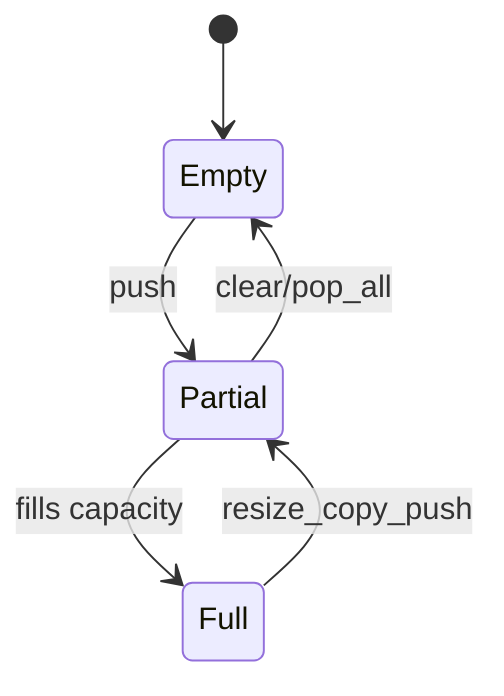
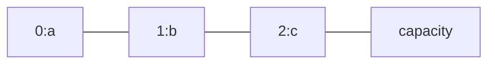

# Array

<TopicMeta />

<Prerequisites />

::: tip Published
This page meets the handbook **published** bar: deep explanation, ≥10 common mistakes, and official references. Further engine-level errata welcome via PR.
:::

## Introduction

An **array** stores elements in a contiguous (or logically contiguous) block addressable by integer index. Classical arrays give \(O(1)\) random access. JavaScript’s `Array` is a dynamic, specialized object—usually dense and fast, but not a fixed C buffer unless you use `TypedArray`.

## Why does it exist?

Indexed sequential data is everywhere: lists of DOM children, pixels, packets, table rows. Arrays match CPU cache lines and simple addressing: `base + i * size`.

## Historical Background

Fixed arrays came with early languages; dynamic arrays (vectors) added resizing. JS historically used object-like arrays; engines optimized dense indexed properties into elements kinds (packed/holey, SMI/double/elements).

## Mental Model

| Operation | Typical complexity |
| --- | --- |
| Get/set by index | \(O(1)\) |
| Append (amortized) | \(O(1)\) |
| Insert/delete at start | \(O(n)\) |
| Search unsorted | \(O(n)\) |

TypedArrays (`Uint8Array`, …) are true byte buffers. Sparse JS arrays with holes behave worse.

## Internal Workflow

Dynamic array push:

1. If capacity full, allocate larger backing store (~2×)
2. Copy elements (occasional \(O(n)\))
3. Write new element; length++

Amortized cost of many pushes remains \(O(1)\).

## Lifecycle



## Browser Perspective

Large arrays of objects retain heap graphs. Virtual lists keep DOM small while the array may still be huge in JS memory.

## JavaScript Engine Perspective

Element kinds matter: mixing types or creating holes can deoptimize. `slice`/`map` allocate new arrays—space \(O(n)\).

## React Perspective

`map` over arrays to children needs stable `key`s. Index keys hurt reorders. Immutable updates copy arrays (`[...arr, x]`)—\(O(n)\)—acceptable for small n, costly for huge lists each keystroke.

## Next.js Perspective

Not applicable beyond shipping JSON arrays as data.

## Server Perspective

Buffering request batches in arrays—bound length to avoid OOM.

## Network Perspective

JSON arrays decode to JS arrays (\(O(n)\) space). Prefer pagination.

## Memory Perspective

Capacity may exceed length after growth. TypedArrays pin `byteLength`. Avoid retaining stale giant arrays in closures.

## Performance

Prefer `push`/`pop` at end over `unshift`/`shift`. For binary data use TypedArrays. Iterate with simple loops when hot.

## Production Example

A grid used `array.unshift` for real-time events (10k/min), causing repeated \(O(n)\) moves and UI freezes. Switching to `push` + reverse render or a ring buffer fixed CPU.

## Code Examples

```js
const a = [10, 20, 30]
a[1] // O(1) → 20
a.push(40) // amortized O(1)
a.unshift(0) // O(n)

// Typed array bytes
const bytes = new Uint8Array([0xff, 0x00])
```

```text
Pseudocode — amortized push

function push(vec, x):
  if vec.len == vec.cap:
    newCap = max(1, vec.cap*2)
    newBuf = alloc(newCap)
    copy(vec.buf → newBuf)
    vec.buf = newBuf; vec.cap = newCap
  vec.buf[vec.len++] = x
```

## Diagrams



## Common Mistakes

1. Using `unshift` heavily on large arrays
2. Assuming JS arrays are always contiguous C arrays
3. Index-as-key in React for reorderable lists
4. Creating holes (`arr[1000]=1` on empty) unintentionally
5. Nested loops over the same array without need (\(O(n^2)\))
6. Copying giant arrays every render
7. Confusing `length` with capacity
8. Missing a production edge case for 01-computer-science.data-structures-array (#1)
9. Missing a production edge case for 01-computer-science.data-structures-array (#2)
10. Missing a production edge case for 01-computer-science.data-structures-array (#3)


## Best Practices

- Choose TypedArrays for numeric/binary buffers
- Grow at the end; use deques/rings for both ends
- Bound retained list sizes in UIs
- Prefer stable IDs as React keys

## Anti-patterns

- `array.splice(0,0,x)` in hot paths for queues
- Sparse arrays as maps (use `Map`)
- Sorting on every read without caching

## Comparison

| Structure | Access | Insert at head |
| --- | --- | --- |
| Array | \(O(1)\) | \(O(n)\) |
| Linked list | \(O(n)\) | \(O(1)\) |
| Map | \(O(1)\) avg by key | n/a |

## Interview Questions

### Easy

**Q:** Why is index access \(O(1)\)?

**A:** The address is computed as base + index × element size without scanning.

### Medium

**Q:** Why is repeated push amortized \(O(1)\) if resizing is \(O(n)\)?

**A:** Resizes are rare (geometric growth); average cost over a sequence of pushes is constant.

### Hard

**Q:** Implement a fixed-memory ring buffer for the last N events.

**A:** Backing array size N, head/tail indices mod N, overwrite oldest; \(O(1)\) append and \(O(1)\) space beyond N slots.

## Summary

- Arrays: indexed, fast random access, costly mid inserts
- JS arrays are dynamic; TypedArrays are byte buffers
- Amortized push vs costly unshift
- Next: [Linked List](/01-computer-science/data-structures/linked-list/)

## References

- [MDN — Array](https://developer.mozilla.org/en-US/docs/Web/JavaScript/Reference/Global_Objects/Array)
- [MDN — TypedArray](https://developer.mozilla.org/en-US/docs/Web/JavaScript/Reference/Global_Objects/TypedArray)
- [ECMAScript — Array objects](https://tc39.es/ecma262/#sec-array-objects)

<RelatedTopics />

Prev: [Data Structures](/01-computer-science/data-structures/) · Next: [Linked List](/01-computer-science/data-structures/linked-list/)
