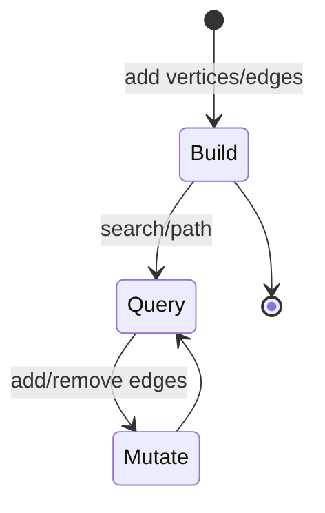
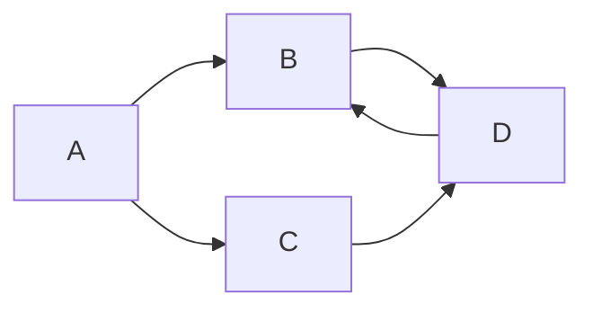

# Graph

<TopicMeta />

<Prerequisites />

::: tip Published
This page meets the handbook **published** bar: deep explanation, ≥10 common mistakes, and official references. Further engine-level errata welcome via PR.
:::

## Introduction

A **graph** is a set of **vertices (nodes)** plus **edges** connecting them. Trees are special graphs; general graphs allow shared neighbors, multiple parents, cycles, and disconnected components. Frontend examples: dependency graphs, route maps, knowledge graphs in this handbook, social/follow graphs, and module import graphs in bundlers.

## Why does it exist?

Real relationships are not always hierarchical. Cycles appear (A imports B imports A), and many-to-many links are common. Graph algorithms answer reachability, shortest path, and topological order questions.

## Historical Background

Euler’s bridges → modern graph theory → network algorithms (BFS, Dijkstra, PageRank). Bundlers and compilers rely on graph algorithms daily.

## Mental Model

- **Undirected vs directed**
- **Weighted vs unweighted**
- Representations:
  - **Adjacency list** — `Map<Node, Node[]>` (sparse-friendly)
  - **Adjacency matrix** — \(O(1)\) edge check, \(O(n^2)\) space

Algorithms: DFS/BFS, topo sort (DAGs), shortest paths, cycle detection.

## Internal Workflow

BFS for shortest hops in unweighted graphs:

1. Queue start; mark seen
2. Dequeue; visit neighbors
3. Enqueue unseen neighbors with distance+1
4. Until queue empty

Topo sort: Kahn’s algorithm (indegrees) or DFS finish times—fails if cycle.

## Lifecycle



## Browser Perspective

Not a browser primitive—but DevTools performance/dependency tooling visualizes graphs. Service worker / navigation sometimes modeled as state graphs.

## JavaScript Engine Perspective

Module graphs are resolved by runtimes/bundlers before execution order is fixed (especially cyclic ESM/CJS nuances).

## React Perspective

State update dependency graphs appear in effects and data libraries. Avoid cyclic `useEffect` triggers—logical cycles.

## Next.js Perspective

Route segments and import graphs affect bundles/code-splitting. Circular imports cause subtle init bugs.

## Server Perspective

Microservices call graphs; BFS/DFS intuition helps debugging transitive outages.

## Network Perspective

Physical/logical networks are graphs; overlays (CDNs) change paths—useful metaphor, deeper in Internet module.

## Memory Perspective

Adjacency lists are \(O(n+m)\); matrices \(O(n^2)\). Retaining whole graphs of entities in client memory needs pagination/windowing.

## Performance

Sparse graphs → lists. Dense → matrix maybe. Shortest path with weights needs Dijkstra/A* not BFS. Cycle detection prevents infinite DFS.

## Production Example

A monorepo bundler hung on circular dependencies during init. Visualizing the import graph and breaking a cycle with a type-only import fixed startup. Graph literacy beat random file moves.

## Code Examples

```js
function buildAdj(edges, directed = false) {
  const adj = new Map()
  const add = (a, b) => {
    if (!adj.has(a)) adj.set(a, [])
    adj.get(a).push(b)
  }
  for (const [u, v] of edges) {
    add(u, v)
    if (!directed) add(v, u)
  }
  return adj
}

function bfs(adj, start) {
  const seen = new Set([start])
  const q = [start]
  const order = []
  while (q.length) {
    const u = q.shift()
    order.push(u)
    for (const v of adj.get(u) ?? []) {
      if (!seen.has(v)) {
        seen.add(v)
        q.push(v)
      }
    }
  }
  return order
}
```

```text
Pseudocode — cycle detect directed DFS

color = map node → WHITE
function dfs(u):
  color[u]=GRAY
  for v in adj[u]:
    if color[v]==GRAY: return CYCLE
    if color[v]==WHITE and dfs(v)==CYCLE: return CYCLE
  color[u]=BLACK
  return OK
```

## Diagrams



## Common Mistakes

1. Forgetting `seen` sets → infinite loops on cycles
2. Using BFS for weighted shortest paths
3. Building \(O(n^2)\) matrices for sparse data
4. Assuming import graphs are trees
5. Mutating adjacency while iterating without care
6. Confusing undirected algorithms on directed data
7. Not handling disconnected components
8. Missing a production edge case for 01-computer-science.data-structures-graph (#1)
9. Missing a production edge case for 01-computer-science.data-structures-graph (#2)
10. Missing a production edge case for 01-computer-science.data-structures-graph (#3)


## Best Practices

- Store graphs as adjacency lists by default
- Explicitly document directed/weighted
- Run cycle checks on user-defined dependency UIs
- Separate visualization layout from graph data model

## Anti-patterns

- Deep recursive DFS on huge graphs in the browser
- Stringly-typed node ids without normalization
- Recomputing full paths every keystroke without cache

## Comparison

| | Tree | Graph |
| --- | --- | --- |
| Parents | ≤1 | Many |
| Cycles | No | Possible |
| Components | One (usually) | Many |

## Interview Questions

### Easy

**Q:** How do you represent a sparse graph?

**A:** Adjacency lists: for each vertex, store its neighbor list—space \(O(n+m)\).

### Medium

**Q:** Why does BFS find shortest paths in unweighted graphs?

**A:** It explores in layers of hop count; the first time you reach a node is via a minimum number of edges.

### Hard

**Q:** Detect a cycle in a directed graph and return one cycle path.

**A:** DFS with colors (WHITE/GRAY/BLACK); on back edge to GRAY, reconstruct cycle via parent pointers; O(n+m).

## Summary

- Graphs generalize trees with cycles and many-to-many edges
- Adjacency lists + BFS/DFS are the workhorse toolkit
- Bundlers, deps, and routes are graph problems
- Next: [Algorithms](/01-computer-science/algorithms/)

## References

- [MDN — Map](https://developer.mozilla.org/en-US/docs/Web/JavaScript/Reference/Global_Objects/Map) (adjacency)
- CLRS — elementary graph algorithms
- [Wikipedia — Graph theory](https://en.wikipedia.org/wiki/Graph_theory) (orientation)

<RelatedTopics />

Prev: [Tree](/01-computer-science/data-structures/tree/) · Next: [Algorithms](/01-computer-science/algorithms/)
