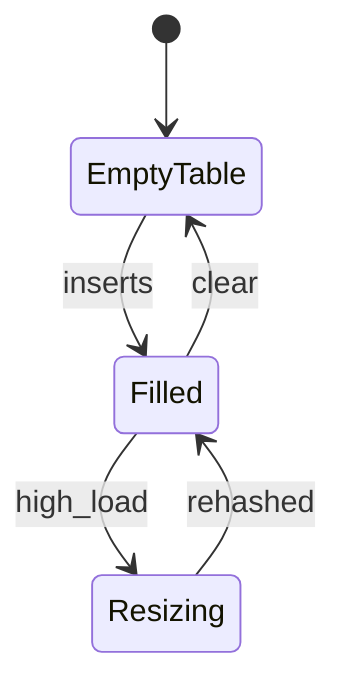
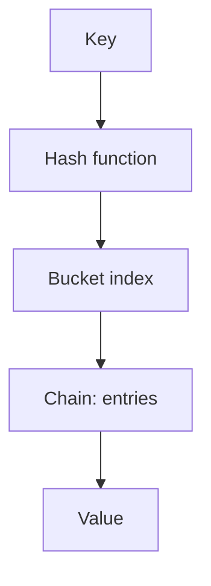

# Hash Table

<TopicMeta />

<Prerequisites />

::: tip Published
This page meets the handbook **published** bar: deep explanation, ≥10 common mistakes, and official references. Further engine-level errata welcome via PR.
:::

## Introduction

A **hash table** (hash map) stores key→value entries in buckets indexed by a **hash function**. Average `get`/`set`/`delete` is \(O(1)\); worst case degrades to \(O(n)\) with collisions. In JavaScript you use `Map`, `Set`, and objects—each with different key rules.

## Why does it exist?

Associative lookup is ubiquitous: indexes by id, caches, counting, graph adjacency via maps. Trees give \(O(\log n)\); hashes chase constant time with more memory and hashing craft.

## Historical Background

Hashing mid-20th century; chaining vs open addressing; dynamic resizing. JS objects began as string-key maps; `Map` (ES2015) added arbitrary keys and reliable size/iteration.

## Mental Model

1. `hash(key) → integer`
2. `bucket = integer mod capacity`
3. Resolve collisions (chain list/tree, or probe)
4. Resize when load factor grows

| Structure | Keys | Notes |
| --- | --- | --- |
| `Object` | String/symbol | Prototype inherited keys risk |
| `Map` | Any | Better for frequent add/remove |
| `Set` | Unique keys | Values = keys |

## Internal Workflow

Insert sketch (chaining):

1. Compute hash; find bucket
2. Search chain for equal key → replace
3. Else append entry
4. If `size/capacity > loadFactor`, allocate larger table, rehash all

## Lifecycle



## Browser Perspective

Objects/Maps hold retainers—caches must evict. `WeakMap` keys do not prevent GC of key objects.

## JavaScript Engine Perspective

Objects optimize property access via hidden classes/shapes; `Map` uses a hash table implementation suited to dynamic keys. Mixing them wrong hurts clarity more than microperf for most apps.

## React Perspective

Normalize entities into `Map`/records by id for \(O(1)\) updates instead of `array.find` (\(O(n)\)) each render path.

## Next.js Perspective

Not applicable specifically—same JS maps on server/client.

## Server Perspective

Beware unbounded Maps as request caches (memory DoS). Hash flood attacks historically mattered for attacker-controlled keys—modern runtimes randomize seeds.

## Network Perspective

Not applicable.

## Memory Perspective

Tables over-allocate buckets. Each entry has overhead. Space is typically \(O(n)\). Weak variants help non-owning associations.

## Performance

Average \(O(1)\) assumes good hash + resizing. For tiny n, arrays can be faster. Iteration order: `Map` is insertion order; object key order has historical quirks—prefer `Map` when order matters.

## Production Example

A storefront used `products.find(p => p.id === id)` in nested loops (\(O(n)\) per lookup). Building `const byId = new Map(products.map(p => [p.id, p]))` made cart resolution \(O(1)\) per line item.

## Code Examples

```js
const counts = new Map()
for (const ch of 'banana') {
  counts.set(ch, (counts.get(ch) ?? 0) + 1)
}

// Object pitfall
const o = Object.create(null) // no prototype
o['__proto__'] // undefined, safer dictionary

// WeakMap
const wm = new WeakMap()
let el = {}
wm.set(el, 'meta')
el = null // entry eligible for GC
```

```text
Pseudocode — get with chaining

function get(table, key):
  b = hash(key) mod table.cap
  for entry in table.buckets[b]:
    if entry.key == key: return entry.value
  return NOT_FOUND
```

## Diagrams



## Common Mistakes

1. Using objects with user keys without `Object.create(null)` / `Map`
2. Assuming worst-case \(O(1)\) always
3. Forgetting to delete from caches
4. Using `{}` when key equality must be by reference (`Map`/`WeakMap`)
5. `JSON.stringify` keys as fake composites without care
6. Iterating object and hitting inherited properties (`for..in`)
7. Expecting `WeakMap` to be enumerable/sizeable (it isn’t)
8. Missing a production edge case for 01-computer-science.data-structures-hash-table (#1)
9. Missing a production edge case for 01-computer-science.data-structures-hash-table (#2)
10. Missing a production edge case for 01-computer-science.data-structures-hash-table (#3)


## Best Practices

- Prefer `Map`/`Set` for collections that grow/shrink a lot
- Bound caches; consider LRU
- Use `WeakMap` for DOM↔meta associations
- Define equality clearly (value vs reference keys)

## Anti-patterns

- Nested objects as deep maps without normalization
- Relying on key order of plain objects for logic
- Growing a Map per keystroke without eviction

## Comparison

| | Hash table | Balanced tree map |
| --- | --- | --- |
| Lookup | \(O(1)\) avg | \(O(\log n)\) |
| Ordered keys | Extra work | Natural |
| Worst case | \(O(n)\) | \(O(\log n)\) |

## Interview Questions

### Easy

**Q:** What average complexity does a hash map give for lookup?

**A:** \(O(1)\) average under uniform hashing and resizing; \(O(n)\) worst case.

### Medium

**Q:** How do hash tables handle collisions?

**A:** Chaining (list/tree per bucket) or open addressing (probe for next slot); both need good load-factor management.

### Hard

**Q:** Design a typeahead index for 100k strings.

**A:** For prefixes, a trie or prefix hash of n-grams beats scanning; a hash map from prefix→list works for bounded prefix lengths with memory trade-offs; discuss space, update cost, and ranking.

## Summary

- Hash tables map keys→values via hashing + collision strategy
- JS: prefer `Map`/`Set`; careful with object dictionaries
- Average \(O(1)\), memory \(O(n)\), bound caches
- Next: [Tree](/01-computer-science/data-structures/tree/)

## References

- [MDN — Map](https://developer.mozilla.org/en-US/docs/Web/JavaScript/Reference/Global_Objects/Map)
- [MDN — WeakMap](https://developer.mozilla.org/en-US/docs/Web/JavaScript/Reference/Global_Objects/WeakMap)
- [ECMAScript — Map objects](https://tc39.es/ecma262/#sec-map-objects)

<RelatedTopics />

Prev: [Queue](/01-computer-science/data-structures/queue/) · Next: [Tree](/01-computer-science/data-structures/tree/)
