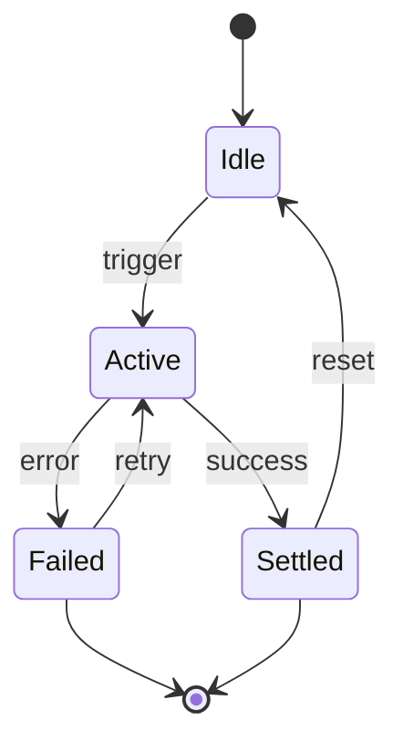
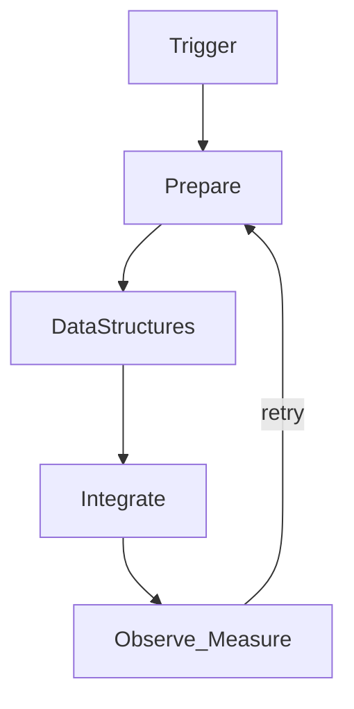
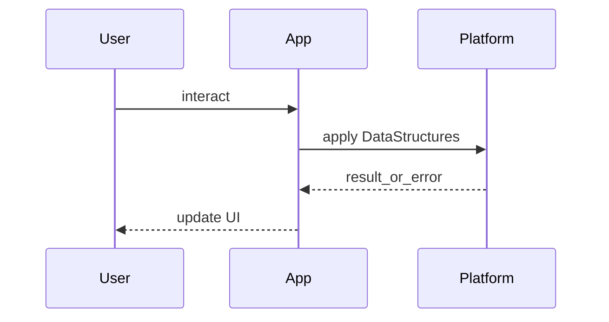

# Data Structures

<TopicMeta />

<Prerequisites />

::: tip Published
This page meets the handbook **published** bar: deep explanation, ≥10 common mistakes, and official references. Further engine-level errata welcome via PR.
:::

## Introduction

**Data Structures** (`01-computer-science.data-structures`) is covered in the `01-computer-science` module. This draft explains what it is, the problem it solves, the steps the system takes, and the mistakes that show up in real products.

Prerequisites to revisit first:

- `01-computer-science.big-o`

## Why does it exist?

Data Structures exists as a foundational machine/algorithm idea that higher web layers assume. Frontend systems inherit its constraints (CPU, memory, scheduling, complexity).

Typical pain without understanding Data Structures:

- incorrect ordering / races
- hidden performance cost
- security or accessibility regressions
- APIs used as superstition instead of tools

## Historical Background

Ideas behind Data Structures predate the web — they come from classical computer science and operating systems. The browser and JS ecosystems reuse these models (memory, processes, complexity) rather than inventing new physics.

Knowing the “before” state stops cargo-cult usage: adopt Data Structures for its original problem, not because a template imported it.

## Mental Model

Hold four cards for Data Structures:

1. **When it applies** — preconditions and inputs
2. **What runs** — the algorithm, protocol, or framework phase
3. **What you observe** — DOM, network, CPU, UX, or build output
4. **How it fails** — errors, timeouts, partial updates, unsupported engines

If you can teach those four cards without reading notes, your mental model is solid.

## Internal Workflow

Operational steps for Data Structures:

1. **Trigger** — navigation, user event, build, deploy, or system callback
2. **Prepare** — validate inputs, environment, auth, and configuration
3. **Execute** — run the core behavior unique to Data Structures
4. **Publish** — surface results to UI, network, disk, or downstream systems
5. **Cleanup** — release resources, settle promises, update caches, schedule follow-ups

Engines optimize the middle steps; your job is to keep the observable semantics correct.

## Lifecycle

Lifecycle of Data Structures in an application:



- **Idle** — defined but not doing work
- **Active** — running the mechanism
- **Settled/Failed** — terminal for this attempt; may restart on a new trigger

## Browser Perspective

Browsers are multi-process, multi-thread programs. Understanding Data Structures clarifies jank, memory limits, and why some APIs are async.

## JavaScript Engine Perspective

JavaScript engines and OSs implement these CS ideas underneath your code. Data Structures explains the machine model your runtime depends on.

## React Perspective

Not applicable.

## Next.js Perspective

Not applicable.

## Server Perspective

Not applicable.

## Network Perspective

Not applicable.

## Memory Perspective

Data Structures interacts with memory through allocations, references, and lifetimes. Prefer clarifying:

- what is stored on the **stack** vs **heap**
- which references keep objects alive (closures, DOM nodes, caches, global registries)
- when memory is released (GC) or explicitly revoked (buffers, object URLs, subscriptions)

Leaks related to Data Structures usually come from forgotten listeners, unbounded caches, or retaining large detached DOM trees.

## Performance

Performance implications of Data Structures:

- **CPU** — algorithmic work, parsing, layout, or encryption
- **Latency** — network RTTs, scheduling delay, hydration
- **Throughput** — how much work per frame (16ms budget) or per request
- **Memory** — retained size and GC pressure

Optimization strategy: measure → attribute → change one variable → remeasure. Trade-offs are normal; faster paths may cost complexity or freshness.

## Production Example

In production, a team might use Data Structures when shipping a user-facing feature that must remain correct under slow networks, busy main threads, and repeated navigations. They document the invariant, add monitoring around the failure modes, and gate risky changes behind a feature flag.

Example scenario: a checkout or dashboard view depends on correct handling of Data Structures. The team adds logging/metrics for the failure path, an integration test for the happy path, and a performance budget if Data Structures sits on the critical rendering or interaction path.

## Code Examples

```text
Pseudocode — Data Structures

function demonstrate(input):
  prepare machine resources
  apply the core idea of Data Structures
  measure time/space cost
  return result
```

```js
// JS-level intuition: costs show up as CPU time, allocations, or latency
function roughCost(n) {
  let total = 0
  for (let i = 0; i < n; i++) total += i
  return total
}
```

## Diagrams





## Common Mistakes

1. Treating Data Structures as a buzzword without a concrete mental model
2. Copying a snippet involving Data Structures without understanding failure modes
3. Optimizing Data Structures before measuring where time/memory actually go
4. Ignoring browser/runtime differences when Data Structures depends on platform APIs
5. Mixing responsibilities — letting Data Structures leak across unrelated layers
6. Confusing asymptotic complexity with real wall-clock performance on small n
7. Missing a production edge case for 01-computer-science.data-structures (#1)
8. Missing a production edge case for 01-computer-science.data-structures (#2)
9. Missing a production edge case for 01-computer-science.data-structures (#3)
10. Missing a production edge case for 01-computer-science.data-structures (#4)


## Best Practices

- Define the invariant Data Structures is supposed to preserve
- Keep the happy path obvious; make failures explicit
- Prefer platform primitives before custom frameworks of your own
- Cross-link related handbook topics instead of duplicating canonical explanations
- Add tests or telemetry where breakage is user-visible

## Anti-patterns

- Abstracting Data Structures before you have two real use cases
- Silent fallbacks that hide broken behavior
- Global mutable singletons that make Data Structures impossible to reason about
- “We’ll fix types/tests/security later” on the critical path

## Comparison

| Approach | Strength | Weakness |
| --- | --- | --- |
| Using Data Structures as designed | Clear semantics, ecosystem support | Must learn the model |
| Ad-hoc workaround | Fast short-term | Fragile, hard to teach |
| Over-abstracted wrapper | Feels tidy locally | Hides costs and edge cases |

When peers exist (e.g. SSR vs CSR, TCP vs UDP, `useEffect` vs events), prefer the handbook’s dedicated comparison topics and link them from here.

## Interview Questions

### Easy

**Q:** What is Data Structures in one or two sentences?

**A:** Explain the core definition, the problem it solves, and where it sits in the stack (language, browser, network, or framework).

### Medium

**Q:** Walk through what happens step-by-step when Data Structures is involved in a typical page load or user interaction.

**A:** Narrate the pipeline (network → browser → JS → render/framework) and call out at least one failure mode.

### Hard

**Q:** What trade-offs does Data Structures introduce in production, and how would you measure/validate a change related to it?

**A:** Discuss performance, complexity, security/a11y if relevant, rollout strategy, and metrics (lab + RUM).

## Summary

- Data Structures solves a concrete class of problems in `01-computer-science`
- Hold a mental model of inputs → mechanism → effects → failures
- Measure production impact; do not optimize by folklore
- Use prerequisites and related topics to build a graph, not isolated facts

## References

- [CPU — Wikipedia overview for orientation](https://en.wikipedia.org/wiki/Central_processing_unit)
- Prefer course notes / CLRS / OS texts for deeper study; link official specs when a web API is involved.

<RelatedTopics />


Prev: [Big O](/01-computer-science/big-o/) · Next: [Array](/01-computer-science/data-structures/array/)
