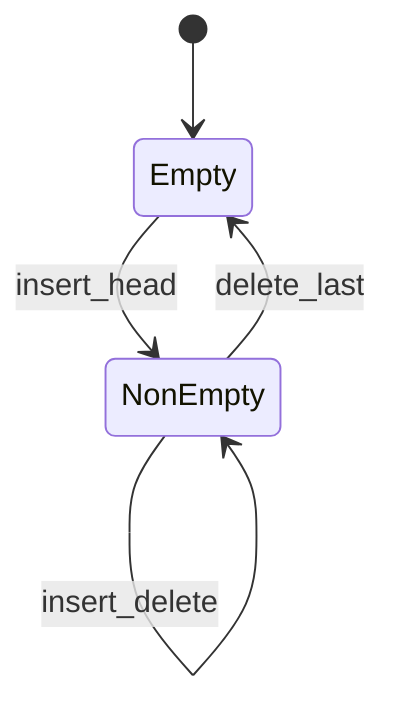
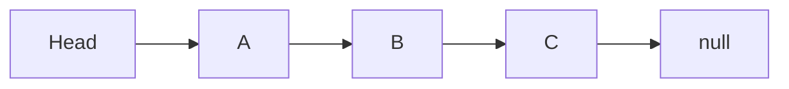

# Linked List

<TopicMeta />

<Prerequisites />

::: tip Published
This page meets the handbook **published** bar: deep explanation, ≥10 common mistakes, and official references. Further engine-level errata welcome via PR.
:::

## Introduction

A **linked list** stores elements in nodes where each node points to the next (and optionally previous). Unlike [arrays](/01-computer-science/data-structures/array/), nodes need not be contiguous. You trade random access for cheap splice at a known node. JS rarely needs hand-rolled lists—engines’ arrays win—but lists teach pointers, interviews, and some real LRU cache designs.

## Why does it exist?

Frequent insert/delete in the middle of sequences is expensive in arrays (\(O(n)\) moves). Lists splice with pointer updates (\(O(1)\) given a node reference). They also underpin stacks/queues and hash table chaining.

## Historical Background

Linked structures date to early list processing (Lisp). Intrusive lists appear in kernels. On the web, abstract list algorithms show up more than custom `Node` classes.

## Mental Model

- **Singly linked** — `next` only
- **Doubly linked** — `next` + `prev` (LRU-friendly)
- Access by index — \(O(n)\) walk
- Insert after node — \(O(1)\)

Head (and tail) references define ends.

## Internal Workflow

Insert after node `n`:

1. Create node `x`
2. `x.next = n.next`
3. `n.next = x`
4. If doubly linked, fix `prev` pointers

Delete similarly by rewiring neighbors.

## Lifecycle



## Browser Perspective

DOM is a tree, not a linked list, but sibling pointers feel list-like. Still, prefer array methods for app data.

## JavaScript Engine Perspective

Pointer-chasing lists hurt CPU caches vs contiguous arrays. That is why arrays dominate JS performance advice.

## React Perspective

Not applicable for component trees (those are trees/fibers). List UI data should usually stay arrays.

## Next.js Perspective

Not applicable.

## Server Perspective

Occasionally used in specialized queues; otherwise same cache-locality warning.

## Network Perspective

Not applicable.

## Memory Perspective

Per-node object overhead in JS is large (header + refs). A list of 1M integers as nodes wastes far more RAM than a `Float64Array`.

## Performance

Prefer arrays unless you need many middle splices *and* already hold node references (rare in JS). For LRU, a `Map` + doubly linked list (or `Map` insertion order) is a known pattern.

## Production Example

An interview-turned-prod LRU used only `Array#splice` to move items to front (\(O(n)\) per access). Under load it melted. A Map-based LRU (insertion order) restored \(O(1)\) average ops.

## Code Examples

```js
class Node {
  constructor(value, next = null) {
    this.value = value
    this.next = next
  }
}

function prepend(head, value) {
  return new Node(value, head)
}

function find(head, predicate) {
  let cur = head
  while (cur) {
    if (predicate(cur.value)) return cur
    cur = cur.next
  }
  return null
}
```

```text
Pseudocode — reverse singly list

function reverse(head):
  prev = null
  cur = head
  while cur:
    next = cur.next
    cur.next = prev
    prev = cur
    cur = next
  return prev
```

## Diagrams



## Common Mistakes

1. Losing the head reference while iterating
2. Forgetting to update `prev` in doubly linked deletes
3. Using lists in JS for indexed access-heavy workloads
4. Creating cycles accidentally and infinite looping
5. Off-by-one when finding the nth node
6. Not handling empty-list edge cases
7. Confusing “O(1) insert” with “O(1) find then insert”
8. Missing a production edge case for 01-computer-science.data-structures-linked-list (#1)
9. Missing a production edge case for 01-computer-science.data-structures-linked-list (#2)
10. Missing a production edge case for 01-computer-science.data-structures-linked-list (#3)


## Best Practices

- Keep head/tail pointers when you need both ends
- Detect cycles (Floyd) when inputs may be hostile
- Prefer `Map`/arrays in application JS unless profiling says otherwise
- Draw pointer updates before coding

## Anti-patterns

- Linked list of React components
- Using lists to emulate arrays of indices
- Recursive reverse on huge lists (stack overflow)

## Comparison

| | Array | Linked list |
| --- | --- | --- |
| Access i-th | \(O(1)\) | \(O(n)\) |
| Insert at head | \(O(n)\) / unshift | \(O(1)\) |
| Locality | Excellent | Poor |
| Overhead | Low | High in JS |

## Interview Questions

### Easy

**Q:** What is the time to access the k-th element in a singly linked list?

**A:** \(O(k)\) / \(O(n)\) — must walk nodes.

### Medium

**Q:** How do you detect a cycle?

**A:** Floyd’s tortoise/hare: slow one step, fast two; meeting implies a cycle.

### Hard

**Q:** Implement LRU cache with O(1) get/put.

**A:** Hash map from key → node plus doubly linked list for recency order; on get, move node to head; on put capacity eviction, remove tail. In modern JS, `Map` insertion order can simulate much of this.

## Summary

- Lists excel at pointer splices, lose at random access and locality
- In JS apps, arrays/`Map` usually win
- Still essential for interviews and some cache designs
- Next: [Stack (Data Structure)](/01-computer-science/data-structures/stack-ds/)

## References

- [MDN — Map (ordered)](https://developer.mozilla.org/en-US/docs/Web/JavaScript/Reference/Global_Objects/Map)
- CLRS — linked lists chapter
- [Wikipedia — Linked list](https://en.wikipedia.org/wiki/Linked_list)

<RelatedTopics />

Prev: [Array](/01-computer-science/data-structures/array/) · Next: [Stack (Data Structure)](/01-computer-science/data-structures/stack-ds/)
