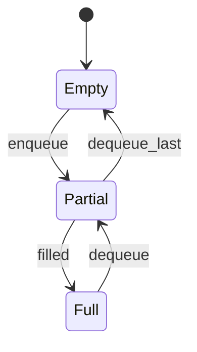
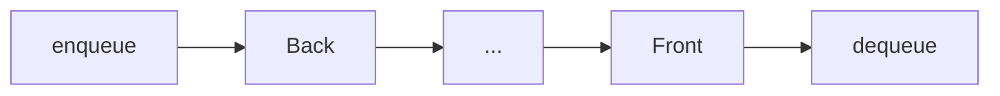

# Queue

<TopicMeta />

<Prerequisites />

::: tip Published
This page meets the handbook **published** bar: deep explanation, ≥10 common mistakes, and official references. Further engine-level errata welcome via PR.
:::

## Introduction

A **queue** is First-In, First-Out: `enqueue` at the back, `dequeue` at the front. Task scheduling, printers, BFS, and the host [event loop](/01-computer-science/event-loop-cs/) all rest on queue ideas. In JS, naive `array.shift()` queues are easy and often too slow for hot paths.

## Why does it exist?

Fair ordering: the earliest waiter should proceed first. Algorithms that expand frontiers layer by layer (BFS) need FIFO. Producer-consumer systems buffer work in queues.

## Historical Background

Queues are classic ADTs alongside stacks. OS schedulers and network buffers use variants (priority queues, deques). Browser task queues are specialized host queues.

## Mental Model

```text
enqueue(x): add to back
dequeue(): remove from front
peek(): front element
```

| Implementation | enqueue | dequeue |
| --- | --- | --- |
| Array + `push`/`shift` | \(O(1)\) am. | \(O(n)\) |
| Ring buffer | \(O(1)\) | \(O(1)\) |
| Linked list head/tail | \(O(1)\) | \(O(1)\) |

## Internal Workflow

Ring buffer:

1. Store `buf`, `head`, `tail`, `size`
2. Enqueue at `tail`; advance `tail % capacity`
3. Dequeue at `head`; advance `head`
4. Reject or resize when full

## Lifecycle



## Browser Perspective

Macrotask/microtask queues schedule callbacks—conceptual queues with priority rules. See [Task Queue](/03-browser/task-queue/). UI event queues drop/coalesce some events under pressure.

## JavaScript Engine Perspective

Job queues for promises are queues drained under host rules. Your app-level queues are ordinary data structures.

## React Perspective

React’s internal lanes/queues schedule updates—do not reimplement; know FIFO intuition for “who runs first.”

## Next.js Perspective

Not applicable as a framework feature; server job queues are infra.

## Server Perspective

Job/message queues (Redis, SQS) are distributed cousins—same FIFO/priority ideas with durability.

## Network Perspective

Packet queues in stacks/routers; application backpressure when queues grow.

## Memory Perspective

Unbounded queues = memory leaks under fast producers. Always bound or apply backpressure.

## Performance

Never use `shift` in a hot million-ops loop—use indices or a deque library. Priority queues (heaps) if order ≠ arrival.

## Production Example

A websocket client pushed every message into `messages.shift()` processing loop at 5k msg/s and pegged CPU on array moves. Switching to head-index queue cut CPU by an order of magnitude.

## Code Examples

```js
function createQueue() {
  const buf = []
  let head = 0
  return {
    enqueue(x) { buf.push(x) },
    dequeue() {
      if (head >= buf.length) return undefined
      const x = buf[head++]
      // occasional compact
      if (head > 100 && head * 2 > buf.length) {
        buf.splice(0, head)
        head = 0
      }
      return x
    },
    get size() { return buf.length - head },
  }
}
```

```text
Pseudocode — BFS

queue = [start]
seen = {start}
while queue not empty:
  u = dequeue()
  visit(u)
  for v in neighbors(u):
    if v not in seen:
      seen.add(v); enqueue(v)
```

## Diagrams



## Common Mistakes

1. Using `shift` on huge arrays in hot paths
2. Unbounded growth without backpressure
3. Using a stack accidentally for BFS
4. Not handling empty dequeue
5. Concurrent producers without synchronization (workers)
6. Starvation when mixing priority + FIFO poorly
7. Compacting never / compacting every op
8. Missing a production edge case for 01-computer-science.data-structures-queue (#1)
9. Missing a production edge case for 01-computer-science.data-structures-queue (#2)
10. Missing a production edge case for 01-computer-science.data-structures-queue (#3)


## Best Practices

- Bound length; drop or block when full
- Prefer O(1) deque implementations for high throughput
- Coalesce UI events when only latest matters
- Clear queues on teardown

## Anti-patterns

- Busy-spin polling an empty queue on the main thread
- One giant global queue of unrelated job types without structure
- Recreating arrays with `slice(1)` each dequeue

## Comparison

| Structure | Order | Typical use |
| --- | --- | --- |
| Queue | FIFO | BFS, jobs |
| Stack | LIFO | DFS, undo |
| Priority queue | By priority | Scheduling |

## Interview Questions

### Easy

**Q:** What does FIFO mean?

**A:** The earliest enqueued element is dequeued first.

### Medium

**Q:** Why is `array.shift` as dequeue often \(O(n)\)?

**A:** All remaining elements must be moved down one index in a contiguous array.

### Hard

**Q:** Design a data structure with O(1) enqueue, dequeue, and getMiddle (approx).

**A:** Use a deque or two data structures (e.g. two stacks / linked list with mid pointer maintained carefully); discuss trade-offs—classic “queue with extras” design question.

## Summary

- Queues = FIFO; event loops are cousins
- Avoid `shift`-based hot queues
- Bound memory; use for BFS/jobs
- Next: [Hash Table](/01-computer-science/data-structures/hash-table/)

## References

- [MDN — Array shift](https://developer.mozilla.org/en-US/docs/Web/JavaScript/Reference/Global_Objects/Array/shift)
- [HTML — task queues](https://html.spec.whatwg.org/multipage/webappapis.html#task-queue)
- CLRS — queues / BFS

<RelatedTopics />

Prev: [Stack (Data Structure)](/01-computer-science/data-structures/stack-ds/) · Next: [Hash Table](/01-computer-science/data-structures/hash-table/)
