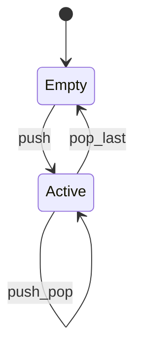
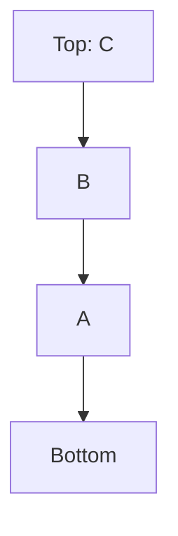

# Stack (Data Structure)

<TopicMeta />

<Prerequisites />

::: tip Published
This page meets the handbook **published** bar: deep explanation, ≥10 common mistakes, and official references. Further engine-level errata welcome via PR.
:::

## Introduction

A **stack** ADT is Last-In, First-Out: `push`, `pop`, and usually `peek`/`isEmpty`. It is the abstract twin of the machine [call stack](/01-computer-science/stack/), but here *you* control the structure—often with an array. UI undo buffers, DFS, and bracket matching are classic uses.

## Why does it exist?

Many problems are nested or reversible: undo, parsing nested tokens, backtracking. Restricting access to one end prevents illegal states and clarifies algorithms.

## Historical Background

Stacks are ancient in CS (Dijkstra’s shunting yard, stack machines). Hardware call stacks borrowed the metaphor; the ADT remains a teaching and interview staple.

## Mental Model

```text
push(x) → [..., x]   // x on top
pop()   → removes top
peek()  → read top
```

Complexity with array at end: all \(O(1)\) amortized.

## Internal Workflow

Array-backed stack:

1. `push`: `arr.push(x)`
2. `pop`: `arr.pop()`
3. Empty check: `arr.length === 0`

Linked-list stack uses head insert/delete.

## Lifecycle



## Browser Perspective

Browser history feels stack-like for back navigation within a frame, though the History API is richer. Undo stacks in editors are explicit app stacks.

## JavaScript Engine Perspective

Call stack ≠ your ADT stack, but overflow errors rhyme when recursion depth mirrors unbounded ADT growth if you simulate recursion poorly.

## React Perspective

Not applicable as a React feature—though undo/redo of state can use stacks of snapshots.

## Next.js Perspective

Not applicable.

## Server Perspective

Recursive descent parsers and DFS use stacks (explicit or call stack).

## Network Perspective

Not applicable.

## Memory Perspective

Each pushed item retains references. Unbounded undo stacks leak memory—bound depth or store diffs.

## Performance

Array at the end is cache-friendly. Avoid `unshift`/`shift` as a “stack.” Cloning giant state snapshots per undo step costs space/time—prefer command patterns or structural sharing.

## Production Example

A design tool stored full document clones on every mouse move for undo, exhausting RAM. Switching to a command stack (inverse operations) with capped depth fixed it.

## Code Examples

```js
function createStack() {
  const items = []
  return {
    push: (x) => items.push(x),
    pop: () => items.pop(),
    peek: () => items[items.length - 1],
    get size() { return items.length },
  }
}

function isBalanced(s) {
  const st = []
  const pair = { ')': '(', ']': '[', '}': '{' }
  for (const ch of s) {
    if ('([{'.includes(ch)) st.push(ch)
    else if (')]}'.includes(ch)) {
      if (st.pop() !== pair[ch]) return false
    }
  }
  return st.length === 0
}
```

```text
Pseudocode — iterative DFS with stack

stack = [root]
while stack not empty:
  node = stack.pop()
  visit(node)
  for child in reverse(node.children):
    stack.push(child)
```

## Diagrams



## Common Mistakes

1. Using `shift`/`unshift` for stack ops
2. Popping without empty checks
3. Confusing ADT stack with call stack exclusively
4. Unbounded undo history
5. Storing mutable objects then mutating after push (history corruption)
6. Deep cloning when a command inverse would do
7. Using stack where a queue (BFS) is required
8. Missing a production edge case for 01-computer-science.data-structures-stack-ds (#1)
9. Missing a production edge case for 01-computer-science.data-structures-stack-ds (#2)
10. Missing a production edge case for 01-computer-science.data-structures-stack-ds (#3)


## Best Practices

- Cap undo depth; serialize commands not always full trees
- Push immutable snapshots or clones when needed
- Prefer iterative stacks to avoid call-stack overflow on deep graphs
- Name top clearly in diagrams/code

## Anti-patterns

- Global singleton stack mutated from everywhere
- Mixing queue and stack operations on one array confusingly
- Recursing and also pushing the same nodes (double traversal bugs)

## Comparison

| ADT | Order | Use |
| --- | --- | --- |
| Stack | LIFO | Undo, DFS, matching |
| Queue | FIFO | BFS, task pipelines |

## Interview Questions

### Easy

**Q:** What does LIFO mean?

**A:** The most recently pushed element is the first one popped.

### Medium

**Q:** How do you evaluate a postfix expression with a stack?

**A:** Scan tokens; push numbers; on operator, pop two operands, apply, push result; final top is the answer.

### Hard

**Q:** Implement MinStack with O(1) min.

**A:** Keep a parallel stack of minima (or store pairs); on push, push `min(x, currentMin)`; on pop, pop both—each op \(O(1)\).

## Summary

- Stack ADT: push/pop/peek, LIFO
- Array end = efficient implementation in JS
- Undo/DFS/parsing workhorses
- Next: [Queue](/01-computer-science/data-structures/queue/)

## References

- [MDN — Array push/pop](https://developer.mozilla.org/en-US/docs/Web/JavaScript/Reference/Global_Objects/Array/push)
- [MDN — History API](https://developer.mozilla.org/en-US/docs/Web/API/History_API)
- CLRS — stacks/queues

<RelatedTopics />

Prev: [Linked List](/01-computer-science/data-structures/linked-list/) · Next: [Queue](/01-computer-science/data-structures/queue/)
