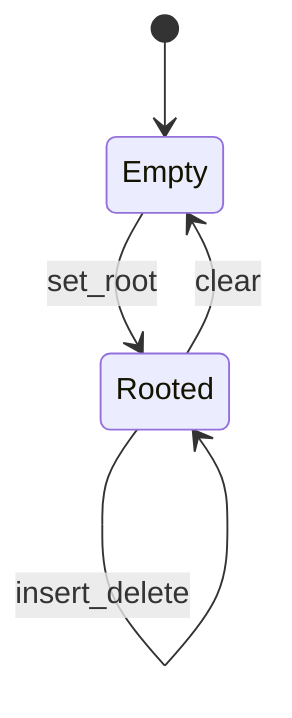
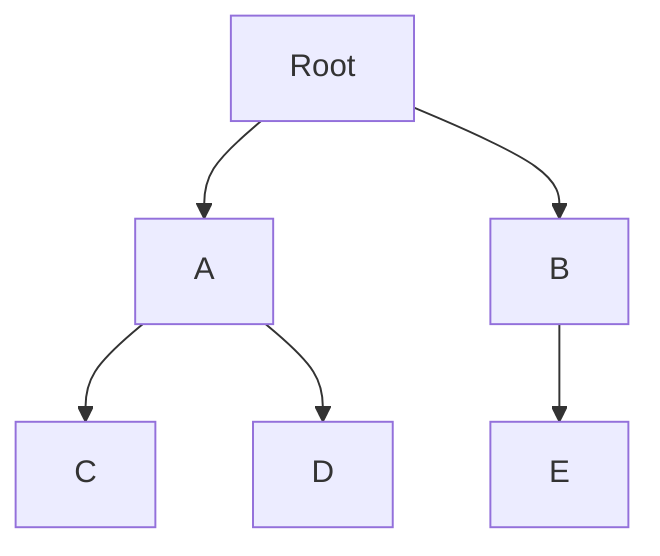

# Tree

<TopicMeta />

<Prerequisites />

::: tip Published
This page meets the handbook **published** bar: deep explanation, ≥10 common mistakes, and official references. Further engine-level errata welcome via PR.
:::

## Introduction

A **tree** is a hierarchical graph with a single **root**, parent/child edges, and no cycles. Frontend engineers live in trees: the [DOM](/03-browser/dom/), React element/fiber trees, JSON, and ASTs from [compilers](/01-computer-science/compiler/). Binary search trees (BSTs) add ordering for \(O(\log n)\) search when balanced.

## Why does it exist?

Hierarchy models containment and composition. Trees give clear ownership, recursive algorithms, and—when ordered/balanced—efficient search. Flat lists cannot express nesting without encoding pain.

## Historical Background

Tree mathematics predates computers; hierarchical file systems and DOM cemented trees in UX platforms. Balanced trees (AVL, red-black) keep height logarithmic.

## Mental Model

Terminology: root, parent, child, leaf, depth, height, subtree.

Traversals:

- **DFS preorder** — node, then children
- **DFS postorder** — children, then node (destroy/cleanup)
- **BFS / level order** — queue by layers

BST invariant: left subtree keys < node < right.

## Internal Workflow

Recursive DFS:

1. Base: null node → return
2. Process per traversal order
3. Recurse children

Balanced insert (conceptual): insert like BST then rotate to restore height invariants.

## Lifecycle



## Browser Perspective

DOM is a tree; layout walks and style inheritance follow it. MutationObserver watches subtree changes. Deep trees cost style/layout—component boundaries matter.

## JavaScript Engine Perspective

ASTs are trees; engines walk them to bytecode. Hidden class transitions are not trees of DOM but shape DAGs—don’t confuse metaphors.

## React Perspective

UI = tree of components; reconciliation compares trees ([reconciliation](/08-jsx-and-react-runtime/reconciliation/)). Keys identify siblings. Deep trees deepen call stacks during sync render.

## Next.js Perspective

App Router file/folder trees map to route hierarchies—product structure mirrors CS trees.

## Server Perspective

HTML serialization is a tree walk (SSR). Oversized trees inflate CPU/space.

## Network Perspective

JSON payloads often encode trees; depth limits prevent abuse.

## Memory Perspective

Each node object has overhead; retainers keep whole subtrees alive. Detaching a DOM subtree while JS holds nodes leaks.

## Performance

Height matters: skewed BST → \(O(n)\) ops. Prefer balanced trees or hash maps when only lookup by id matters. Virtualize large UI trees.

## Production Example

A settings UI nested 30 levels of accordions (real DOM depth), slowing style recalculation. Flattening visual nesting with CSS and shallower DOM cut interaction latency sharply.

## Code Examples

```js
function walkPre(node, visit) {
  if (!node) return
  visit(node)
  for (const child of node.children ?? []) walkPre(child, visit)
}

function bfs(root, visit) {
  const q = [root]
  while (q.length) {
    const n = q.shift()
    visit(n)
    for (const c of n.children ?? []) q.push(c)
  }
}

// BST search
function bstFind(node, key) {
  if (!node) return null
  if (key === node.key) return node
  return key < node.key ? bstFind(node.left, key) : bstFind(node.right, key)
}
```

```text
Pseudocode — tree height

function height(n):
  if n is null: return -1
  return 1 + max(height(n.left), height(n.right))
```

## Diagrams



## Common Mistakes

1. Recursing without null base cases
2. Using DFS recursion on huge depth → stack overflow (use explicit stack)
3. Confusing trees with general DAGs/graphs (multiple parents)
4. Assuming BST stay \(O(\log n)\) when unsorted inserts skew them
5. React index keys among siblings that reorder
6. Mutating trees while iterating naively
7. Deep cloning entire trees when a path update would do
8. Missing a production edge case for 01-computer-science.data-structures-tree (#1)
9. Missing a production edge case for 01-computer-science.data-structures-tree (#2)
10. Missing a production edge case for 01-computer-science.data-structures-tree (#3)


## Best Practices

- Choose traversal order by purpose (postorder for teardown)
- Keep UI DOM depth reasonable
- Normalize entities (ids + maps) when graphs aren’t pure trees
- Prefer iterative walks for untrusted depth

## Anti-patterns

- Encoding forests as giant nested JSON without pagination
- Sync recursive render of thousands of nodes
- DIY unbalanced BST for production indexes (use known libs)

## Comparison

| Structure | Parents | Cycles | Typical lookup |
| --- | --- | --- | --- |
| Tree | One | No | Walk / BST log n |
| DAG | Many | No | Depends |
| Graph | Many | Maybe | BFS/DFS |

## Interview Questions

### Easy

**Q:** What is a leaf?

**A:** A node with no children.

### Medium

**Q:** Difference between preorder and postorder?

**A:** Preorder processes a node before its children; postorder after—useful for deletion and computing sizes bottom-up.

### Hard

**Q:** Serialize/deserialize a binary tree.

**A:** e.g. preorder with null markers, or level-order with sentinels; reconstruct by consuming the same scheme—handle duplicates and shape ambiguity.

## Summary

- Trees model hierarchy: DOM, React, ASTs
- Traversals DFS/BFS; BSTs add order
- Height and depth drive performance and stack safety
- Next: [Graph](/01-computer-science/data-structures/graph/)

## References

- [MDN — Document Object Model](https://developer.mozilla.org/en-US/docs/Web/API/Document_Object_Model)
- [React — Understanding your UI as a tree](https://react.dev/learn/understanding-your-ui-as-a-tree)
- CLRS — trees / BST / red-black (advanced)

<RelatedTopics />

Prev: [Hash Table](/01-computer-science/data-structures/hash-table/) · Next: [Graph](/01-computer-science/data-structures/graph/)
