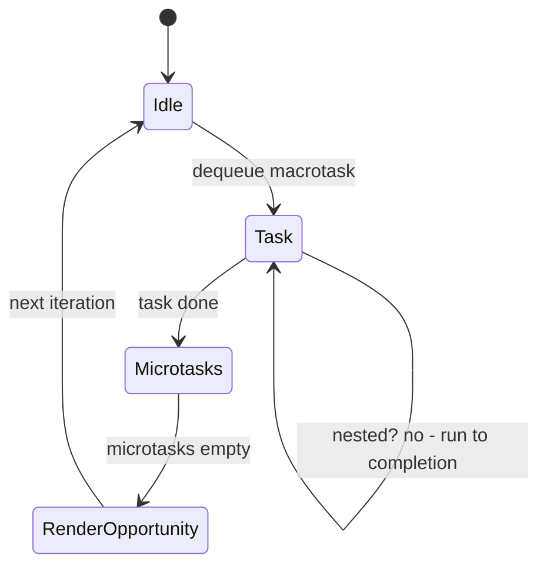
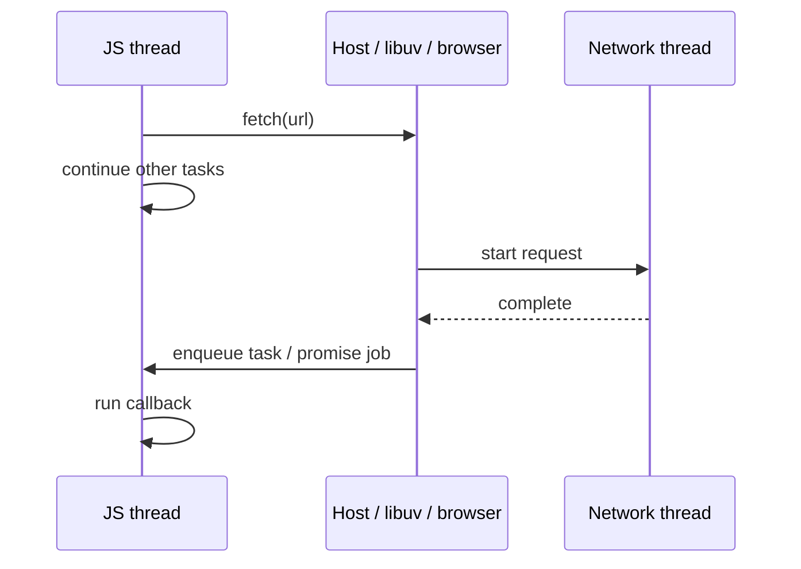
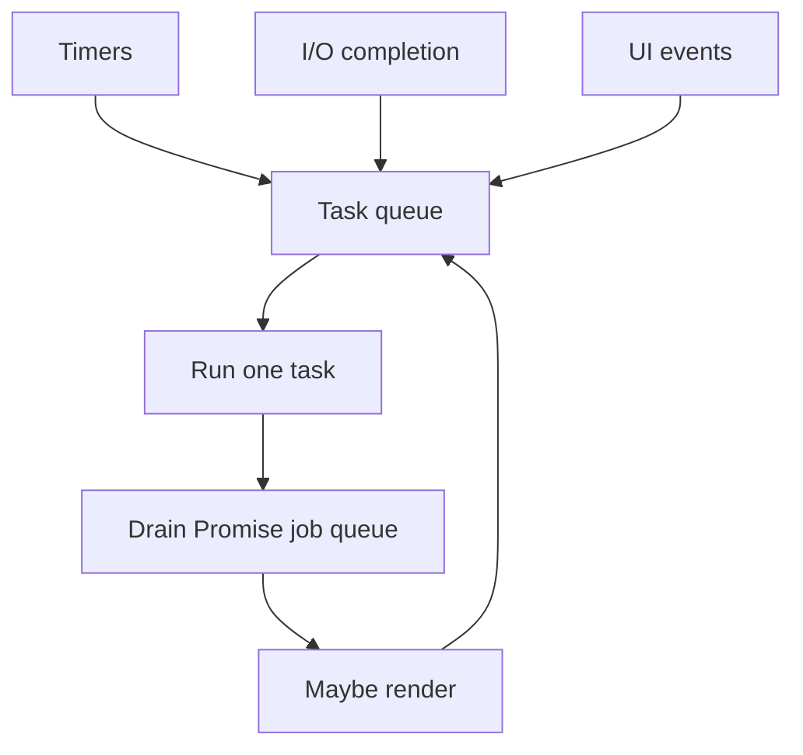

# Event Loop (Runtime View)

<TopicMeta />

<Prerequisites />

::: tip Published
This page meets the handbook **published** bar: deep explanation, ≥10 common mistakes, and official references. Further engine-level errata welcome via PR.
:::

## Introduction

An **event loop** is a control loop in the *host* (browser, Node) that repeatedly takes work items from queues and runs them on a JavaScript [thread](/01-computer-science/thread/). It is the classic answer to: how can one thread juggle I/O, timers, and UI without a thread-per-connection model? This CS view complements the browser-specific page at [Event Loop](/03-browser/event-loop/) and the JS-focused [Event Loop (JS)](/06-javascript/event-loop-js/).

## Why does it exist?

Blocking a UI/network thread on I/O wastes cores and freezes interfaces. Dedicating an OS thread per request does not scale. The event loop multiplexes many outstanding operations onto one (or few) threads: start async work, continue other tasks, run a callback when the host signals completion.

## Historical Background

Event-driven architectures predate Node (GUI toolkits, select/poll servers). Browser script embedding made a single-threaded turn-based model mandatory for DOM safety. Node popularized the same idea on servers with libuv. HTML and Event Loop specifications gradually standardized task/microtask queues.

## Mental Model

```text
while (runtime_alive):
  wait until a task is queued (or deadline)
  run next macrotask to completion
  drain microtask queue until empty
  (hosts may render / idle work between turns)
```

- **Task (macrotask)** — timer callbacks, I/O callbacks, message events, script execution units
- **Microtask** — Promise jobs, `queueMicrotask`, mutation observer callbacks (host-defined)
- **Run to completion** — a task is not preempted by another JS task (Workers aside)

Async/await is syntax over promises—still event-loop scheduling, not OS parallelism.

## Internal Workflow

1. JS calls a host API (`setTimeout`, `fetch`, `readFile`)
2. Host starts work on background threads / kernel I/O
3. JS stack clears; loop waits/runs other tasks
4. Completion enqueues a task or resolves a promise → microtask
5. Loop picks the task; engine creates a fresh stack; callback runs
6. After each task, microtasks drain before the next task (per HTML/Node rules)

Exact queue priorities differ by host; the CS idea stays: **queues + single-threaded execution turns**.

## Lifecycle



## Browser Perspective

Browsers interleave rendering with the loop: after tasks/microtasks, they may style/layout/paint. Long tasks delay input and frames. Details, frame budgeting, and `requestAnimationFrame`: [Event Loop](/03-browser/event-loop/), [Macrotasks](/03-browser/macrotasks/), [Microtasks](/03-browser/microtasks/).

## JavaScript Engine Perspective

Engines implement `JobQueue` (Promise jobs) per ECMAScript; the **host** integrates that queue with platform tasks. V8 does not “own” `setTimeout`—Chrome/Node does. Engines optimize code within a turn; they do not preempt JS arbitrarily for another task.

## React Perspective

React schedules updates as work that must fit into event-loop turns (and uses cooperative scheduling in concurrent mode). Effects run after paint in specific phases—still on the same thread’s loop. A stuck task blocks React the same as any JS.

## Next.js Perspective

Node’s loop drives SSR request handling. CPU-heavy synchronous work blocks other requests on that process. Edge runtimes also use event-loop-style concurrency with tighter CPU limits.

## Server Perspective

Node/libuv: poll phase, timers, check, close callbacks—same idea, different phase names. Blocking the loop increases latency for everyone on the process.

## Network Perspective

Sockets complete on OS/network threads; readiness becomes a task on the loop. Your `fetch().then` does not run on the NIC thread.

## Memory Perspective

Closures queued as callbacks retain heap graphs until the callback runs or is canceled (`AbortController`, `clearTimeout`). Unbounded queue growth (producing tasks faster than consumption) blows memory and delays.

## Performance

Latency = queue wait + handler CPU. Microtasks can starve rendering if you continuously schedule more microtasks. Split CPU across tasks (`scheduler.yield` / `setTimeout(0)` chunking). Measure long tasks (>50ms) in traces.

## Production Example

A metrics library flushed with `Promise.resolve().then` in a tight loop during page load, draining microtasks for hundreds of milliseconds and delaying first paint. Moving flush to a macrotask (`setTimeout`) or batching fixed FCP without changing network code.

## Code Examples

```js
console.log('A')
setTimeout(() => console.log('D-task'), 0)
Promise.resolve().then(() => console.log('C-microtask'))
console.log('B')
// A, B, C-microtask, D-task
```

```text
Pseudocode — host loop

queue = TaskQueue()
micro = MicrotaskQueue()

function loop():
  while true:
    task = queue.next()
    if task is null: wait_for_wakeup()
    else:
      run_js(task)
      while micro not empty:
        run_js(micro.next())
      maybe_render()
```

## Diagrams





## Common Mistakes

1. Believing `async` functions run on another thread
2. Assuming `setTimeout(fn, 0)` means “next millisecond” rather than “next task after delay≥0”
3. Starving the page with endless microtask chaining
4. Forgetting cancellation—callbacks retain memory and still run
5. Blocking the loop with sync crypto/JSON on large inputs
6. Confusing Node phases with browser rendering opportunities
7. Expecting task order guarantees across different APIs without reading specs
8. Missing a production edge case for 01-computer-science.event-loop-cs (#1)
9. Missing a production edge case for 01-computer-science.event-loop-cs (#2)
10. Missing a production edge case for 01-computer-science.event-loop-cs (#3)


## Best Practices

- Keep turns short; chunk CPU
- Prefer `await` readability but know it yields as microtasks/promises
- Cancel obsolete work on navigation
- Use host scheduling APIs when available (`requestAnimationFrame`, `scheduler`)

## Anti-patterns

- Busy-wait loops waiting for a flag
- Recursive `Promise.then` without bound
- Sync XHR / `Atomics.wait` on the main thread

## Comparison

| Model | Parallelism | Complexity |
| --- | --- | --- |
| Event loop (1 thread) | I/O concurrency | Low races |
| Thread-per-request | Parallel CPU/I/O | Races, memory |
| Workers + loop each | Parallel CPU | Messaging cost |

## Interview Questions

### Easy

**Q:** What is the event loop?

**A:** A host mechanism that queues callbacks from async APIs and executes them one at a time on a JS thread, draining microtasks between tasks.

### Medium

**Q:** Why does Promise then run before `setTimeout(0)`?

**A:** Promise reactions enqueue microtasks, which are processed after the current task finishes and before the next macrotask (such as a timer).

### Hard

**Q:** How would you design backpressure for a high-volume event source on the loop?

**A:** Bound queues; drop/coalesce events; process in chunks per task; pause the producer when queue depth exceeds N; abort on teardown; measure event-loop lag (Node) or long tasks (browser).

## Summary

- Event loop = queues + run-to-completion turns on one thread
- Microtasks vs tasks explain surprising ordering
- Browser/Node specialize the same CS model
- Next: [Compiler](/01-computer-science/compiler/) · Also: [Browser Event Loop](/03-browser/event-loop/)

## References

- [HTML Living Standard — Event loops](https://html.spec.whatwg.org/multipage/webappapis.html#event-loops)
- [ECMAScript — Jobs and Host Operations to Enqueue Jobs](https://tc39.es/ecma262/#sec-jobs)
- [Node.js — Event loop](https://nodejs.org/en/learn/asynchronous-work/event-loop-timers-and-nexttick)
- [MDN — Event loop](https://developer.mozilla.org/en-US/docs/Web/JavaScript/Event_loop)

<RelatedTopics />

Prev: [Thread](/01-computer-science/thread/) · Next: [Compiler](/01-computer-science/compiler/)
