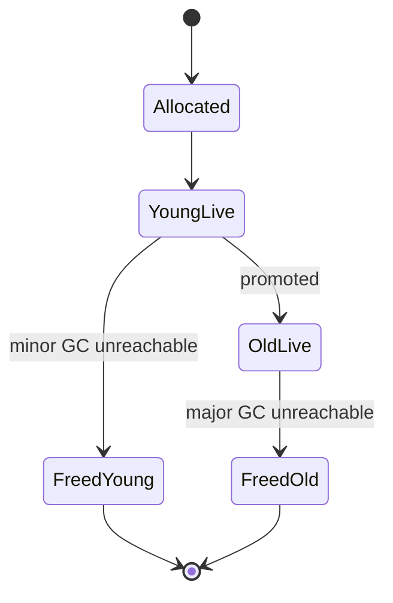
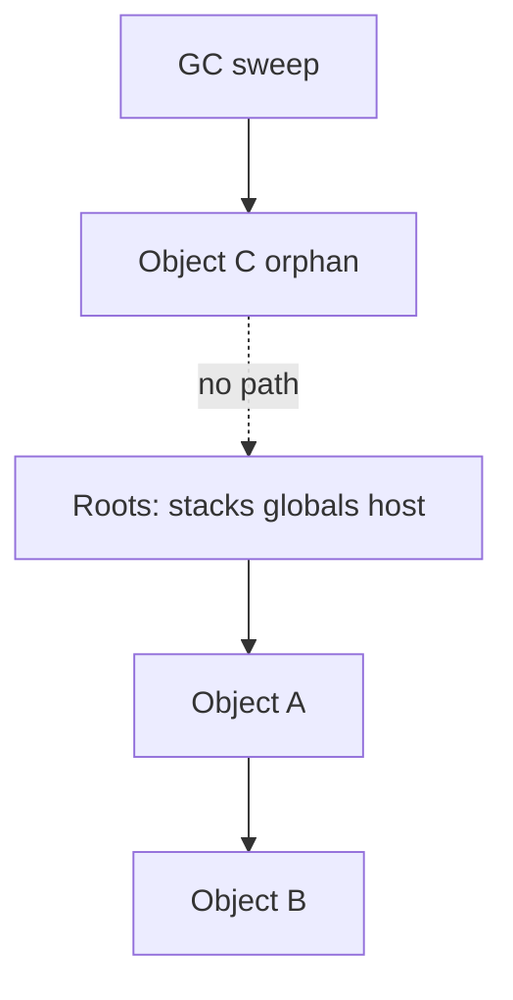

# Garbage Collection

<TopicMeta />

<Prerequisites />

::: tip Published
This page meets the handbook **published** bar: deep explanation, ≥10 common mistakes, and official references. Further engine-level errata welcome via PR.
:::

## Introduction

**Garbage collection (GC)** automatically reclaims [heap](/01-computer-science/heap/) memory that is no longer **reachable** from roots. JavaScript developers do not `free()` objects; they manage *references*. GC bugs in apps are almost always retainer bugs, not “GC is broken.” Browser-focused follow-up: [Garbage Collection (browser)](/03-browser/garbage-collection-browser/).

## Why does it exist?

Manual memory management causes use-after-free and leaks. GC trades programmer convenience and safety for non-deterministic pauses and CPU cost. For dynamic UI languages, that trade-off won.

## Historical Background

Mark-sweep (McCarthy, Lisp), reference counting (cycles problem), generational hypothesis (most objects die young), and modern concurrent/parallel collectors evolved over decades. V8’s Orinoco and related collectors moved work off the main thread where possible, but mutator pauses remain a design concern.

## Mental Model

**Reachability**: object is live if a path exists from roots (stacks, globals, host handles) via references.

```text
mark roots
mark through references
sweep unmarked OR compact and update pointers
```

Reference counting frees ASAP but needs cycle detection. Tracing GC handles cycles naturally.

## Internal Workflow

Generational sketch:

1. Allocate in young generation (nursery)
2. Minor GC: mark nursery from roots + remembered set
3. Survivors promote to old generation
4. Major GC: mark/sweep/compact old space occasionally
5. Optionally concurrent marking while mutator runs

Allocation failure or heuristics trigger collections.

## Lifecycle



## Browser Perspective

GC pauses compete with rendering on the main thread (even with concurrent helpers). Memory panel + Performance “GC” events diagnose jank. DOM wrappers participate in a complex graph with C++ objects.

## JavaScript Engine Perspective

Engines hide collector details behind ECMAScript’s abstract “unreachable memory may be reclaimed.” FinalizationRegistry/WeakRef expose limited lifecycle hooks—not deterministic destructors.

## React Perspective

Fibers and state are ordinary heap graphs. Subscriptions in `useEffect` without cleanup are retainers. Concurrent rendering may keep alternate trees briefly—usually fine; leaks are longer-lived.

## Next.js Perspective

Server: per-request allocations should become unreachable after response; globals that accumulate are process leaks. Edge: tighter memory → GC pressure sooner.

## Server Perspective

Long-lived Node processes need the same discipline as SPAs. Heap snapshots in production (carefully) catch retainers.

## Network Perspective

Not applicable beyond decoded payloads becoming heap garbage after use.

## Memory Perspective

GC frees only unreachable objects. Caches without eviction → “GC can’t help.” WeakMaps do not keep keys alive; useful for metadata associations.

## Performance

GC cost scales with live set and allocation rate. Reduce retention and allocation churn on hot paths. Forcing GC in apps is not a fix. Measure: allocation timeline, pause frequency, heap growth across sessions.

## Production Example

An analytics SDK attached listeners to `window` and `document` per component mount without removal. Heap grew with each client-side navigation. Cleanup + singleton listeners stopped the leak; GC then reclaimed route heaps normally.

## Code Examples

```js
// Retainer via closure
function attach(el) {
  const huge = new Array(1e6).fill('x')
  const onClick = () => console.log(huge[0])
  el.addEventListener('click', onClick)
  // leak until removeEventListener(onClick) or el dies with listener
  return () => el.removeEventListener('click', onClick)
}

// WeakMap: entry dies when key dies
const meta = new WeakMap()
let obj = {}
meta.set(obj, { note: 'ephemeral' })
obj = null // meta entry can be GC'd
```

```text
Pseudocode — mark-sweep

mark(roots)
for obj in heap:
  if not obj.marked: free(obj)
  else obj.marked = false
```

## Diagrams



## Common Mistakes

1. Calling `gc()` mentally as a solution—references remain
2. Forgotten event listeners / Intervals / Observers
3. Caches keyed forever by route or user id
4. Detached DOM retained by React refs or arrays
5. Closures capturing whole props/state objects
6. Growing `console.log` of large objects in DevTools retaining them
7. Assuming cycles prevent GC in tracing collectors (they don’t)
8. Missing a production edge case for 01-computer-science.garbage-collection (#1)
9. Missing a production edge case for 01-computer-science.garbage-collection (#2)
10. Missing a production edge case for 01-computer-science.garbage-collection (#3)


## Best Practices

- Always pair subscribe with unsubscribe
- Bound caches (LRU) or use weak keys when appropriate
- Null out large temporary structures when done in long functions
- Snapshot before/after suspect navigations

## Anti-patterns

- Global mutable stores that never evict
- Relying on FinalizationRegistry for resource correctness (sockets, watches)
- Disabling pools while allocating megabytes per frame

## Comparison

| Strategy | Pros | Cons |
| --- | --- | --- |
| Tracing GC | Handles cycles | Pauses/CPU |
| Refcount | Prompt free | Cycles, atomic cost |
| Manual free | Predictable | UAF/leaks |

## Interview Questions

### Easy

**Q:** When can GC free an object?

**A:** When it is unreachable from roots—no live reference path remains.

### Medium

**Q:** Why doesn’t setting `obj = null` always reduce memory immediately?

**A:** It only removes one reference; other retainers may exist, and GC runs asynchronously later.

### Hard

**Q:** How do you distinguish a leak from a large but stable working set?

**A:** Take heap snapshots after repeating a user journey and returning to baseline UI. Leaks show monotonic retained growth of the same retainer classes; stable caches plateau. Fix retainers, don’t “tune GC.”

## Summary

- GC reclaims unreachable heap; you manage references
- Generational collectors optimize for short-lived objects
- Leaks are retainer graphs—listen, cache, DOM, closures
- Next: [Time Complexity](/01-computer-science/time-complexity/)

## References

- [MDN — Memory management](https://developer.mozilla.org/en-US/docs/Web/JavaScript/Guide/Memory_management)
- [MDN — WeakRef](https://developer.mozilla.org/en-US/docs/Web/JavaScript/Reference/Global_Objects/WeakRef)
- [V8 — Trash talk: GC](https://v8.dev/blog/trash-talk)
- [ECMAScript — WeakRef / FinalizationRegistry](https://tc39.es/ecma262/#sec-weakref-objects)

<RelatedTopics />

Prev: [Runtime](/01-computer-science/runtime/) · Next: [Time Complexity](/01-computer-science/time-complexity/)
