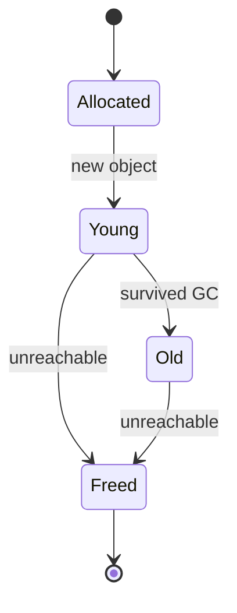
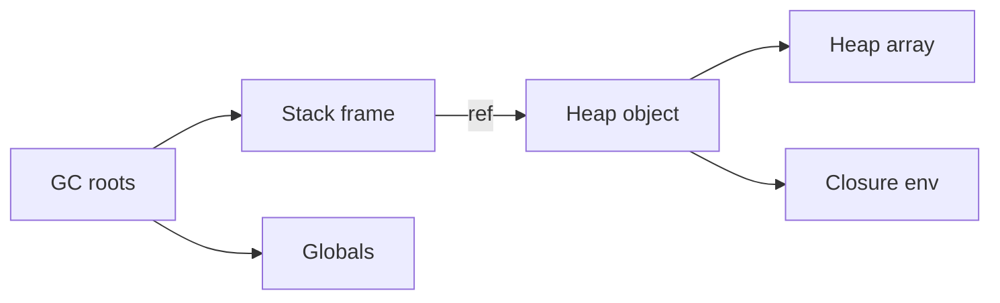

# Heap

<TopicMeta />

<Prerequisites />

::: tip Published
This page meets the handbook **published** bar: deep explanation, ≥10 common mistakes, and official references. Further engine-level errata welcome via PR.
:::

## Introduction

The **heap** is the region for **dynamic allocation**: memory whose size and lifetime are not tied to a single function frame. In JavaScript, objects, arrays, closures’ environments, and `ArrayBuffer`s live on the heap. The [stack](/01-computer-science/stack/) stores references into that heap. (This is unrelated to the “binary heap” priority-queue structure.)

## Why does it exist?

Real programs create data that outlives the function that built it, or whose size is unknown at compile time. Stack frames cannot hold that. The heap provides flexible lifetime, managed either by explicit free (C/`malloc`) or [garbage collection](/01-computer-science/garbage-collection/) (JS).

## Historical Background

Manual heaps predated GC. Fragmentation and use-after-free bugs pushed managed languages toward automatic reclaim. JS engines use generational/mark-sweep/mark-compact variants tuned for short-lived web objects.

## Mental Model

- **Allocate** — runtime finds a free block; returns a reference
- **Use** — program follows references (pointer chasing)
- **Retain** — any live reference path from roots keeps the object
- **Reclaim** — GC frees unreachable objects; manual heaps require `free`

Roots include stacks, globals, and certain host handles (DOM ↔ JS wrappers).

## Internal Workflow

Typical JS allocation:

1. Bytecode/runtime requests space for an object of shape S
2. Nursery/young generation bump-allocates if possible
3. Object header + fields initialized
4. Reference stored in stack slot / register / property
5. On collection, survivors may promote to old space
6. Compaction may move objects; engines update references

## Lifecycle



## Browser Perspective

Heap snapshots in Chrome DevTools show JS objects and retainers. DOM nodes have dual life: C++ DOM heap + JS wrapper. Detached DOM retained by JS closures is a classic leak. See [Garbage Collection (browser)](/03-browser/garbage-collection-browser/).

## JavaScript Engine Perspective

Hidden classes/maps, inline caches, and pointer compression (engine-specific) shape heap layout. Large `ArrayBuffer`s may live outside the GC nursery in separate allocators but still be retained by JS wrappers.

## React Perspective

Fibers, props objects, and state updates allocate on the heap. Frequent re-renders create short-lived objects—usually fine (generational GC)—unless retained by subscriptions or module caches.

## Next.js Perspective

Server heaps hold request-scoped data; accidentally attaching large data to global scope leaks across requests.

## Server Perspective

Process heap limits (`--max-old-space-size` in Node) cap growth. OOM kills are heap pressure symptoms.

## Network Perspective

Not applicable except that decoded payloads become heap objects (strings, ArrayBuffers).

## Memory Perspective

Shallow size vs retained size matters: a tiny Map can retain a huge graph. Fragmentation and old-space growth increase GC cost. Prefer clearing references over hoping GC “runs harder.”

## Performance

Allocation is cheap; promotion and full GC are not. Avoid allocating large objects per frame. Structural sharing / pooling helps hot paths; readability usually wins first. Measure allocation timelines when jank correlates with GC pauses.

## Production Example

A chart library cloned a 5MB config object on every hover (heap churn). GC pauses caused tooltip jank. Memoizing the config and mutating a thin hover state object removed pauses.

## Code Examples

```js
// Stack holds reference; object on heap
function makeUser(name) {
  const user = { name, friends: [] } // heap object
  return user // reference escapes the frame
}

// Retainer edge
const root = { child: makeUser('Ada') }
root.child = null // previous user becomes unreachable (if no other refs)
```

```text
Pseudocode — mark phase root walk

function mark(roots):
  stack = roots.copy()
  while stack not empty:
    obj = stack.pop()
    if obj.marked: continue
    obj.marked = true
    for ref in obj.fields:
      stack.push(ref)
```

## Diagrams



## Common Mistakes

1. Calling the heap “RAM” without distinguishing stack/code
2. Believing `null` assignment always frees immediately (GC is deferred)
3. Confusing binary heap data structure with memory heap
4. Closures capturing whole `props` trees unintentionally
5. Growing arrays without bounds in long-lived apps
6. Comparing heap snapshots from different scenarios incorrectly
7. Forcing GC in production as a “fix”
8. Missing a production edge case for 01-computer-science.heap (#1)
9. Missing a production edge case for 01-computer-science.heap (#2)
10. Missing a production edge case for 01-computer-science.heap (#3)


## Best Practices

- Drop references when done (`removeEventListener`, cache eviction)
- Use WeakMap/WeakRef for non-owning associations when appropriate
- Snapshot retainers to find the real owner
- Keep hot-path allocations stable and small

## Anti-patterns

- Module-level arrays that append forever
- Caching promises of fetches without eviction
- Circular iframe references across navigations

## Comparison

| | Stack | Heap |
| --- | --- | --- |
| Lifetime | Automatic per call | Until unreachable/freed |
| Size flexibility | Poor for large/unknown | Excellent |
| Management | Push/pop | Allocator + GC/free |
| Typical contents | Locals, return addr | Objects, buffers |

## Interview Questions

### Easy

**Q:** Where do JavaScript objects live?

**A:** On the heap; variables hold references to them (primitives may be stack/immediate depending on engine, but objects are heap-allocated).

### Medium

**Q:** Why can detached DOM nodes still appear in heap snapshots?

**A:** JS references (closures, arrays, React refs) keep wrappers alive, which keep C++ DOM nodes alive—unreachable from the document but reachable from JS roots.

### Hard

**Q:** How does generational GC exploit heap allocation patterns in UI apps?

**A:** Most objects die young (short-lived props, arrays); minor GC scans nursery cheaply. Long-lived stores promote to old space and are scanned less often—so accidental promotion of large temporary graphs is costly.

## Summary

- Heap = dynamic object/buffer storage
- Reachability from roots defines lifetime under GC
- Snapshots diagnose retainers; null alone isn’t a vacuum
- Next: [Process](/01-computer-science/process/)

## References

- [MDN — Memory management](https://developer.mozilla.org/en-US/docs/Web/JavaScript/Guide/Memory_management)
- [V8 blog — Trash talk (GC)](https://v8.dev/blog/trash-talk)
- [Chrome — Heap snapshot](https://developer.chrome.com/docs/devtools/memory-problems/heap-snapshots/)

<RelatedTopics />

Prev: [Stack](/01-computer-science/stack/) · Next: [Process](/01-computer-science/process/)
