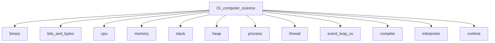

# Computer Science Fundamentals

## Scope

Bits, machines, runtimes, complexity, and core data structures

## Prerequisites

See the learning paths and each topic's prerequisites in the registry.

## Topics in order

- [Binary](/01-computer-science/binary/) — beginner, ~25 min
- [Bits and Bytes](/01-computer-science/bits-and-bytes/) — beginner, ~20 min
- [CPU](/01-computer-science/cpu/) — beginner, ~30 min
- [Memory](/01-computer-science/memory/) — beginner, ~35 min
- [Stack](/01-computer-science/stack/) — junior, ~25 min
- [Heap](/01-computer-science/heap/) — junior, ~25 min
- [Process](/01-computer-science/process/) — junior, ~30 min
- [Thread](/01-computer-science/thread/) — junior, ~30 min
- [Event Loop (Runtime View)](/01-computer-science/event-loop-cs/) — mid, ~35 min
- [Compiler](/01-computer-science/compiler/) — junior, ~35 min
- [Interpreter](/01-computer-science/interpreter/) — junior, ~30 min
- [Runtime](/01-computer-science/runtime/) — junior, ~30 min
- [Garbage Collection](/01-computer-science/garbage-collection/) — mid, ~40 min
- [Time Complexity](/01-computer-science/time-complexity/) — junior, ~30 min
- [Space Complexity](/01-computer-science/space-complexity/) — junior, ~25 min
- [Big O](/01-computer-science/big-o/) — junior, ~35 min
- [Data Structures](/01-computer-science/data-structures/) — junior, ~20 min
- [Algorithms](/01-computer-science/algorithms/) — junior, ~20 min

## Module knowledge graph

## Suggested learning paths

Browse [Learning Paths](/learning-paths/).
