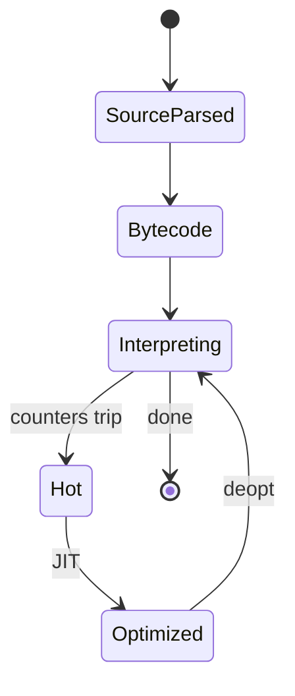
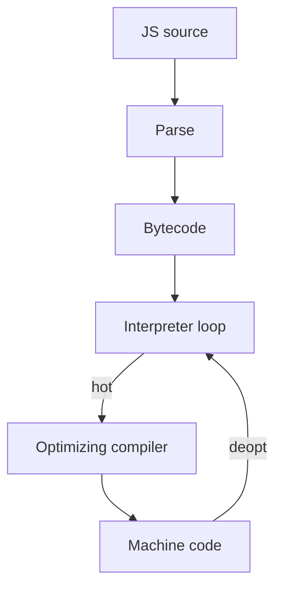

# Interpreter

<TopicMeta />

<Prerequisites />

::: tip Published
This page meets the handbook **published** bar: deep explanation, ≥10 common mistakes, and official references. Further engine-level errata welcome via PR.
:::

## Introduction

An **interpreter** executes a program by reading an intermediate representation (AST or bytecode) and performing the semantics directly, rather than translating the whole program to machine code first. JavaScript engines typically **interpret first, JIT-compile hot paths later**. Understanding interpreters explains fast startup, slower peaks, and why `eval` is costly.

## Why does it exist?

Pure AOT compilation delays first execution and complicates dynamic languages (runtime `eval`, changing shapes). Interpreters start quickly and handle dynamism naturally. Hybrid designs keep interpreter simplicity where code is cold.

## Historical Background

Lisp and early BASIC popularized interpretation. Bytecode VMs (Pascal P-code, Java, Python, early JS) split “compile to bytecode” from “interpret bytecode.” V8 originally JITed early; later Ignition restored a bytecode interpreter for memory and startup wins, feeding TurboFan.

## Mental Model

```text
while true:
  op = code[pc]
  pc += 1
  switch op:
    case ADD: push(pop() + pop())
    case LOAD: ...
    case CALL: ...
```

The interpreter is a program whose data is *your* program. A [compiler](/01-computer-science/compiler/) turns ops into machine code; an interpreter *is* the loop.

## Internal Workflow

JS engine sketch:

1. Parse source → AST
2. Generate bytecode
3. Interpreter executes bytecode, collecting type feedback
4. Hot functions → optimizing compiler
5. If assumptions fail → deoptimize back to interpreter/baseline

## Lifecycle



## Browser Perspective

First visit / cold cache favors interpreters: less machine code memory, faster startup. DevTools profilers may show time in interpreted vs optimized code (engine-specific views).

## JavaScript Engine Perspective

Ignition (V8), SpiderMonkey baseline interpreter, JSC LLInt—names differ, pattern matches. Bytecode is typically compact; handlers implement ECMAScript ops.

## React Perspective

Not applicable directly. JSX is compiled ahead of the engine; React runtime is ordinary JS that engines interpret/JIT.

## Next.js Perspective

Server cold start runs through the same interpret/JIT tiers in Node’s V8—short-lived serverless may stay mostly interpreted.

## Server Perspective

CLI scripts and one-off tools benefit from interpreter startup. Long-running servers warm JITs.

## Network Perspective

Not applicable (except that downloaded JS must be parsed/interpreted before interactivity).

## Memory Perspective

Bytecode < machine code for cold functions. Interpreters allocate for runtime values the same as JIT code would; the *code* footprint differs. Huge `eval` strings create parse+bytecode churn.

## Performance

Interpretation overhead per op hurts tight loops; JIT wins on hot paths. Avoid relying on microbenchmarks that only hit optimized tiers. Prefer algorithms over hoping the interpreter “gets faster.”

## Production Example

A feature used `new Function` to build validators from JSON schemas on each request (interpret/compile every time). Caching compiled functions cut CPU dramatically—same semantics, fewer interpreter entries.

## Code Examples

```js
// eval forces runtime parse + execute (slow & risky)
const expr = '2 + 2'
console.log(eval(expr))

// Prefer data-driven code shipped through the normal pipeline
const ops = { add: (a, b) => a + b }
console.log(ops.add(2, 2))
```

```text
Pseudocode — bytecode interpreter

pc = 0
stack = []
while pc < len(code):
  switch code[pc++]:
    case PUSH_CONST: stack.push(imm())
    case ADD:
      b=stack.pop(); a=stack.pop(); stack.push(a+b)
    case RETURN: return stack.pop()
```

## Diagrams



## Common Mistakes

1. Equating “interpreted language” with “always slow forever”
2. Using `eval`/`new Function` in hot paths
3. Assuming production always runs fully optimized code
4. Microbenchmarking tiny functions that JIT erases unrealistically
5. Confusing bundler compile with engine interpret
6. Thinking TypeScript interprets types at runtime
7. Ignoring parse cost of giant inline scripts
8. Missing a production edge case for 01-computer-science.interpreter (#1)
9. Missing a production edge case for 01-computer-science.interpreter (#2)
10. Missing a production edge case for 01-computer-science.interpreter (#3)


## Best Practices

- Ship parseable, cacheable scripts; avoid runtime codegen when possible
- Keep hot loops in straightforward shapes for JIT
- Measure with realistic warm-up
- Treat interpreter as part of the [runtime](/01-computer-science/runtime/)

## Anti-patterns

- Dynamic code generation from untrusted strings
- Extremely megamorphic object shapes in tight loops
- Disabling optimizations via pathological patterns without need

## Comparison

| | Interpreter | Optimizing JIT |
| --- | --- | --- |
| Startup | Fast | Slower to peak |
| Peak throughput | Lower | Higher |
| Memory (code) | Lower | Higher |
| Dynamism | Natural | Needs assumptions |

## Interview Questions

### Easy

**Q:** What is an interpreter?

**A:** A program that executes another program’s IR directly via a fetch-dispatch loop instead of only producing machine code ahead of time.

### Medium

**Q:** Why do JS engines still interpret if they have JITs?

**A:** Most functions are cold; interpreting saves memory and speeds startup, while collecting feedback so the JIT can optimize what matters.

### Hard

**Q:** How can deoptimization cause performance cliffs?

**A:** Code oscillates between optimized and interpreter tiers when type feedback is unstable (e.g. polymorphic shapes), paying compile cost repeatedly—stabilize types or simplify call sites.

## Summary

- Interpreters execute bytecode/AST with a dispatch loop
- JS engines pair interpreters with JITs
- Avoid runtime `eval` on hot paths
- Next: [Runtime](/01-computer-science/runtime/)

## References

- [V8 — Ignition](https://v8.dev/docs/ignition)
- [ECMAScript specification](https://tc39.es/ecma262/)
- [MDN — eval security](https://developer.mozilla.org/en-US/docs/Web/JavaScript/Reference/Global_Objects/eval)

<RelatedTopics />

Prev: [Compiler](/01-computer-science/compiler/) · Next: [Runtime](/01-computer-science/runtime/)
