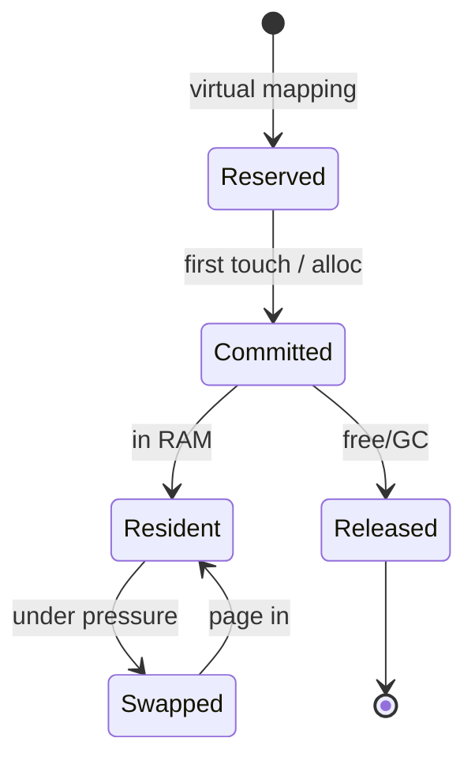
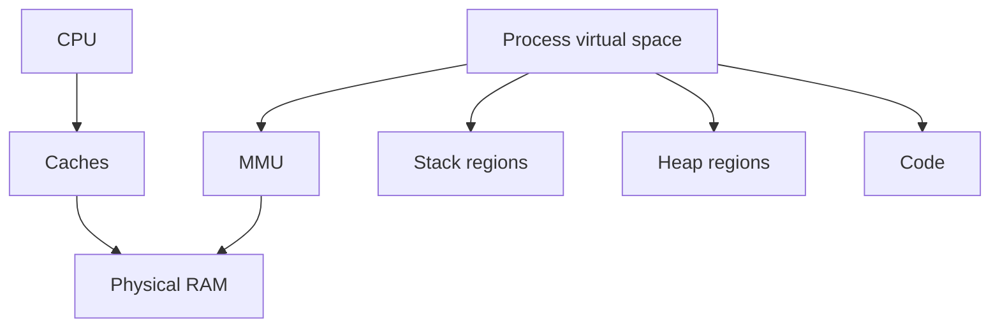

# Memory

<TopicMeta />

<Prerequisites />

::: tip Published
This page meets the handbook **published** bar: deep explanation, ≥10 common mistakes, and official references. Further engine-level errata welcome via PR.
:::

## Introduction

**Memory** is the addressable storage a process uses at runtime—primarily RAM, mediated by the OS as **virtual memory**. Frontend apps feel memory through JS heaps, DOM trees, image bitmaps, and tab crashes (“Aw, Snap”). This page builds the machine model before specializing into [stack](/01-computer-science/stack/) and [heap](/01-computer-science/heap/).

## Why does it exist?

CPUs have tiny registers. Programs need bulk storage for code, stacks, and dynamic data. Hierarchical memory (registers → caches → RAM → disk swap) balances speed and capacity. Without a coherent memory model, you cannot reason about leaks, locality, or why large allocations jank.

## Historical Background

Physical addressing gave way to virtual memory so processes could be isolated and RAM overcommitted with paging. Managed runtimes (JS, Java, Go) added garbage-collected heaps atop the same OS primitives. Browsers further sandbox per-site memory in renderer processes.

## Mental Model

A process sees a **virtual address space**:

- **Code** — executable instructions
- **Globals / statics** — long-lived data
- **Stack** — per-thread frames (automatic storage)
- **Heap** — dynamic allocations (objects, buffers)
- **Memory-mapped files / shared regions** — OS-backed

Addresses are numbers referring to bytes ([bits and bytes](/01-computer-science/bits-and-bytes/)). The MMU translates virtual → physical frames; missing pages fault to the OS.

## Internal Workflow

Allocation path (conceptual):

1. Program requests memory (stack push, `malloc`, JS `new`, `ArrayBuffer`)
2. Runtime/OS finds a region (bump pointer, freelist, mmap)
3. Optional zeroing/security scrub
4. Program reads/writes via CPU loads/stores
5. Free via stack pop, explicit free, or [GC](/01-computer-science/garbage-collection/)
6. OS may reclaim physical pages under pressure

## Lifecycle



## Browser Perspective

Each renderer process has its own address space. Chrome’s Task Manager shows per-tab memory. DOM nodes, JS objects, and GPU resources (often accounted separately) dominate. See [Memory Management](/03-browser/memory-management/).

## JavaScript Engine Perspective

Engines divide heap into generations/spaces, store objects with headers/hidden classes, and allocate short-lived objects cheaply. Stack frames hold primitives and references; object payloads live on the heap. Details unfold in stack/heap/GC topics.

## React Perspective

Component state and fiber trees occupy JS heap. Retaining large lists in state, closures, or module-level caches increases memory. Keys and list virtualization are UX features with memory consequences.

## Next.js Perspective

Server: Node heap per instance; Edge: stricter limits. Shipping huge serialized props inflates both server and client memory.

## Server Perspective

Containers enforce memory limits (cgroups). Exceed → OOM kill. SSR fan-out without bounds is a common outage mode.

## Network Perspective

Not the same as RAM, but download size becomes memory when buffered. Streaming reduces peak residency.

## Memory Perspective

This *is* the perspective: watch **retained size** vs **shallow size**, distinguish leaks (unbounded growth) from high-water usage (big but stable), and note that GC frees heap only when references die.

## Performance

RAM pressure causes paging and GC thrash—both destroy frame budgets. Locality matters: traversing contiguous arrays beats pointer-chasing object graphs. Measure with Allocation instrumentation / heap snapshots, not guesses.

## Production Example

A SPA kept every visited route’s data in a global store “for back navigation.” After an hour, mobile tabs crashed. Fix: bounded LRU cache + disposing detached route heaps. Peak memory dropped ~60%.

## Code Examples

```js
// References keep heap objects alive
const cache = new Map()
function leaky(key, huge) {
  cache.set(key, huge) // lives until deleted
}

// Buffers are explicit byte memory
const buf = new ArrayBuffer(10_000_000) // ~10MB
console.log(buf.byteLength)
```

```text
Pseudocode — virtual access

function load(vaddr):
  paddr = translate(vaddr) // may page fault
  return physical_read(paddr)
```

## Diagrams



## Common Mistakes

1. Confusing disk “memory” marketing with RAM
2. Thinking GC means “I can’t leak”
3. Holding DOM nodes in JS Sets after removal from document
4. Duplicating large arrays defensively without need
5. Ignoring detached window/iframe retained graphs
6. Measuring only Chrome on desktop with 32GB RAM
7. Equating bundle KB with runtime heap size
8. Missing a production edge case for 01-computer-science.memory (#1)
9. Missing a production edge case for 01-computer-science.memory (#2)
10. Missing a production edge case for 01-computer-science.memory (#3)


## Best Practices

- Bound caches; prefer `WeakMap` when keys are objects
- Release listeners and URLs (`revokeObjectURL`)
- Snapshot before/after suspect flows
- Stream large downloads

## Anti-patterns

- Global ever-growing Maps keyed by route/user
- Circular references across iframe bridges left alive
- Allocating giant typed arrays on each animation frame

## Comparison

| Layer | Latency (order) | Size |
| --- | --- | --- |
| Register | 1 cycle | tiny |
| L1 cache | ~few cycles | tens of KB |
| RAM | ~100 cycles | GBs |
| SSD | microseconds+ | TBs |

## Interview Questions

### Easy

**Q:** What is virtual memory?

**A:** The OS gives each process an isolated virtual address space mapped onto physical RAM (and maybe disk), so programs see contiguous addresses without owning all physical memory.

### Medium

**Q:** Where do JavaScript objects live—stack or heap?

**A:** Object payloads are heap-allocated; stack frames store references (and primitives). Closures keep heap objects alive via environment references.

### Hard

**Q:** How do you prove a leak vs a large cache?

**A:** Heap snapshots over time: leak shows retained size growing after returning to baseline UI; a cache stays flat after fill. Use allocation timelines + comparison snapshots; fix by clearing references, not by forcing GC.

## Summary

- Processes use virtual address spaces backed by RAM
- Stack vs heap specialize automatic vs dynamic storage
- Browsers isolate memory per renderer; JS heaps still leak by reference
- Next: [Stack](/01-computer-science/stack/)

## References

- [MDN — Memory management](https://developer.mozilla.org/en-US/docs/Web/JavaScript/Guide/Memory_management)
- [Chrome — Fix memory problems](https://developer.chrome.com/docs/devtools/memory-problems/)
- [ECMAScript — Executable code and execution contexts](https://tc39.es/ecma262/#sec-executable-code-and-execution-contexts)

<RelatedTopics />

Prev: [CPU](/01-computer-science/cpu/) · Next: [Stack](/01-computer-science/stack/)
