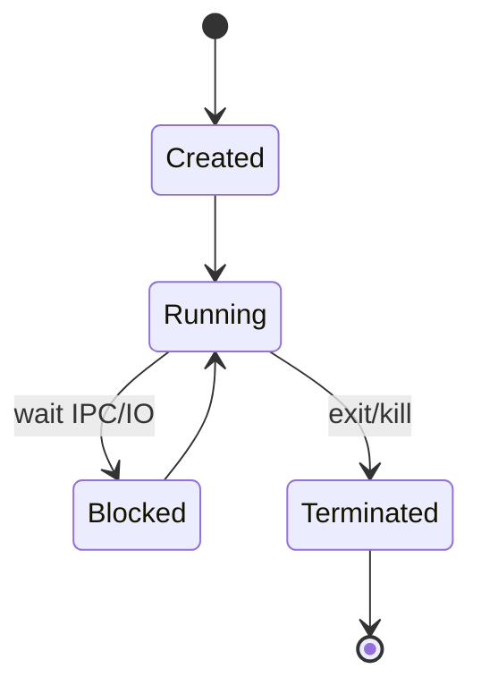
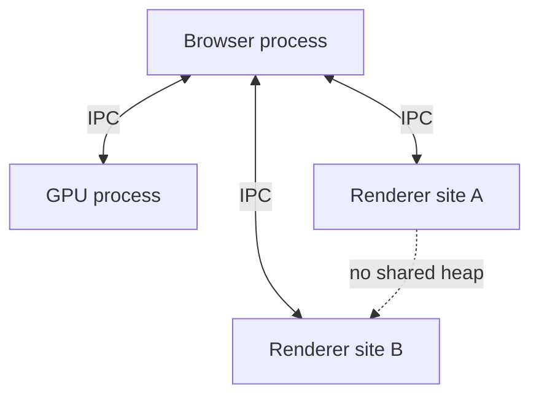

# Process

<TopicMeta />

<Prerequisites />

::: tip Published
This page meets the handbook **published** bar: deep explanation, ≥10 common mistakes, and official references. Further engine-level errata welcome via PR.
:::

## Introduction

A **process** is an OS-level unit of isolation: its own virtual [memory](/01-computer-science/memory/) address space, handles, and security credentials, plus one or more [threads](/01-computer-science/thread/) that run code. Browsers are multi-process programs—understanding processes explains site isolation, IPC cost, and why “Chrome uses so much RAM.”

## Why does it exist?

Isolation prevents one buggy or malicious program from freely corrupting another’s memory. Crash containment, privilege separation, and scheduling fairness all depend on process boundaries. The web’s hostile-content model *requires* this.

## Historical Background

Early OSes had weak isolation; modern Unix/Windows processes became standard. Chromium popularized multi-process browsers (2008+): browser process + renderers + GPU + utilities. Site Isolation further splits origins into different renderers.

## Mental Model

Process = **container for resources** + **threads that execute**.

- Cannot casually read another process’s memory
- Communication via IPC (pipes, sockets, Mojo/IPC in Chromium), not shared arbitrary pointers
- `fork`/`CreateProcess` style creation is expensive relative to spawning a thread

Node.js typically = one process (unless clustered). Browsers = many.

## Internal Workflow

Lifecycle sketch:

1. Parent asks OS to create process with a program image
2. OS sets up address space, maps code/libs, creates main thread
3. Process runs; may spawn child processes or threads
4. IPC messages cross boundaries for privileged ops (file picker, network in browser)
5. Exit reaps resources; abnormal exit notifies parent (browser shows sad tab)

## Lifecycle



## Browser Perspective

Chromium roles (simplified): **Browser** (privileged UI/network orchestration), **Renderer** (site content, sandboxed), **GPU**, **Plugin/Utility**. One renderer may host one site instance. See [Multi-Process Model](/03-browser/multi-process-model/). IPC latency matters for input and navigation.

## JavaScript Engine Perspective

Each renderer process embeds an engine isolate/realm set. JS cannot open another process’s heap. `SharedArrayBuffer` requires careful cross-origin isolation; still within constrained sharing rules, not arbitrary process memory.

## React Perspective

Not applicable at the library level. React runs inside a renderer process’s JS realm.

## Next.js Perspective

Node server = process(es). Clustering/PM2 run multiple processes for CPU scaling. Edge isolates are process-like sandboxes with different APIs.

## Server Perspective

Containers often wrap a main process; orchestration restarts crashed processes. Zombie/orphan processes matter for ops hygiene.

## Network Perspective

Browser process / network service owns sockets; renderers request fetches via IPC. That split enforces permissions (CORS, cookies policies applied centrally).

## Memory Perspective

Per-process heaps do not share by default → memory duplication (e.g. multiple renderers loading similar code). Trade-off: security/stability vs RAM. Out-of-process iframes multiply footprints.

## Performance

Process creation and IPC are heavier than thread calls. Too many renderer processes stress RAM; too few weaken isolation. Measure with browser task managers. Workers are threads (usually) inside a process—cheaper than new processes.

## Production Example

A compromised ad iframe in a separate process crashes or is killed without taking down the parent banking tab—process isolation as a product feature. Conversely, an embedder forcing many OOPs iframes on low-end devices causes OOM; the team consolidates trusted content.

## Code Examples

```bash
# OS view (illustrative)
ps aux | head
# Node cluster = multiple processes
node -e "console.log('pid', process.pid)"
```

```text
Pseudocode — privileged fetch in a browser

renderer: send IPC Message{url, credentialsMode}
browser/network: check permissions; perform socket IO
browser/network: return IPC Response{bodyHandle}
renderer: map bytes into JS ArrayBuffer
```

## Diagrams



## Common Mistakes

1. Equating “Chrome process in Task Manager” with a single web tab always
2. Thinking `Web Worker` is a new OS process (usually a thread)
3. Expecting global mutable state across processes without IPC
4. Ignoring RAM cost of site isolation on weak devices
5. Blocking the browser process with bad native extensions (whole UI freezes)
6. Confusing Docker container limits with in-page JS heap limits
7. Assuming `localStorage` is shared across processes unsafely—it is origin storage mediated by the browser
8. Missing a production edge case for 01-computer-science.process (#1)
9. Missing a production edge case for 01-computer-science.process (#2)
10. Missing a production edge case for 01-computer-science.process (#3)


## Best Practices

- Treat cross-process boundaries as unreliable/latency-bearing APIs
- Prefer Workers for parallel CPU inside a page; rely on browser for process isolation
- Watch real device memory, not only DevTools heap
- Understand COOP/COEP when using powerful cross-origin features

## Anti-patterns

- Building your own “multi-process” via many heavy iframes without need
- Synchronous cross-process chatty IPC loops
- Storing secrets in renderer memory assuming the process is trusted against XSS (it isn’t)

## Comparison

| | Process | Thread |
| --- | --- | --- |
| Address space | Separate | Shared within process |
| Crash isolation | Strong | Weak (can corrupt process) |
| Creation cost | Higher | Lower |
| Communication | IPC | Shared memory + sync primitives |

## Interview Questions

### Easy

**Q:** Why do modern browsers use multiple processes?

**A:** Security sandboxing, crash isolation, and privilege separation—untrusted page code runs in locked-down renderer processes.

### Medium

**Q:** Why might Chrome show high RAM with few tabs?

**A:** Multiple utility/GPU/renderer processes, per-site isolation, shared caches still duplicated, extensions, and memory reserved ahead of use—not only “JS heap of one page.”

### Hard

**Q:** When would you put work in a Worker vs relying on process isolation?

**A:** Worker: parallelize CPU for *your* page inside the same renderer, shared origin. Process isolation: browser-enforced boundary against untrusted content. You don’t create renderer processes yourself; design embeds/iframes knowing OOPIF costs.

## Summary

- Process = isolated address space + threads
- Browsers are multi-process; IPC replaces shared heaps
- Security/RAM trade-offs are intentional
- Next: [Thread](/01-computer-science/thread/)

## References

- [Chrome — Process model / Site Isolation](https://www.chromium.org/developers/design-documents/process-models/)
- [MDN — Web Workers](https://developer.mozilla.org/en-US/docs/Web/API/Web_Workers_API) (contrast with processes)
- [Node.js — Process](https://nodejs.org/api/process.html)

<RelatedTopics />

Prev: [Heap](/01-computer-science/heap/) · Next: [Thread](/01-computer-science/thread/)
