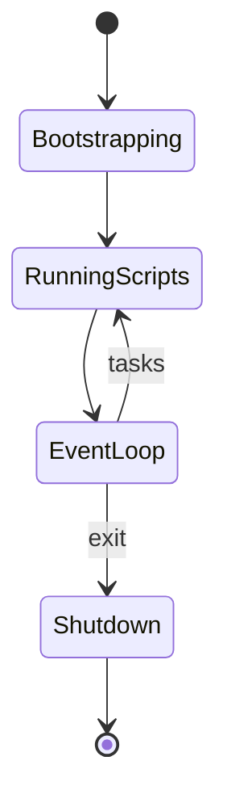
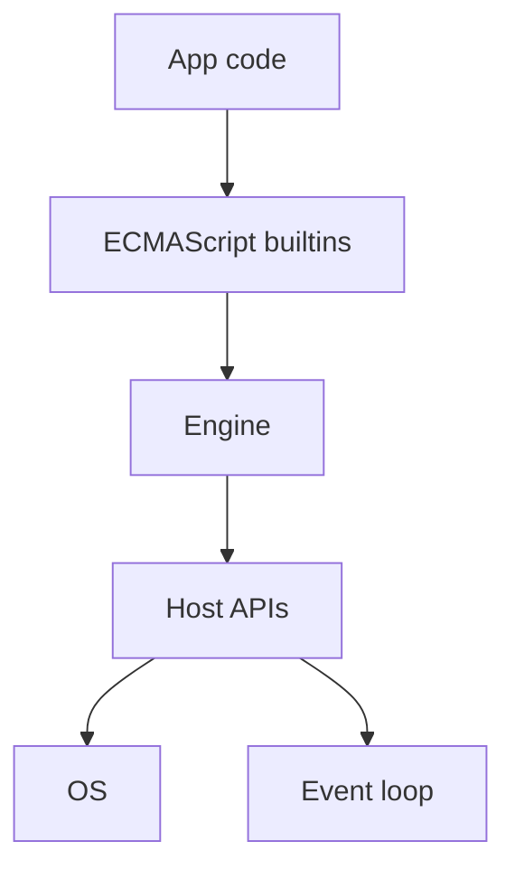

# Runtime

<TopicMeta />

<Prerequisites />

::: tip Published
This page meets the handbook **published** bar: deep explanation, ≥10 common mistakes, and official references. Further engine-level errata welcome via PR.
:::

## Introduction

A **runtime** is the executing environment that makes programs work: memory manager, scheduler/event loop, built-in objects, and host bindings (DOM, Node `fs`, etc.). “JavaScript” the language needs a runtime to run—browser, Node, Deno, Edge isolate. This topic separates **language semantics** from **host capabilities**.

## Why does it exist?

Source code is inert. The runtime supplies the machine-facing services: allocate objects, run GC, wire timers, expose I/O. Different runtimes share ECMAScript but disagree on hosts—that is why `fs` fails in browsers and `document` fails in Node.

## Historical Background

Browser JS runtimes predated Node (2009), which reused V8 and added libuv. Multiple engines (V8, JSC, SpiderMonkey) implement the same language with different runtime embeddings. Serverless/edge runtimes later restricted hosts further.

## Mental Model

```text
Your code
  → Language builtins (Array, Promise, …)     // ECMAScript
  → Engine (parser, interpreter, JIT, GC)     // implementation
  → Host APIs (DOM, fetch, process, …)        // runtime product
  → OS / hardware
```

“Runtime error” usually means something failed *while executing* under that stack—not a type error from `tsc`.

## Internal Workflow

Boot sequence (conceptual):

1. Embedder starts engine isolate/realm
2. Install builtins + host bindings
3. Load entry script/modules
4. Drive [event loop](/01-computer-science/event-loop-cs/) until idle/exit
5. Tear down heaps and handles

Module resolution, Web API availability, and security policies are runtime rules.

## Lifecycle



## Browser Perspective

The browser runtime includes the engine + Web APIs + rendering integration. Realm per window/worker. See [JavaScript Engine](/03-browser/javascript-engine/).

## JavaScript Engine Perspective

The engine is the core of the runtime but not the whole product. Embedders (Chrome, Node) define hosts. Same engine, different runtimes.

## React Perspective

React is a library *inside* the runtime, not a runtime itself (unless you consider React Native’s host). Concurrent features use host scheduling (`MessageChannel`, `scheduler`).

## Next.js Perspective

Dual runtimes: Node/Edge on server, browser on client. Code shared across them must respect API differences (`window`, Node buffers, Edge limits).

## Server Perspective

Node runtime = V8 + libuv + modules + npm ecosystem. Process env, signals, and cwd are runtime concepts.

## Network Perspective

`fetch` may be host-provided (browsers, modern Node). Networking is not in ECMAScript core—runtime dependent.

## Memory Perspective

Runtime configures heap limits, GC, and buffer allocators. Leaks are about runtime reachability. Multiple realms (iframes) mean multiple runtime heaps.

## Performance

Runtime choice changes cold start, I/O model, and available native bindings. Polyfilling missing APIs can cost CPU. Prefer feature detection over assuming one runtime.

## Production Example

A shared package used `Buffer` and broke in Edge. The fix used `Uint8Array` + feature checks—writing to the *language* baseline, not one runtime’s sugar.

## Code Examples

```js
// Runtime detection (rough)
const isBrowser = typeof document !== 'undefined'
const isNode = typeof process !== 'undefined' && process.versions?.node

export function readEnv(name) {
  if (isNode) return process.env[name]
  // browser: no process.env unless bundled DefinePlugin
  return undefined
}
```

```text
Pseudocode — minimal runtime services

services = {
  alloc, free_or_gc,
  schedule_task, start_timer,
  import_module, bind_host_api
}
execute(entryModule, services)
```

## Diagrams



## Common Mistakes

1. Assuming npm packages work in every JS runtime
2. Treating React as “the runtime”
3. Polyfilling Node APIs into browsers blindly (bundle bloat/security)
4. Ignoring Edge API subsets
5. Confusing compile-time `process.env` injection with runtime `process`
6. Leaking across requests via global runtime state on servers
7. Expecting identical `Date`/Intl behavior without checking ICU data
8. Missing a production edge case for 01-computer-science.runtime (#1)
9. Missing a production edge case for 01-computer-science.runtime (#2)
10. Missing a production edge case for 01-computer-science.runtime (#3)


## Best Practices

- Document supported runtimes for shared libraries
- Use standard APIs (`fetch`, `URL`, `AbortController`) when possible
- Isolate host-specific code behind adapters
- Test in browser + Node/Edge as needed

## Anti-patterns

- Silent fallbacks that change behavior per runtime without tests
- Giant `if (isNode)` trees scattered everywhere
- Relying on non-standard global pollution

## Comparison

| Runtime | Engine (typical) | Host highlights |
| --- | --- | --- |
| Browser | V8/JSC/SM | DOM, Web APIs |
| Node | V8 | fs, net, npm |
| Edge isolate | V8/workerd etc. | Limited I/O, fast start |

## Interview Questions

### Easy

**Q:** What is a language runtime?

**A:** The environment that executes programs—engine plus memory/GC, scheduling, builtins, and host APIs.

### Medium

**Q:** Why can the same JS file fail in Node but work in the browser?

**A:** Host APIs differ; the language core may match while `document` or `fs` availability does not.

### Hard

**Q:** How would you design a library for browser, Node, and Edge?

**A:** Core pure functions + thin host adapters; depend on Web standards; avoid Node builtins in core; CI matrix; clear `exports` conditions; document unsupported APIs.

## Summary

- Runtime = engine + services + host APIs
- ECMAScript ≠ DOM ≠ Node
- Dual-runtime apps need explicit boundaries
- Next: [Garbage Collection](/01-computer-science/garbage-collection/)

## References

- [ECMAScript Language Specification](https://tc39.es/ecma262/)
- [HTML — Web IDL & host bindings](https://html.spec.whatwg.org/)
- [Node.js docs](https://nodejs.org/docs/latest/api/)
- [MDN — JavaScript](https://developer.mozilla.org/en-US/docs/Web/JavaScript)

<RelatedTopics />

Prev: [Interpreter](/01-computer-science/interpreter/) · Next: [Garbage Collection](/01-computer-science/garbage-collection/)
