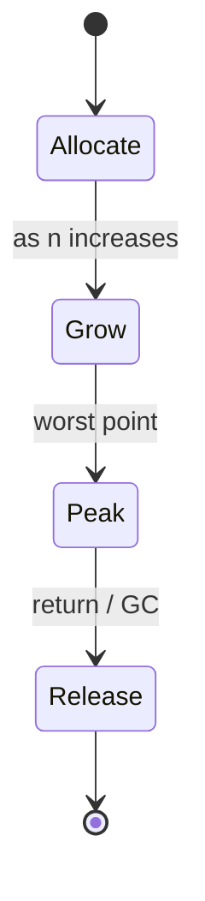
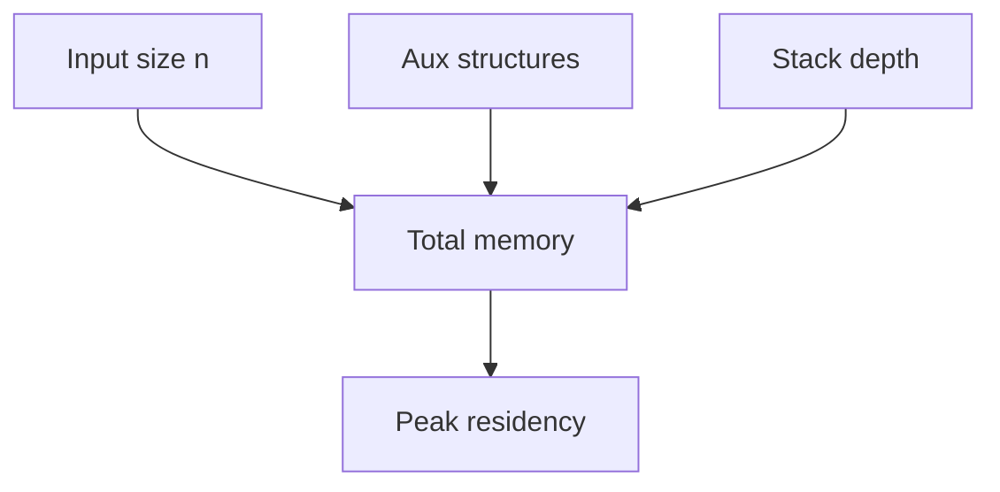

# Space Complexity

<TopicMeta />

<Prerequisites />

::: tip Published
This page meets the handbook **published** bar: deep explanation, ≥10 common mistakes, and official references. Further engine-level errata welcome via PR.
:::

## Introduction

**Space complexity** describes how memory usage grows with input size \(n\). Analysts often separate **input space** from **auxiliary space** (extra allocations beyond the input). Recursion also spends [stack](/01-computer-science/stack/) space proportional to depth.

## Why does it exist?

Time-optimal algorithms can be memory-hungry (and vice versa). On mobile browsers and Edge isolates, RAM caps are real. Space analysis predicts crashes and GC pressure before they ship.

## Historical Background

Same asymptotic tradition as time analysis. “In-place” algorithms (O(1) auxiliary) became a theme for constrained hardware; on the web, the constraint returned via low-end devices and giant SPAs.

## Mental Model

Examples:

| Approach | Aux space |
| --- | --- |
| Find max in array | \(O(1)\) |
| Copy & sort array | \(O(n)\) |
| Recursion depth n | \(O(n)\) stack |
| Set of all elements | \(O(n)\) |

Streaming can keep space \(O(1)\) or \(O(k)\) while time still processes \(n\) items.

## Internal Workflow

1. Identify what counts as input vs extra
2. Sum sizes of allocated structures in terms of \(n\)
3. Add maximum stack depth cost
4. Consider peak space, not only end state
5. Trade against [time complexity](/01-computer-science/time-complexity/) goals

## Lifecycle



## Browser Perspective

Large arrays/strings in memory, image bitmaps, and retained DOM dominate. Virtualized lists keep *DOM* space ~constant while data may still be \(O(n)\) in JS.

## JavaScript Engine Perspective

TypedArrays cost `byteLength` predictably; object graphs have per-object overhead. Stack overflows are space limits too.

## React Perspective

Keeping previous virtual trees, memo caches, and query caches are space choices. Unbounded React Query/SWR caches are space leaks in practice.

## Next.js Perspective

SSR props serialized into HTML/JSON cost space on wire and hydrated heap—\(O(n)\) props ⇒ \(O(n)\) client memory.

## Server Perspective

Buffering entire uploads is \(O(n)\) space; streaming is \(O(1)\) buffers. Multiplying concurrency \(C\) by per-request buffers ⇒ \(O(C\cdot b)\).

## Network Perspective

Payload size is not RAM, but decoding JSON usually allocates ~O(n) heap.

## Memory Perspective

This *is* algorithmic memory. Peak matters for OOM. Auxiliary vs total space: clarify in interviews.

## Performance

Less space can mean more GC friendliness—or more time (recompute vs cache). Measure retained size with heap snapshots when caches are involved.

## Production Example

A CSV preview loaded a 50MB file into a string, split to rows (`O(n)` plus overhead), freezing a tab. Switching to chunked parsing with a fixed window kept auxiliary space ~constant and restored interactivity.

## Code Examples

```js
// O(1) auxiliary
function max(arr) {
  let m = -Infinity
  for (const x of arr) if (x > m) m = x
  return m
}

// O(n) auxiliary
function dedupe(arr) {
  return [...new Set(arr)]
}

// O(n) stack space (bad for large n)
function factorial(n) {
  if (n <= 1) return 1
  return n * factorial(n - 1)
}
```

```text
Pseudocode — two-pointer reverse in place

function reverse(a):
  i=0; j=len(a)-1
  while i<j:
    swap(a[i], a[j])
    i++; j--
  // aux space O(1)
```

## Diagrams



## Common Mistakes

1. Ignoring stack space from recursion
2. Claiming \(O(1)\) while allocating a copy
3. Forgetting per-object overhead in JS
4. Unbounded memoization tables
5. Counting disk/network as “free space”
6. Confusing compressed wire size with decoded heap size
7. Keeping both normalized and denormalized full copies forever
8. Missing a production edge case for 01-computer-science.space-complexity (#1)
9. Missing a production edge case for 01-computer-science.space-complexity (#2)
10. Missing a production edge case for 01-computer-science.space-complexity (#3)


## Best Practices

- Stream when \(n\) can be huge
- Bound caches explicitly
- Prefer in-place or single-buffer transforms when clear
- Document space/time trade-offs in ADRs for hot paths

## Anti-patterns

- `JSON.parse` of unbounded bodies
- Recursion on user-controlled depth
- Shadow copies “just in case” in tight loops

## Comparison

| Strategy | Time | Aux space |
| --- | --- | --- |
| In-place reverse | \(O(n)\) | \(O(1)\) |
| Copy reverse | \(O(n)\) | \(O(n)\) |
| Hash dedupe | \(O(n)\) avg | \(O(n)\) |

## Interview Questions

### Easy

**Q:** What is auxiliary space?

**A:** Extra memory beyond the input storage itself—temporary arrays, hash tables, recursion stack, etc.

### Medium

**Q:** Is merge sort in-place?

**A:** Classic merge sort uses \(O(n)\) auxiliary arrays (not in-place). Some variants exist with different trade-offs; standard answer: \(O(n)\) space.

### Hard

**Q:** How do you keep a live dashboard of millions of events without \(O(n)\) DOM or heap growth forever?

**A:** Aggregate/sample server-side; store fixed-size ring buffers or windowed metrics client-side; virtualize any lists; evict old points; stream updates—keep space \(O(w)\) for window \(w\), not \(O(\text{all history})\).

## Summary

- Space complexity tracks memory vs \(n\), especially auxiliary + stack
- Peaks and caches dominate real apps
- Trade space for time deliberately
- Next: [Big O](/01-computer-science/big-o/)

## References

- [MDN — Memory management](https://developer.mozilla.org/en-US/docs/Web/JavaScript/Guide/Memory_management)
- [Wikipedia — Space complexity](https://en.wikipedia.org/wiki/Space_complexity)
- CLRS — *Introduction to Algorithms*

<RelatedTopics />

Prev: [Time Complexity](/01-computer-science/time-complexity/) · Next: [Big O](/01-computer-science/big-o/)
