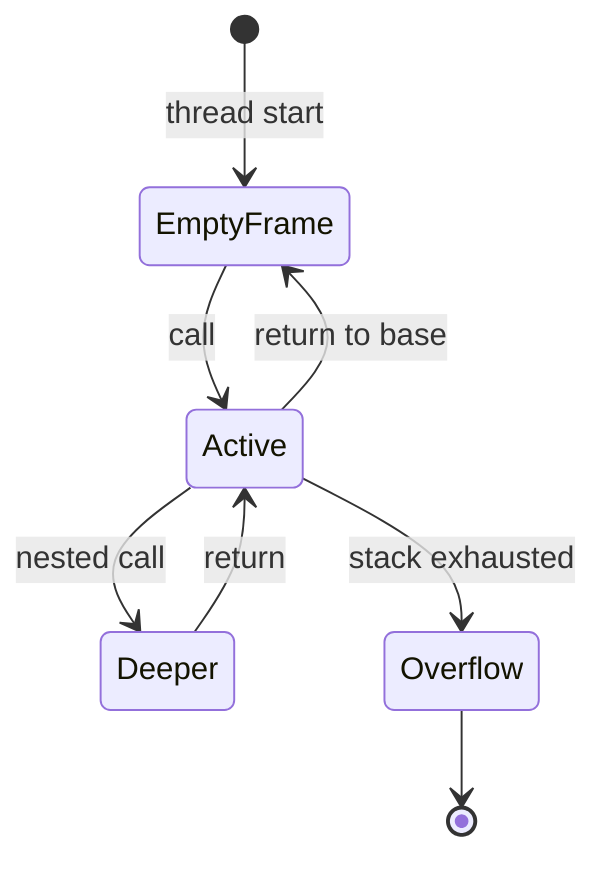
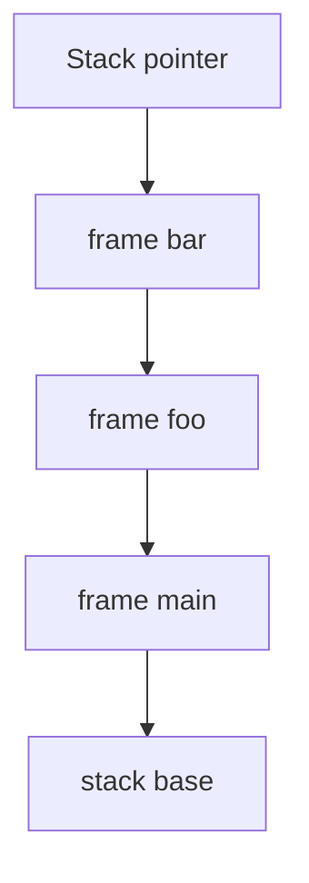

# Stack

<TopicMeta />

<Prerequisites />

::: tip Published
This page meets the handbook **published** bar: deep explanation, ≥10 common mistakes, and official references. Further engine-level errata welcome via PR.
:::

## Introduction

In systems terms, the **stack** is a per-thread region of memory that grows and shrinks with function calls. Each call pushes a **stack frame** (return address, saved registers, locals/parameters). This is the machine basis of the browser [call stack](/03-browser/call-stack/) you see in DevTools—and distinct from the [stack data structure](/01-computer-science/data-structures/stack-ds/) ADT, though both are LIFO.

## Why does it exist?

Calls nest; the CPU needs a disciplined place to remember “where to return” and local scratch space that frees automatically. Hardware and OS conventions (stack pointer register) make push/pop extremely cheap compared to heap allocation.

## Historical Background

Stack machines and call stacks evolved with early procedural languages. Recursion made the model essential. JavaScript engines implement the ECMAScript execution context stack atop native stacks (with care for async—async pauses do not keep a native frame forever).

## Mental Model

LIFO: last call pushed is first popped.

```text
main()
  → foo()
    → bar()   // top of stack
  ← bar returns
← foo returns
```

Frame contents (conceptual): return address, parameters, local variables, sometimes spill slots. Large locals can blow the stack; big data belongs on the [heap](/01-computer-science/heap/).

## Internal Workflow

1. Caller evaluates arguments
2. Call instruction pushes return address; jumps to callee
3. Callee prolog allocates frame (moves stack pointer)
4. Body executes; may call further (deeper stack)
5. Epilog deallocates frame; returns to address
6. Overflow if stack pointer crosses OS/guard page → crash / RangeError in JS

## Lifecycle



## Browser Perspective

DevTools “Call Stack” panel shows JS frames on the main thread (or worker). Sync work deepens the stack; when it returns to idle, the [event loop](/03-browser/event-loop/) can run the next task. Stack traces in errors are snapshots of frames at throw time.

## JavaScript Engine Perspective

Engines map JS execution contexts to native frames or optimized frames; tail-call elimination is largely not guaranteed in JS. Async functions complete a native call, schedule continuation; the logical async “stack” for debugging is reconstructed (async stack traces).

## React Perspective

Render is a recursive walk of components—deep trees deepen the stack. Very deep element trees can overflow; prefer composition patterns that flatten where needed. Error stack traces often point through React frames.

## Next.js Perspective

Not applicable beyond the same Node stack limits on the server during SSR.

## Server Perspective

Each request handler on a thread/worker uses a stack; unbounded recursion in SSR helpers crashes the process.

## Network Perspective

Not applicable.

## Memory Perspective

Stacks are finite (often ~1MB order on some platforms for JS, environment-dependent). Space cost of recursion is O(depth) stack frames. Prefer heap structures + iteration for large depths. Stack memory is reclaimed instantly on return—no GC for frame locals themselves (referenced heap objects remain).

## Performance

Stack allocation is cheap (pointer adjust). Excessive depth hurts instruction cache and risks crash. Throwing/catching uses stack unwinding—avoid hot-path exceptions for control flow.

## Production Example

A recursive file-tree component rendered 20k nested folders without virtualization and hit `Maximum call stack size exceeded`. Fix: iterative traversal + windowed rendering. Same UX goal, bounded stack.

## Code Examples

```js
function sum(n) {
  if (n === 0) return 0
  return n + sum(n - 1) // O(n) stack depth
}

// Safer iterative
function sumIter(n) {
  let t = 0
  for (let i = 1; i <= n; i++) t += i
  return t
}

try {
  sum(1e5)
} catch (e) {
  console.log(e.name) // RangeError on many engines
}
```

```text
Pseudocode — call

push return_address
push args
jump function
// on return:
pop frame
jump return_address
```

## Diagrams



## Common Mistakes

1. Confusing call stack with the stack ADT interview question without noting both
2. Recursing on unbounded input depth
3. Assuming async/await keeps the same native stack across awaits
4. Putting huge arrays as stack-like locals in WASM without checking limits
5. Ignoring stack traces when debugging—jumping straight to logs
6. Believing try/finally erases stack cost of deep calls
7. Accidental circular synchronous calls between modules
8. Missing a production edge case for 01-computer-science.stack (#1)
9. Missing a production edge case for 01-computer-science.stack (#2)
10. Missing a production edge case for 01-computer-science.stack (#3)


## Best Practices

- Prefer iteration for large or unbounded depth
- Keep functions small enough that traces stay readable
- Use async stack traces in DevTools when diagnosing promise chains
- Distinguish “stack overflow” from “out of heap memory”

## Anti-patterns

- Recursive DFS on user-controlled graph depth without guards
- Using exceptions as routine stack-unwinding control flow in hot loops
- Deep monolithic reducers calling themselves synchronously without need

## Comparison

| Concept | Lifetime | Growth |
| --- | --- | --- |
| Call stack | Until return | Per call depth |
| Heap | Until unreferenced/freed | Dynamic |
| Stack ADT | Until pop | Explicit push/pop API |

## Interview Questions

### Easy

**Q:** What does LIFO mean for the call stack?

**A:** The most recently called function returns first; frames push on call and pop on return.

### Medium

**Q:** Why does `await` not leave your function sitting on the native stack forever?

**A:** The async function returns a Promise; the native frame completes. The continuation runs later on a fresh stack when the engine invokes the resolved callback via the event loop.

### Hard

**Q:** How would you convert a recursive tree walk that overflows into a safe algorithm?

**A:** Use an explicit stack data structure on the heap (iterative DFS) or a queue (BFS), bounding memory intentionally; or increase batching/virtualization so you never materialize huge depth in one sync call.

## Summary

- Call stacks store frames; LIFO matches nested calls
- Finite depth → recursion limits; async continues later
- Basis for browser call-stack debugging
- Next: [Heap](/01-computer-science/heap/)

## References

- [MDN — Call stack](https://developer.mozilla.org/en-US/docs/Glossary/Call_stack)
- [ECMAScript — Execution contexts](https://tc39.es/ecma262/#sec-execution-contexts)
- [Chrome — Debug JavaScript](https://developer.chrome.com/docs/devtools/javascript/)

<RelatedTopics />

Prev: [Memory](/01-computer-science/memory/) · Next: [Heap](/01-computer-science/heap/)
