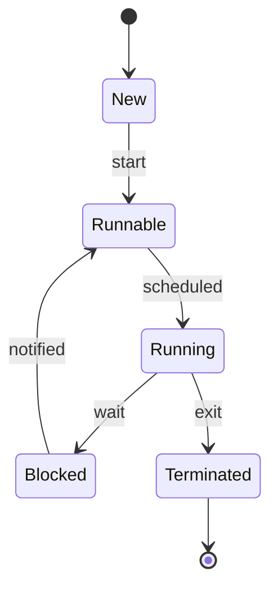
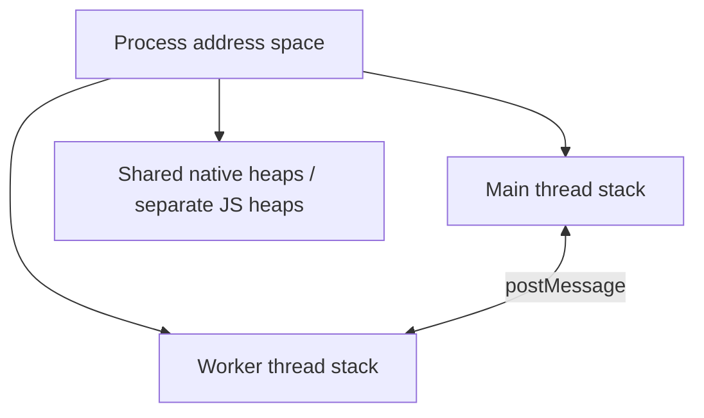

# Thread

<TopicMeta />

<Prerequisites />

::: tip Published
This page meets the handbook **published** bar: deep explanation, ≥10 common mistakes, and official references. Further engine-level errata welcome via PR.
:::

## Introduction

A **thread** is the OS (or runtime) unit of execution that owns a call [stack](/01-computer-science/stack/) and a program counter, while sharing the [process](/01-computer-science/process/) address space with sibling threads. JavaScript on a page is **mostly single-threaded**: one main thread runs your JS and much of rendering control. Parallelism arrives via Web Workers, worklets, and browser-internal threads—not by racing two `useEffect`s on shared objects.

## Why does it exist?

Processes isolate; threads parallelize *within* isolation. Blocking I/O and multi-core CPUs need concurrent execution without the cost of separate address spaces. The risk is shared-memory data races—hence JS’s single-threaded programming model plus structured worker messaging.

## Historical Background

Classic threading (pthreads, Java threads) made races common. The web chose an event-driven, single-threaded JS model (inspired by browsers’ UI threads and Node’s early design), adding Workers for explicit parallelism with structured clone/transfer.

## Mental Model

- **Main thread** — JS + style/layout (mostly); must stay responsive
- **Worker thread** — JS without DOM; talks via `postMessage`
- **Browser threads** — network, compositor, GC helpers, etc. (not your code)

Synchronization primitives (mutexes) exist in low-level code; in page JS you usually coordinate with messages and the [event loop](/01-computer-science/event-loop-cs/).

## Internal Workflow

Thread scheduling:

1. Thread becomes runnable
2. OS scheduler assigns a CPU core
3. Thread runs until preempted, blocks, or yields
4. Context switch saves/restores registers and stack pointer
5. Shared heap accesses require synchronization in native code

Worker creation clones/loads module scripts on a new thread with its own event loop.

## Lifecycle



## Browser Perspective

Compositor thread can keep scrolling smooth while main thread is busy (for some content). Long main-thread tasks still delay JS-driven UI. Workers: [Web Workers](/09-browser-apis/web-workers/). SharedArrayBuffer + Atomics enable true shared-memory threads with Cross-Origin Isolation.

## JavaScript Engine Perspective

One isolate can host multiple threads only under careful embedding rules; typically each worker has its own isolate/heap. Data moves by structured clone or transfer, not shared object references (unless SAB).

## React Perspective

React 18+ concurrent rendering still runs on the main JS thread; it *time-slices* work, it does not use free-threaded React by default in browsers. Offscreen/Worker renderers exist experimentally—know the default.

## Next.js Perspective

Node can use `worker_threads` for CPU tasks; request handlers still often share a thread pool model via libuv for I/O.

## Server Perspective

Thread pools back async I/O. CPU-bound work on the main Node thread blocks the event loop—same UX class of bug as browser jank.

## Network Perspective

Network stack threads perform socket I/O; completion notifies the JS thread via the event loop—your handler is not running on the NIC interrupt thread.

## Memory Perspective

Threads share heap → races. Workers isolate JS heaps (mostly) → duplication + copy costs. Stack memory is per-thread. Too many threads thrash caches and increase RAM.

## Performance

Parallel speedup needs divisible work and low communication overhead. `postMessage` copying large graphs can erase gains—transfer `ArrayBuffer`s. Prefer Workers for CPU > ~few ms that would block interaction.

## Production Example

Image resize on main thread blocked INP. Moving resize to a Worker with transferred `ArrayBuffer` restored responsiveness; the main thread only applied a bitmap result.

## Code Examples

```js
// main.js
const worker = new Worker(new URL('./worker.js', import.meta.url), { type: 'module' })
worker.postMessage({ op: 'sort', data: bigArray })
worker.onmessage = (e) => console.log('sorted', e.data)

// worker.js
self.onmessage = (e) => {
  const { data } = e.data
  data.sort((a, b) => a - b)
  self.postMessage(data)
}
```

```text
Pseudocode — data race (native shared memory)

thread A: x = x + 1
thread B: x = x + 1
// without atomic/lock, final x may be +1 not +2
```

## Diagrams



## Common Mistakes

1. Calling JS “multi-threaded” because of promises/async
2. Touching DOM from a Worker
3. Spawning unbounded Workers per keystroke
4. Structured-cloning 20MB objects every frame
5. Forgetting to `terminate()` Workers on navigation in SPAs
6. Using SharedArrayBuffer without understanding Spectre mitigations/COOP/COEP
7. Blocking Node’s main thread with CPU loops
8. Missing a production edge case for 01-computer-science.thread (#1)
9. Missing a production edge case for 01-computer-science.thread (#2)
10. Missing a production edge case for 01-computer-science.thread (#3)


## Best Practices

- Default to single-threaded correctness; add Workers with clear message protocols
- Transfer large binary payloads
- Cap Worker pool size
- Keep critical UI path on main thread short

## Anti-patterns

- Fake parallelism with nested `setTimeout(0)` for heavy CPU
- Shared mutable globals across workers via hacks
- Synchronous `Atomics.wait` on the main thread

## Comparison

| Model | Parallel CPU | Shared JS objects |
| --- | --- | --- |
| Main thread only | No | N/A |
| Workers + postMessage | Yes | No (clone/transfer) |
| SAB + Atomics | Yes | Yes (bytes) |

## Interview Questions

### Easy

**Q:** Is JavaScript single-threaded?

**A:** The language’s common browser model runs your realm’s JS on one thread at a time; hosts may use other threads, and Workers provide additional JS threads without DOM.

### Medium

**Q:** Why don’t promises create real parallelism?

**A:** Promise callbacks are scheduled on the same thread’s event loop after async work completes; they interleave, not race on multiple cores (unless the *host* did work elsewhere).

### Hard

**Q:** Design a Worker pool for image processing in a SPA.

**A:** Fixed pool size ≈ cores; queue jobs; transfer buffers; cancel on route change; fall back to main thread for tiny images; measure postMessage overhead; ensure errors propagate; avoid SAB unless cross-origin isolated and justified.

## Summary

- Threads execute; processes isolate
- Page JS is mainly one thread; Workers add explicit parallelism
- Messaging beats shared mutability on the web
- Next: [Event Loop (Runtime View)](/01-computer-science/event-loop-cs/)

## References

- [MDN — Web Workers API](https://developer.mozilla.org/en-US/docs/Web/API/Web_Workers_API)
- [HTML Living Standard — Workers](https://html.spec.whatwg.org/multipage/workers.html)
- [Node.js — Worker threads](https://nodejs.org/api/worker_threads.html)

<RelatedTopics />

Prev: [Process](/01-computer-science/process/) · Next: [Event Loop (Runtime View)](/01-computer-science/event-loop-cs/)
