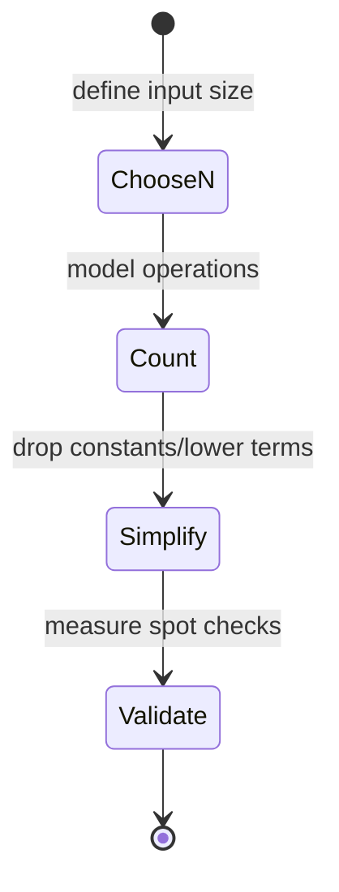
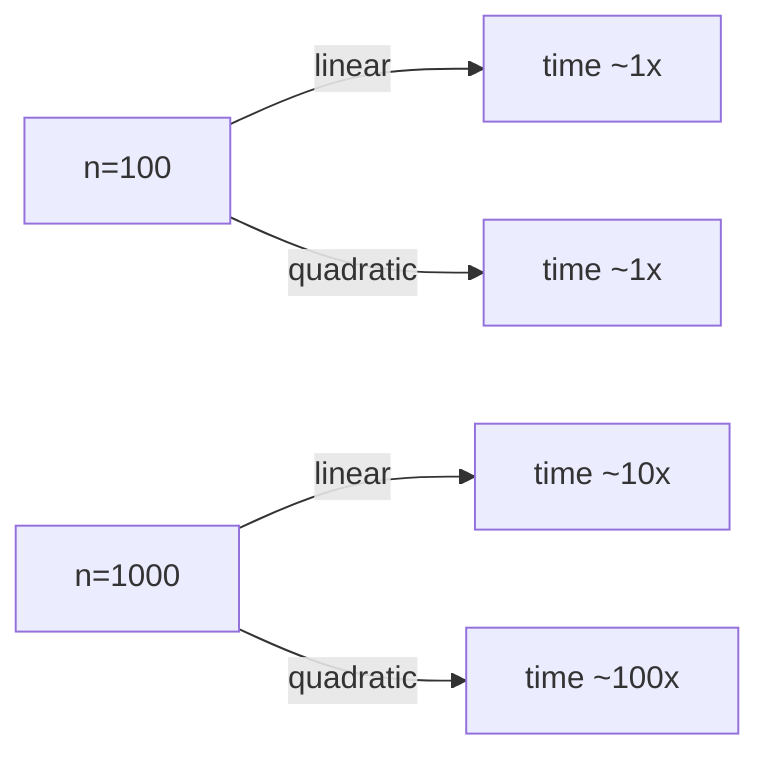

# Time Complexity

<TopicMeta />

<Prerequisites />

::: tip Published
This page meets the handbook **published** bar: deep explanation, ≥10 common mistakes, and official references. Further engine-level errata welcome via PR.
:::

## Introduction

**Time complexity** describes how the number of primitive steps an algorithm performs grows as input size \(n\) grows. It is about *scaling*, not milliseconds on your laptop. [Big O](/01-computer-science/big-o/) is the notation commonly used to summarize that growth; this page builds the intuition first.

## Why does it exist?

Machines and datasets change; wall-clock times do not transfer. Counting how work scales lets you predict whether a UI loop that is fine for 100 rows explodes at 100,000—before production.

## Historical Background

Algorithm analysis (Knuth, earlier mathematical roots) formalized asymptotic growth so engineers could compare algorithms independently of hardware. Interviews and systems design still use this language daily.

## Mental Model

Pick a unit of work (comparison, iteration step). Express steps as a function \(T(n)\). Focus on the **dominant term** as \(n\) gets large.

| Pattern | Rough \(T(n)\) |
| --- | --- |
| Single loop to n | \(c\cdot n\) |
| Nested loops to n | \(c\cdot n^2\) |
| Halving each step | \(c\cdot \log n\) |
| Divide & conquer sort | \(c\cdot n\log n\) |

Constants matter in production but are secondary in first-cut analysis.

## Internal Workflow

1. Identify input size parameter(s) \(n\) (and maybe \(m\))
2. Find loops/recursions that depend on \(n\)
3. Multiply nested independent iterations
4. Add sequential blocks; keep the largest-growth term
5. Sanity-check with small timings at 1k vs 10k inputs

## Lifecycle



## Browser Perspective

Main-thread handlers with \(O(n^2)\) DOM work cause jank as lists grow. Virtualization changes *effective* \(n\) painted per frame.

## JavaScript Engine Perspective

Engines shave constant factors (JIT); they rarely turn \(n^2\) into \(n\). Engine costs (GC, hidden classes) add constants/noise.

## React Perspective

Re-rendering a list of \(n\) items without memo/windowing is \(O(n)\) React work per update—fine until \(n\) and update frequency both rise. Nested maps over the same list → \(O(n^2)\) easily.

## Next.js Perspective

SSR mapping huge datasets to HTML is CPU time on the server—same complexity, different thread.

## Server Perspective

Request handlers with \(O(n^2)\) over body size are DoS vectors. Bound \(n\).

## Network Perspective

Not time complexity of CPU—but transferring \(n\) bytes is at least \(O(n)\) on the wire. Do not download \(n\) if you need \(k\ll n\).

## Memory Perspective

Time and space trade off: hash indexes spend memory to buy average \(O(1)\) lookups. See [Space Complexity](/01-computer-science/space-complexity/).

## Performance

Asymptotic class first, then constants, then micro-opts. Prove \(n\) with logs: if 10× input → ~100× time, suspect quadratic.

## Production Example

A search box filtered with nested loops: for each of \(n\) items, scan \(n\) selected tags (\(O(n^2)\)). At 5k items the keystroke handler exceeded 100ms. Pre-indexing tags in a Map made it \(O(n)\).

## Code Examples

```js
// O(n)
function sum(arr) {
  let s = 0
  for (const x of arr) s += x
  return s
}

// O(n²)
function hasDuplicateNaive(arr) {
  for (let i = 0; i < arr.length; i++)
    for (let j = i + 1; j < arr.length; j++)
      if (arr[i] === arr[j]) return true
  return false
}

// O(n) time with Set
function hasDuplicate(arr) {
  const seen = new Set()
  for (const x of arr) {
    if (seen.has(x)) return true
    seen.add(x)
  }
  return false
}
```

```text
Pseudocode — analyze nested loops

T = 0
for i in 1..n:        // n
  for j in 1..n:      // n each
    T += 1            // => n*n
```

## Diagrams



## Common Mistakes

1. Quoting Big O without defining \(n\)
2. Ignoring nested loops hidden in library calls
3. Measuring once on tiny \(n\) and declaring “fast”
4. Confusing average vs worst case (hash tables)
5. Forgetting sort is typically \(O(n\log n)\)
6. Assuming async makes CPU complexity free
7. Optimizing constants before fixing quadratic blowups
8. Missing a production edge case for 01-computer-science.time-complexity (#1)
9. Missing a production edge case for 01-computer-science.time-complexity (#2)
10. Missing a production edge case for 01-computer-science.time-complexity (#3)


## Best Practices

- State best/average/worst when they differ
- Log \(n\) in performance traces
- Prefer appropriate data structures early
- Bound user-controlled \(n\)

## Anti-patterns

- “It’s only a few thousand rows” without measuring devices
- Copy-paste nested filters in render paths
- Recomputing expensive functions every keystroke without debounce/index

## Comparison

| Growth | Name | UI intuition |
| --- | --- | --- |
| \(O(1)\) | Constant | Fine |
| \(O(\log n)\) | Logarithmic | Fine |
| \(O(n)\) | Linear | Watch large n |
| \(O(n\log n)\) | Linearithmic | Sorts |
| \(O(n^2)\) | Quadratic | Danger for UI |
| \(O(2^n)\) | Exponential | Only tiny n |

## Interview Questions

### Easy

**Q:** What is time complexity?

**A:** A characterization of how an algorithm’s operation count grows as a function of input size.

### Medium

**Q:** What is the time complexity of checking duplicates with a nested loop vs a Set?

**A:** Nested loop \(O(n^2)\); Set membership approach \(O(n)\) average time with \(O(n)\) extra space.

### Hard

**Q:** A page sorts on every render. How do you analyze and fix it?

**A:** Sorting is \(O(n\log n)\) per render; if parent re-renders often, total cost multiplies by frame count. Memoize sorted data, sort in a Worker, or sort on server; verify with Profiler + complexity argument.

## Summary

- Time complexity = scaling of work with \(n\)
- Dominating nested loops drive quadratic pain
- Measure to confirm; Big O next formalizes notation
- Next: [Space Complexity](/01-computer-science/space-complexity/)

## References

- [MDN — Performance](https://developer.mozilla.org/en-US/docs/Web/Performance)
- [Wikipedia — Time complexity](https://en.wikipedia.org/wiki/Time_complexity) (orientation)
- CLRS — *Introduction to Algorithms* (canonical text)

<RelatedTopics />

Prev: [Garbage Collection](/01-computer-science/garbage-collection/) · Next: [Space Complexity](/01-computer-science/space-complexity/)
