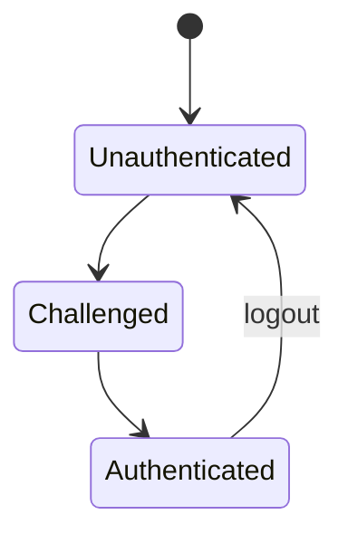
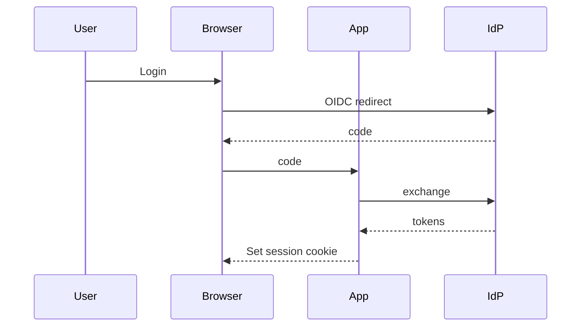

# Authentication

<TopicMeta />

<Prerequisites />

::: tip Published
This page meets the handbook **published** bar: deep explanation, ≥10 common mistakes, and official references. Further engine-level errata welcome via PR.
:::

## Introduction

**Authentication (AuthN)** answers “who are you?” — verifying identity via passwords, magic links, OAuth/OIDC, passkeys/WebAuthn, mTLS, etc. It is distinct from [authorization](/02-internet/authorization/) (“what can you do?”).

## Why does it exist?

Without AuthN, personalization and protected APIs are impossible. Weak AuthN is account takeover.

## Historical Background

HTTP Basic → form sessions → federated OAuth → OIDC identity layer → passkeys.

## Mental Model

Credentials → verifier → identity assertion (session/cookie or token). Browser stores the assertion carefully.

## Internal Workflow

1. Collect credentials / redirect to IdP.
2. Verify (password hash / IdP code exchange / WebAuthn).
3. Issue session or tokens.
4. Subsequent requests authenticate via cookie/token.
5. Logout/revoke.

## Lifecycle



## Browser Perspective

Redirects, cookies, WebAuthn ceremonies, FedCM emerging.

## JavaScript Engine Perspective

Not applicable.

## React Perspective

Don’t keep long-lived tokens in JS when HttpOnly sessions suffice.

## Next.js Perspective

Auth.js / middleware gate server components & routes.

## Server Perspective

Hash passwords (argon2/bcrypt); never store raw; constant-time compares.

## Network Perspective

HTTPS mandatory for credentials.

## Memory Perspective

Not applicable.

## Performance

Auth redirects add RTTs; cache userinfo carefully; JWKS fetch caching.

## Production Example

Password reset tokens were predictable; attacker reset accounts. Switched to 256-bit random + single use.

## Code Examples

```http
Authorization: Bearer eyJhbGciOi...
# or Cookie: session=…
```

## Diagrams



## Common Mistakes

1. Rolling custom crypto for passwords
2. JWT in localStorage without XSS posture
3. Confusing AuthN with AuthZ
4. Long-lived refresh tokens without rotation
5. Logging tokens/passwords
6. Trusting email from IdP without checking audience/issuer
7. No rate limits on login
8. Overlooking an edge case #1 specific to 02-internet.authentication in production traffic
9. Overlooking an edge case #2 specific to 02-internet.authentication in production traffic
10. Overlooking an edge case #3 specific to 02-internet.authentication in production traffic


## Best Practices

- Prefer standard protocols (OIDC) & passkeys
- HttpOnly sessions where suitable
- MFA for sensitive apps
- Rotate refresh tokens

## Anti-patterns

- Home-grown SSO

## Comparison

| Method | UX | Notes |
| --- | --- | --- |
| Password + session | Familiar | Phishing risk |
| OIDC | Federated | Great for SaaS |
| Passkeys | Strong | Phishing resistant |

## Interview Questions

### Easy

**Q:** AuthN vs AuthZ?

**A:** AuthN identifies the principal; AuthZ decides permissions.

### Medium

**Q:** Why is HTTPS required for login?

**A:** To prevent credentials and session cookies from being intercepted or modified on the network.

### Hard

**Q:** Outline Authorization Code + PKCE for a SPA.

**A:** SPA redirects to IdP with code challenge; receives auth code; exchanges code+verifier at IdP for tokens — avoids embedding a client secret in the SPA.

## Summary

- AuthN proves identity
- Prefer standards and HttpOnly sessions when fit
- Never invent password storage
- Distinct from authorization

## References

- [OWASP Authentication Cheat Sheet](https://cheatsheetseries.owasp.org/cheatsheets/Authentication_Cheat_Sheet.html)
- [OpenID Connect Core](https://openid.net/specs/openid-connect-core-1_0.html)

<RelatedTopics />


Prev: [`02-internet.sessions`](/02-internet/sessions/) · Next: [`02-internet.authorization`](/02-internet/authorization/)
