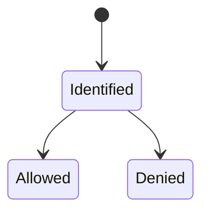
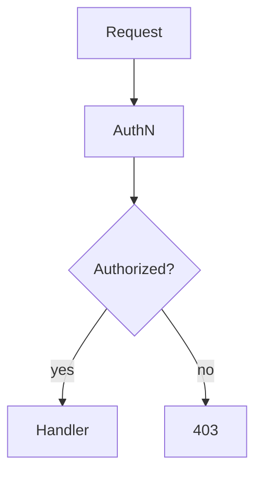

# Authorization

<TopicMeta />

<Prerequisites />

::: tip Published
This page meets the handbook **published** bar: deep explanation, ≥10 common mistakes, and official references. Further engine-level errata welcome via PR.
:::

## Introduction

**Authorization (AuthZ)** decides whether a principal may perform an action on a resource — roles (RBAC), attributes/policies (ABAC), ACLs, relationship-based models (ReBAC). It always runs **on the server** for security; UI hiding is UX only.

## Why does it exist?

Broken AuthZ (IDOR) is a top real-world vulnerability class — users accessing others’ objects by changing IDs.

## Historical Background

OS ACLs → web roles → centralized policy engines (OPA), Google Zanzibar-inspired systems.

## Mental Model

`can(principal, action, resource, context)?` Every API must answer. Frontend routes are not enforcement.

## Internal Workflow

1. Authenticate request → principal.
2. Load policies/roles/relationships.
3. Allow/deny; audit.
4. Return 401 if unauthenticated, 403 if authenticated but forbidden.

## Lifecycle



## Browser Perspective

Hide buttons for UX; still expect 403s.

## JavaScript Engine Perspective

Not applicable.

## React Perspective

Permission hooks are convenience, not security.

## Next.js Perspective

Server Components/Route Handlers must check AuthZ before data access.

## Server Perspective

Enforce per object, not just “is logged in”.

## Network Perspective

Not applicable.

## Memory Perspective

Not applicable.

## Performance

Policy checks should be fast; cache role membership carefully with invalidation.

## Production Example

API checked `userId` from client body instead of session — IDOR. Fixed to use server session subject.

## Code Examples

```ts
if (resource.ownerId !== session.userId && !session.roles.includes('admin')) {
  return new Response('Forbidden', { status: 403 })
}
```

## Diagrams



## Common Mistakes

1. UI-only authorization
2. Trusting client-provided roles
3. Checking auth only at gateway, not per resource
4. Using 401/403 inconsistently without a policy
5. Overly broad admin roles
6. Caching permissions without invalidation
7. Overlooking an edge case #1 specific to 02-internet.authorization in production traffic
8. Overlooking an edge case #2 specific to 02-internet.authorization in production traffic
9. Overlooking an edge case #3 specific to 02-internet.authorization in production traffic
10. Overlooking an edge case #4 specific to 02-internet.authorization in production traffic


## Best Practices

- Deny by default
- Per-resource checks
- Centralize policies as complexity grows
- Audit sensitive allows

## Anti-patterns

- Security through obscurity of object IDs

## Comparison

| Model | Idea |
| --- | --- |
| RBAC | Roles → permissions |
| ABAC | Attributes/policies |
| ACL | Per-object grants |
| ReBAC | Relationships (graph) |

## Interview Questions

### Easy

**Q:** Where must authorization be enforced?

**A:** On the server (or other trusted tier), for every sensitive operation.

### Medium

**Q:** What is IDOR?

**A:** Insecure Direct Object Reference — changing a resource ID to access another user’s object due to missing AuthZ.

### Hard

**Q:** Why are 401 and 403 different?

**A:** 401 means authentication required/failed; 403 means the server understands the principal but refuses the action. Browsers/clients use them differently for login redirects.

## Summary

- AuthZ answers “allowed?”
- Enforce server-side per resource
- UI checks are not security
- IDOR is the classic failure

## References

- [OWASP Authorization Cheat Sheet](https://cheatsheetseries.owasp.org/cheatsheets/Authorization_Cheat_Sheet.html)
- [OWASP Top 10 — Broken Access Control](https://owasp.org/Top10/A01_2021-Broken_Access_Control/)

<RelatedTopics />


Prev: [`02-internet.authentication`](/02-internet/authentication/) · Next: [`02-internet.rest`](/02-internet/rest/)
