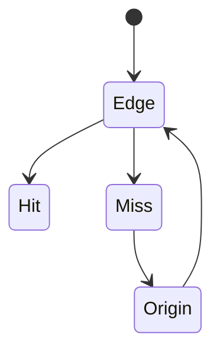
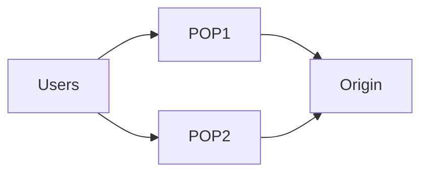

# CDN Basics

<TopicMeta />

<Prerequisites />

::: tip Published
This page meets the handbook **published** bar: deep explanation, ≥10 common mistakes, and official references. Further engine-level errata welcome via PR.
:::

## Introduction

A **CDN (Content Delivery Network)** places caches/edges near users to serve static assets (and sometimes dynamic/edge compute) with lower latency and offload from origin. It is shared HTTP caching + Anycast routing + operational tooling (purge, WAF, TLS).

## Why does it exist?

Origins in one region cannot be close to everyone. CDNs cut RTT and absorb traffic spikes for cacheable content.

## Historical Background

1990s commercial CDNs → cloud CDN commodity → edge workers.

## Mental Model

User → nearest POP → cache hit return / miss fetch origin → store per headers → next user hits.

## Internal Workflow

1. DNS/anycast to POP.
2. TLS terminate at edge often.
3. Cache lookup keyed by URL/+headers.
4. Origin fetch on miss; respect Cache-Control.

## Lifecycle



## Browser Perspective

Still HTTP; cookies on CDN hostnames need care.

## JavaScript Engine Perspective

Not applicable.

## React Perspective

Not applicable.

## Next.js Perspective

Many platforms put a CDN in front by default.

## Server Perspective

Origin shield / tiered caching reduces origin storms.

## Network Perspective

Anycast + peering matter as much as “more POPs”.

## Memory Perspective

Not applicable.

## Performance

Cache hit ratio is the KPI. Incorrect Vary/cookies destroy hit ratio.

## Production Example

Product images uncacheable due to `Set-Cookie` on every response — stripped at CDN, hit ratio 5%→92%.

## Code Examples

```http
# Good for CDN-cached asset
Cache-Control: public, max-age=86400
```

## Diagrams



## Common Mistakes

1. Putting personalized HTML on long CDN TTLs
2. Purging as primary deploy strategy without hashing
3. Cookieing static hostname
4. Assuming CDN equals DDoS immunity without config
5. Ignoring geographic privacy/compliance of edge logs
6. Double compression mistakes
7. Overlooking an edge case #1 specific to 02-internet.cdn-basics in production traffic
8. Overlooking an edge case #2 specific to 02-internet.cdn-basics in production traffic
9. Overlooking an edge case #3 specific to 02-internet.cdn-basics in production traffic
10. Overlooking an edge case #4 specific to 02-internet.cdn-basics in production traffic


## Best Practices

- Hash assets; long TTL
- Origin shield
- Explicit purge only when needed
- Separate cookie-less static domain if needed

## Anti-patterns

- Bypass CDN for all HTML “to be safe” without measuring

## Comparison

| Layer | Role |
| --- | --- |
| Browser cache | Per user |
| CDN | Shared near users |
| Origin | Source of truth |

## Interview Questions

### Easy

**Q:** What is a CDN?

**A:** A distributed set of edge servers that cache and serve content close to users.

### Medium

**Q:** When does a CDN help most?

**A:** For cacheable static assets and cacheable pages — high hit ratio, lower latency, origin offload.

### Hard

**Q:** How can cookies defeat CDN caching?

**A:** If responses vary on Cookie or Set-Cookie marks content uncacheable/private, edges cannot share responses effectively.

## Summary

- CDNs cache near users
- Hit ratio depends on headers
- Great for static & some HTML
- Still honor HTTP caching rules

## References

- [MDN — CDN](https://developer.mozilla.org/en-US/docs/Glossary/CDN)
- [RFC 9111 — HTTP Caching](https://www.rfc-editor.org/rfc/rfc9111)

<RelatedTopics />


Prev: [`02-internet.http-caching`](/02-internet/http-caching/) · Next: [`02-internet.load-balancing-basics`](/02-internet/load-balancing-basics/)
