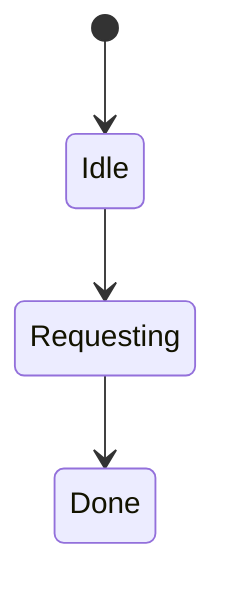
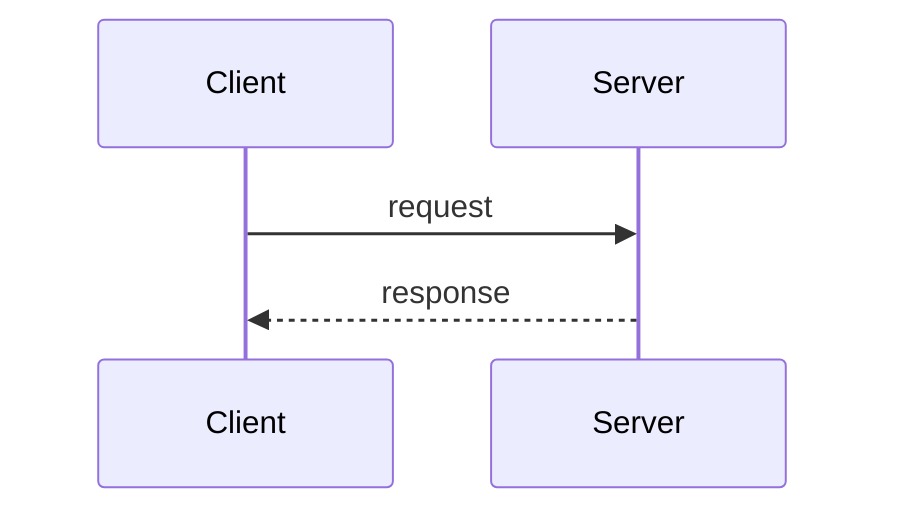

# Client

<TopicMeta />

<Prerequisites />

::: tip Published
This page meets the handbook **published** bar: deep explanation, ≥10 common mistakes, and official references. Further engine-level errata welcome via PR.
:::

## Introduction

A **client** initiates communication to a **server** (or peer). In web engineering the primary client is the browser: it resolves DNS, connects, speaks HTTP(S), renders, and enforces security policies.

## Why does it exist?

APIs are designed around client capabilities and constraints (CORS, cookies, connection limits, battery).

## Historical Background

Dumb terminals → desktop browsers → mobile browsers → native apps with WebViews → edge workers as clients of origins.

## Mental Model

Client asks; server answers (usually). Browsers are highly capable clients with sandboxes.

## Internal Workflow

1. User/app triggers request.
2. Client applies cache/CORS/credentials rules.
3. Transport + HTTP exchange.
4. Client processes response.

## Lifecycle



## Browser Perspective

Browser = opinionated HTTP client + renderer.

## JavaScript Engine Perspective

Not applicable.

## React Perspective

Not applicable.

## Next.js Perspective

Not applicable.

## Server Perspective

Must authenticate clients; never trust client input.

## Network Perspective

Clients often behind NAT; servers see CGNAT IPs.

## Memory Perspective

Not applicable.

## Performance

Connection reuse, parallelism limits, and client CPU matter as much as server.

## Production Example

Mobile clients on flaky networks needed idempotent APIs + resumable uploads.

## Code Examples

```js
await fetch('/api/me', { credentials: 'include' })
```

## Diagrams



## Common Mistakes

1. Trusting client-side authz
2. Ignoring browser connection limits (esp. HTTP/1.1)
3. Assuming all clients are Chrome desktop
4. Forgetting credentials mode
5. Treating WebView as identical to full browser
6. No timeouts on client requests
7. Overlooking an edge case #1 specific to 02-internet.client in production traffic
8. Overlooking an edge case #2 specific to 02-internet.client in production traffic
9. Overlooking an edge case #3 specific to 02-internet.client in production traffic
10. Overlooking an edge case #4 specific to 02-internet.client in production traffic


## Best Practices

- Timeouts + abort
- Feature detect
- Treat clients as hostile

## Anti-patterns

- Secrets in client bundles

## Comparison

| Client | Notes |
| --- | --- |
| Browser | CORS, cookies, UX |
| Native app | Often fewer CORS constraints |
| curl/server | Backend-to-backend |

## Interview Questions

### Easy

**Q:** What is a client in networking?

**A:** The initiator of a request to a service/server.

### Medium

**Q:** Why can’t the browser read arbitrary third-party responses?

**A:** Same-origin policy / CORS protect users from malicious sites reading other origins.

### Hard

**Q:** How do client constraints shape API design?

**A:** Payload size, chatty RPCs, auth cookie vs bearer, pagination, and offline — all follow from client environments.

## Summary

- Clients initiate
- Browsers are constrained clients
- Never trust the client
- Design APIs for real devices

## References

- [MDN — Client](https://developer.mozilla.org/en-US/docs/Glossary/Client)
- [Fetch Standard](https://fetch.spec.whatwg.org/)

<RelatedTopics />


Prev: [`02-internet.what-is-the-internet`](/02-internet/what-is-the-internet/) · Next: [`02-internet.server`](/02-internet/server/)
