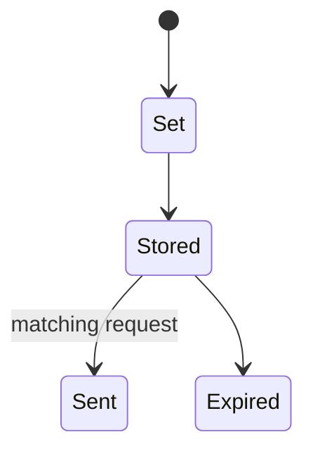
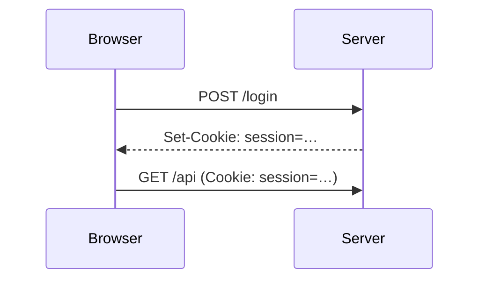

# Cookies

<TopicMeta />

<Prerequisites />

::: tip Published
This page meets the handbook **published** bar: deep explanation, ≥10 common mistakes, and official references. Further engine-level errata welcome via PR.
:::

## Introduction

**Cookies** are small name/value stores the browser keeps per cookie table rules and sends on matching requests via the `Cookie` header. Servers set them with `Set-Cookie`. Attributes (`Domain`, `Path`, `Secure`, `HttpOnly`, `SameSite`, `Max-Age`) control scope and security.

## Why does it exist?

Session IDs, CSRF defenses, personalization, and consent banners all collide in cookie space. Misconfigured cookies cause auth bugs and privacy violations.

## Historical Background

Netscape cookies → RFC 6265 → SameSite reforms against CSRF / cross-site leaks.

## Mental Model

Server says “store this”; browser auto-attaches later to matching requests. JS can read non-HttpOnly cookies via `document.cookie` — XSS can steal them.

## Internal Workflow

1. Response `Set-Cookie`.
2. Browser stores if accepted.
3. Later requests include `Cookie` when scope matches.
4. Expiry/eviction/clear removes.

## Lifecycle



## Browser Perspective

DevTools Application → Cookies. Third-party cookie deprecation changes tracking.

## JavaScript Engine Perspective

Not applicable.

## React Perspective

Prefer HttpOnly session cookies over localStorage tokens when possible.

## Next.js Perspective

Not applicable.

## Server Perspective

Set precise attributes; rotate session IDs on login.

## Network Perspective

Cookie headers add weight to every request — watch size.

## Memory Perspective

Not applicable.

## Performance

Large cookies inflate every request to that domain (incl. static if shared host).

## Production Example

Static CDN on parent domain received 6KB session cookies → moved static to cookie-less host.

## Code Examples

```http
Set-Cookie: session=abc; Path=/; Secure; HttpOnly; SameSite=Lax; Max-Age=3600
```

```js
// Only non-HttpOnly cookies:
document.cookie = 'theme=dark; path=/; secure; samesite=lax'
```

## Diagrams



## Common Mistakes

1. Storing access tokens in readable cookies without HttpOnly
2. SameSite=None without Secure
3. Overly broad Domain= on multi-tenant subdomains
4. Assuming cookies work cross-site without SameSite=None + CORS credentials
5. Sensitive data in cookies unencrypted
6. Not rotating session cookies after login
7. Ignoring third-party cookie blocking
8. Overlooking an edge case #1 specific to 02-internet.cookies in production traffic
9. Overlooking an edge case #2 specific to 02-internet.cookies in production traffic
10. Overlooking an edge case #3 specific to 02-internet.cookies in production traffic


## Best Practices

- HttpOnly + Secure + appropriate SameSite
- Minimal data in cookies
- Cookie-less static domains
- Document third-party needs

## Anti-patterns

- document.cookie session IDs for auth

## Comparison

| Store | Sent automatically? | JS readable? |
| --- | --- | --- |
| HttpOnly cookie | Yes (scope) | No |
| localStorage | No | Yes |
| memory token | No | Yes |

## Interview Questions

### Easy

**Q:** How does a server set a cookie?

**A:** Using the Set-Cookie response header; the browser stores and later sends it as Cookie.

### Medium

**Q:** What does SameSite=Lax do?

**A:** It omits the cookie on most cross-site subrequests while allowing top-level GET navigations — reducing CSRF risk.

### Hard

**Q:** Why prefer HttpOnly session cookies over localStorage JWTs?

**A:** HttpOnly cookies are not readable by XSS JavaScript; XSS can still do damage, but token exfiltration is harder. Pair with CSRF defenses.

## Summary

- Cookies are scoped key/values auto-sent by browsers
- Attributes define security boundaries
- SameSite/HttpOnly/Secure matter
- Size and domain choice affect performance

## References

- [RFC 6265bis drafts / RFC 6265](https://www.rfc-editor.org/rfc/rfc6265)
- [MDN — HTTP cookies](https://developer.mozilla.org/en-US/docs/Web/HTTP/Guides/Cookies)

<RelatedTopics />


Prev: [`02-internet.quic`](/02-internet/quic/) · Next: [`02-internet.sessions`](/02-internet/sessions/)
