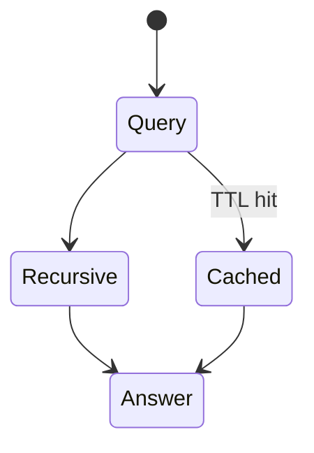
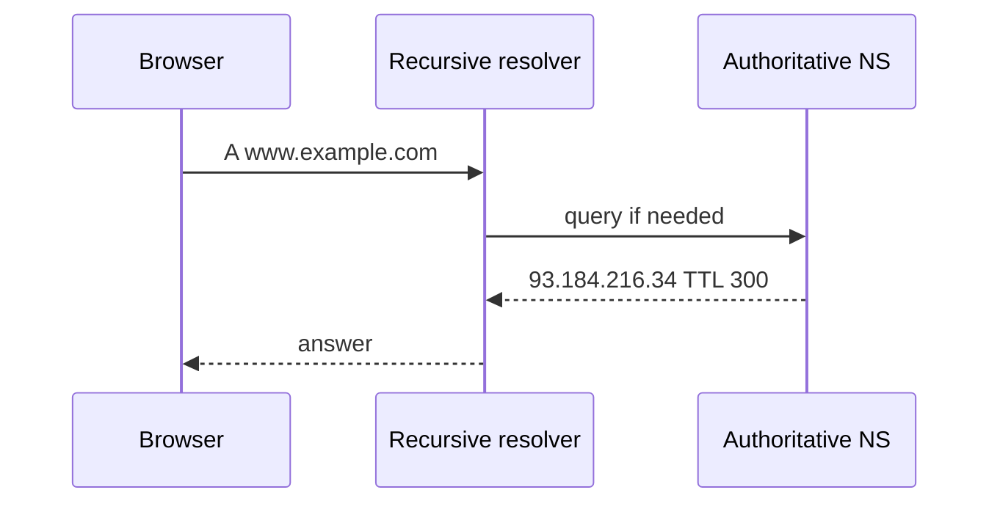

# DNS

<TopicMeta />

<Prerequisites />

::: tip Published
This page meets the handbook **published** bar: deep explanation, ≥10 common mistakes, and official references. Further engine-level errata welcome via PR.
:::

## Introduction

**DNS (Domain Name System)** maps names like `www.example.com` to records: **A/AAAA** (IPv4/IPv6), **CNAME**, **MX**, **TXT**, **NS**, etc. Browsers resolve names before connecting. DNS is a hierarchical, cached, UDP/TCP/DoH/DoT-served database — and a common outage/perf culprit.

## Why does it exist?

Wrong DNS ⇒ users hit old IPs after cutovers. Slow DNS ⇒ slow TTFB. DNS also carries authenticity-adjacent records (CAA, TLSA) and email security (SPF/DKIM via TXT).

## Historical Background

Hosts files → DNS (1983) → anycast resolvers → DNSSEC → DoH/DoT privacy.

## Mental Model

Stub resolver → recursive resolver (often ISP/Cloudflare/Google) → iterative queries from root → TLD → authoritative nameservers. TTLs control cache freshness.

## Internal Workflow

1. Browser asks OS resolver for hostname.
2. Recursive resolver walks hierarchy (or uses cache).
3. Authoritative answer returns A/AAAA (etc).
4. Client connects to IP; may re-resolve on failure/Happy Eyeballs.

## Lifecycle



## Browser Perspective

DNS cache + connection pool. `dns-prefetch` / `preconnect` resource hints.

## JavaScript Engine Perspective

Not applicable.

## React Perspective

Not applicable.

## Next.js Perspective

Not applicable.

## Server Perspective

Change DNS carefully; lower TTL before migrations.

## Network Perspective

DNS latency is often 1+ RTT before TCP. Prefetch/preconnect hide it.

## Memory Perspective

Not applicable.

## Performance

Use low TTLs only when needed; prefer stable anycast; measure resolve time in RUM; avoid long CNAME chains.

## Production Example

Blue/green cutover left TTL at 24h — half users stayed on old IP. Pre-lowered TTL + dual-run fixed next deploy.

## Code Examples

```bash
dig example.com +short
dig www.example.com CNAME
# DoH example (Cloudflare)
curl -H 'accept: application/dns-json' 'https://cloudflare-dns.com/dns-query?name=example.com&type=A'
```

## Diagrams



## Common Mistakes

1. Leaving high TTL during migrations
2. Long CNAME chains to the critical origin
3. Assuming DNS updates are instant globally
4. Single DNS provider without secondary
5. Putting underscores/invalid labels casually
6. Forgetting AAAA (IPv6) behavior with Happy Eyeballs
7. Using DNS as a poor man’s health check exclusively
8. Hard-coding IPs in clients and skipping DNS entirely
9. Ignoring negative caching / NXDOMAIN TTLs when debugging “flaky” DNS
10. Forgetting split-horizon DNS differences between corp VPN and public resolvers


## Best Practices

- Lower TTL before cutovers
- Redundant nameservers
- preconnect to critical origins
- Monitor resolution errors

## Anti-patterns

- Tiny TTLs forever (extra latency + cost)
- Manual hosts-file “fixes” in production lore

## Comparison

| Record | Purpose |
| --- | --- |
| A | IPv4 |
| AAAA | IPv6 |
| CNAME | Alias |
| NS | Nameserver delegation |
| TXT | Arbitrary text (SPF, verification) |

## Interview Questions

### Easy

**Q:** What does DNS do?

**A:** Resolves domain names to records like IP addresses.

### Medium

**Q:** Walk through resolving www.example.com.

**A:** Stub → recursive resolver → (cache miss) root/TLD/authoritative → A/AAAA answer with TTL → client caches.

### Hard

**Q:** How can DNS hurt web performance?

**A:** Cold resolve adds RTT; CNAME chains multiply lookups; high TTL slows failover; lack of prefetch on new origins delays first connection.

## Summary

- DNS maps names to records via hierarchy + cache
- TTL governs propagation trade-offs
- Critical for migrations and latency
- Browsers can prefetch DNS

## References

- [RFC 1034 / 1035 — DNS](https://www.rfc-editor.org/rfc/rfc1034)
- [MDN — DNS](https://developer.mozilla.org/en-US/docs/Glossary/DNS)

<RelatedTopics />


Prev: [`02-internet.switch`](/02-internet/switch/) · Next: [`02-internet.domain`](/02-internet/domain/)
