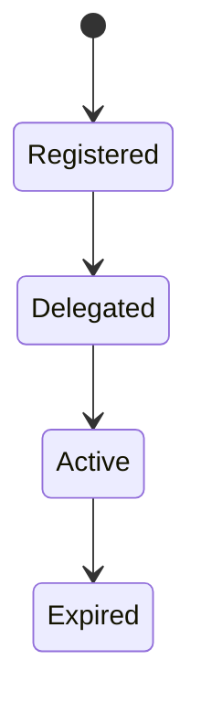
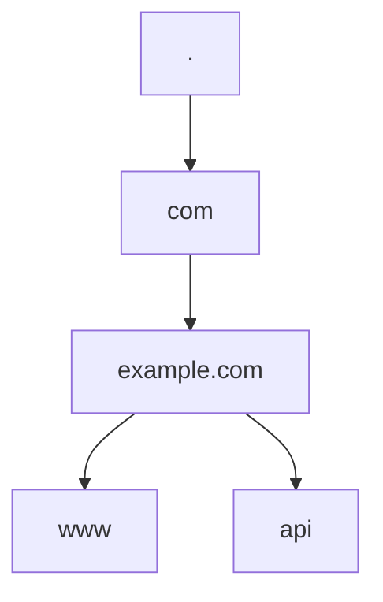

# Domain

<TopicMeta />

<Prerequisites />

::: tip Published
This page meets the handbook **published** bar: deep explanation, ≥10 common mistakes, and official references. Further engine-level errata welcome via PR.
:::

## Introduction

A **domain name** is a human-readable DNS name (`example.com`) composed of labels. Registrars sell registrations under TLDs; **zones** are delegated via NS records. Browsers combine scheme + host + port into an **origin** — `https://example.com` ≠ `https://www.example.com` if hosts differ.

## Why does it exist?

Cookies, CORS, and TLS certificates are host/domain scoped. Misunderstanding subdomain boundaries causes auth bugs.

## Historical Background

Central hosts.txt → DNS hierarchy → ICANN/registry/registrar ecosystem → IDN (unicode) domains.

## Mental Model

Root → TLD (`com`) → registered domain (`example.com`) → subdomains (`api.example.com`). Ownership ≠ automatic cookie sharing.

## Internal Workflow

1. Register domain.
2. Set NS to DNS host.
3. Publish records.
4. Issue TLS certs covering hosts.
5. Configure apps/cookie Domain attributes carefully.

## Lifecycle



## Browser Perspective

eTLD+1 matters for cookies (public suffix list).

## JavaScript Engine Perspective

Not applicable.

## React Perspective

Not applicable.

## Next.js Perspective

Not applicable.

## Server Perspective

Virtual hosting: many domains → one IP via SNI/Host header.

## Network Perspective

Domains are DNS names; IPs are where packets go.

## Memory Perspective

Not applicable.

## Performance

Extra subdomain can mean extra DNS + TLS unless connection coalescing applies (HTTP/2/3 rules).

## Production Example

Auth cookies set on `app.example.com` but API on `api.example.com` without Domain=.example.com — session “randomly” missing.

## Code Examples

```http
Set-Cookie: session=…; Domain=example.com; Path=/; Secure; HttpOnly; SameSite=Lax
```

## Diagrams



## Common Mistakes

1. Assuming subdomains share cookies by default
2. Ignoring public suffix list (can’t set Domain=com)
3. Cert missing www or API host
4. Mixing apex and www without redirects
5. Treating domain privacy as security control alone
6. Case-sensitivity myths (DNS labels case-insensitive)
7. Overlooking an edge case #1 specific to 02-internet.domain in production traffic
8. Overlooking an edge case #2 specific to 02-internet.domain in production traffic
9. Overlooking an edge case #3 specific to 02-internet.domain in production traffic
10. Overlooking an edge case #4 specific to 02-internet.domain in production traffic


## Best Practices

- Canonical host + redirects
- Explicit cookie Domain/Path/SameSite
- Cover all hostnames in certs (SAN)

## Anti-patterns

- Wildcard cookies across hostile multi-tenant subdomains

## Comparison

| Name | Example |
| --- | --- |
| TLD | com |
| Registered domain | example.com |
| FQDN | www.example.com. |
| Origin | https://www.example.com:443 |

## Interview Questions

### Easy

**Q:** What is a domain name?

**A:** A DNS name used to identify hosts/services, like example.com.

### Medium

**Q:** Why might www and apex be different origins?

**A:** Different hosts → different origins even with the same registrable domain.

### Hard

**Q:** How does the public suffix list affect cookies?

**A:** Browsers refuse Domain attributes on public suffixes so sites cannot set cookies for `.com` or other shared suffixes.

## Summary

- Domains are DNS names in a hierarchy
- Origins are stricter than “site”
- Cookie scope needs explicit design
- Certs and redirects must match hosts

## References

- [RFC 1035 — DNS](https://www.rfc-editor.org/rfc/rfc1035)
- [Public Suffix List](https://publicsuffix.org/)

<RelatedTopics />


Prev: [`02-internet.dns`](/02-internet/dns/) · Next: [`02-internet.ip`](/02-internet/ip/)
