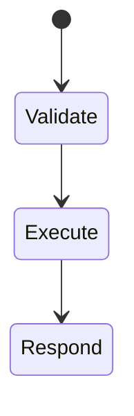
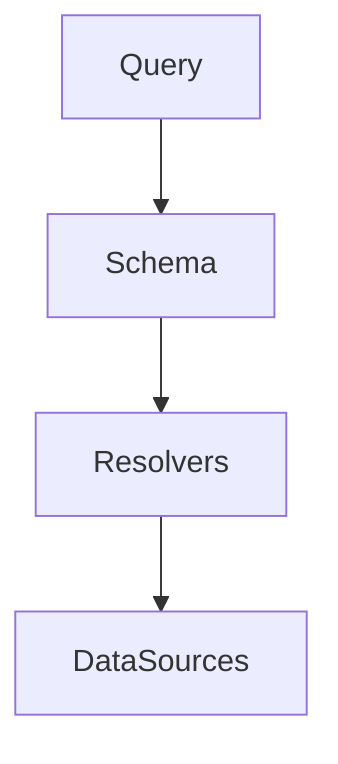

# GraphQL

<TopicMeta />

<Prerequisites />

::: tip Published
This page meets the handbook **published** bar: deep explanation, ≥10 common mistakes, and official references. Further engine-level errata welcome via PR.
:::

## Introduction

**GraphQL** is a query language and runtime for APIs: clients send queries/mutations/subscriptions against a **schema** of types and fields; the server resolves fields. It reduces over/under-fetching common in rigid REST endpoints — at the cost of caching and complexity trade-offs.

## Why does it exist?

Mobile/web UIs need tailored data graphs. One schema can serve many clients when governed well.

## Historical Background

Facebook internal → 2015 public → ecosystem (Apollo, Relay, GraphQL.js).

## Mental Model

Schema is a type graph; a query is a tree selection; resolvers populate fields; N+1 risks need dataloaders.

## Internal Workflow

1. Client posts query to `/graphql`.
2. Validate against schema.
3. Execute resolvers (with auth context).
4. Return `{ data, errors }`.

## Lifecycle



## Browser Perspective

Apollo/urql/Relay clients; upload/auth headers via fetch.

## JavaScript Engine Perspective

Not applicable.

## React Perspective

Hooks map queries to components; watch waterfalls vs fragments.

## Next.js Perspective

Server Components can query directly without shipping GraphQL client to browser.

## Server Perspective

AuthZ per field/object; depth/cost limiting against expensive queries.

## Network Perspective

Usually one HTTP POST; CDN caching harder than GET REST. Persisted queries help.

## Memory Perspective

Not applicable.

## Performance

Persisted queries, dataloaders, pagination (connections), complexity limits, avoid huge unbounded lists.

## Production Example

Public GraphQL without cost limits → expensive nested queries CPU DoS. Added depth/cost analysis + auth.

## Code Examples

```graphql
query Cart($id: ID!) {
  cart(id: $id) {
    id
    items { product { name price } quantity }
  }
}
```

```http
POST /graphql HTTP/1.1
Content-Type: application/json

{"query":"query { viewer { id name } }"}
```

## Diagrams



## Common Mistakes

1. Exposing GraphQL without AuthZ/cost limits
2. N+1 resolvers without dataloaders
3. Treating GraphQL as a DB dump
4. Ignoring error partial success semantics
5. Caching as if every query were a static GET
6. Giant unbounded lists without pagination
7. Overlooking an edge case #1 specific to 02-internet.graphql in production traffic
8. Overlooking an edge case #2 specific to 02-internet.graphql in production traffic
9. Overlooking an edge case #3 specific to 02-internet.graphql in production traffic
10. Overlooking an edge case #4 specific to 02-internet.graphql in production traffic


## Best Practices

- Persisted queries in prod
- Dataloaders
- Field-level authz
- Connection pagination

## Anti-patterns

- One mega `viewer` query fetched on every keystroke

## Comparison

| | GraphQL | REST |
| --- | --- | --- |
| Shape | Client-selected | Server endpoints |
| Caching | Harder | Natural for GET |
| Typing | Schema | OpenAPI optional |

## Interview Questions

### Easy

**Q:** What problem does GraphQL solve?

**A:** It lets clients request exactly the fields they need from a typed schema, reducing over/under-fetching.

### Medium

**Q:** What is the N+1 problem in GraphQL?

**A:** A list resolver that triggers a separate datastore fetch per child field — fixed with batching/dataloaders.

### Hard

**Q:** How do you securely expose GraphQL?

**A:** Authenticate, authorize per field/object, limit depth/complexity, prefer persisted queries, timeout/CPU budgets, and don’t leak internals in errors.

## Summary

- GraphQL = schema + queries + resolvers
- Powerful but needs cost control
- Caching differs from REST GET
- Dataloaders and AuthZ are mandatory at scale

## References

- [GraphQL specification](https://spec.graphql.org/)
- [GraphQL.org learn](https://graphql.org/learn/)

<RelatedTopics />


Prev: [`02-internet.rest`](/02-internet/rest/) · Next: [`02-internet.http-caching`](/02-internet/http-caching/)
