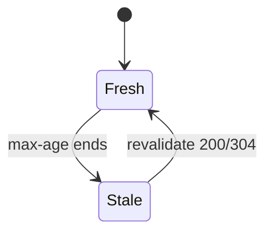
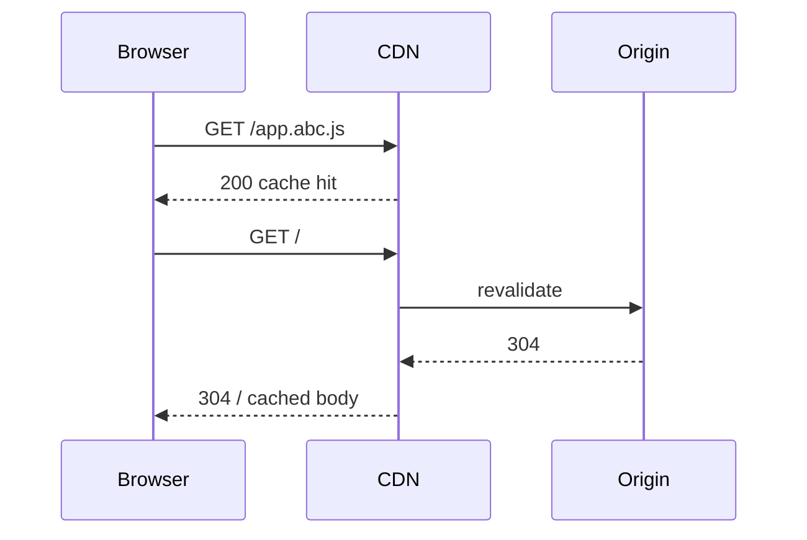

# HTTP Caching

<TopicMeta />

<Prerequisites />

::: tip Published
This page meets the handbook **published** bar: deep explanation, ≥10 common mistakes, and official references. Further engine-level errata welcome via PR.
:::

## Introduction

**HTTP caching** lets browsers and shared caches (CDNs) reuse responses without re-downloading. Controlled primarily by `Cache-Control`, `Expires`, validators (`ETag`/`Last-Modified`), and `Vary`. Correct caching is the highest-leverage web performance tool.

## Why does it exist?

Without cache headers, every navigation refetches; with wrong headers, users see stale private data.

## Historical Background

HTTP/1.0 Expires → HTTP/1.1 Cache-Control → modern stale-while-revalidate patterns.

## Mental Model

Freshness lifetime → serve from cache; when stale → revalidate (304) or refetch (200). Private vs public decides shared caches.

## Internal Workflow

1. Server sets caching metadata.
2. Browser/CDN stores response if allowed.
3. Later request: use cached or conditional GET.
4. 304 Not Modified saves bandwidth.

## Lifecycle



## Browser Perspective

Disk/memory HTTP cache; DevTools “disable cache”; Size shows (disk cache).

## JavaScript Engine Perspective

Not applicable.

## React Perspective

Client fetch caches depend on Request cache mode.

## Next.js Perspective

Next data cache ≠ browser cache; still emit HTTP headers for clients/CDNs.

## Server Perspective

Not applicable.

## Network Perspective

CDNs as shared caches honor public caching + Vary.

## Memory Perspective

Not applicable.

## Performance

Immutable hashed assets: `Cache-Control: public, max-age=31536000, immutable`. HTML: short/no-cache with revalidation.

## Production Example

HTML cached 24h at CDN → users stuck on old JS hashes after deploy. Fingerprinted assets + `no-cache` HTML fixed it.

## Code Examples

```http
# Fingerprinted static asset
Cache-Control: public, max-age=31536000, immutable

# HTML shell
Cache-Control: no-cache
ETag: "abc123"

# Private API
Cache-Control: private, no-store
```

## Diagrams



## Common Mistakes

1. Caching HTML and fingerprinted JS with the same policy
2. Forgetting Vary: Accept-Encoding / Authorization / Cookie when relevant
3. Caching authenticated responses as public
4. Using no-cache thinking it means don’t store (it means must revalidate)
5. Purge folklore instead of content hashing
6. Service Worker cache disagreeing with HTTP cache without a plan
7. Giant Cookie headers busting CDN cache keys unintentionally via Vary
8. Using `max-age=0` and `no-store` interchangeably
9. Forgetting CDN and browser are different caches with different keys
10. Shipping HTML with year-long TTL because “CDN is fast”


## Best Practices

- Hash filenames for static assets
- Revalidate HTML
- private/no-store for personalized data
- Understand no-cache vs no-store

## Anti-patterns

- Query string cache-busters on every request forever

## Comparison

| Directive | Meaning (approx) |
| --- | --- |
| max-age | Freshness lifetime |
| no-cache | Store but revalidate |
| no-store | Don’t store |
| private | Browser only |
| public | Shared caches OK |
| immutable | Never revalidate before expiry |

## Interview Questions

### Easy

**Q:** Which header primarily controls caching?

**A:** Cache-Control (with validators like ETag supporting revalidation).

### Medium

**Q:** Difference between no-cache and no-store?

**A:** no-cache allows storage but requires revalidation before reuse; no-store forbids storing the response.

### Hard

**Q:** How can Vary cause cache fragmentation?

**A:** Caches key on Vary headers; high-cardinality Vary (e.g., Cookie) can prevent meaningful cache hits.

## Summary

- Caching is header-driven
- Separate HTML vs hashed assets policies
- Validators enable 304s
- Never publicly cache private data

## References

- [RFC 9111 — HTTP Caching](https://www.rfc-editor.org/rfc/rfc9111)
- [MDN — HTTP caching](https://developer.mozilla.org/en-US/docs/Web/HTTP/Guides/Caching)

<RelatedTopics />


Prev: [`02-internet.graphql`](/02-internet/graphql/) · Next: [`02-internet.cdn-basics`](/02-internet/cdn-basics/)
