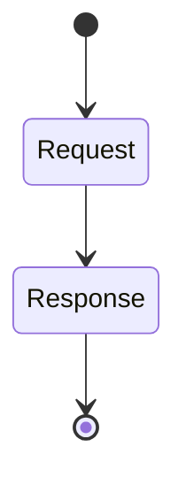
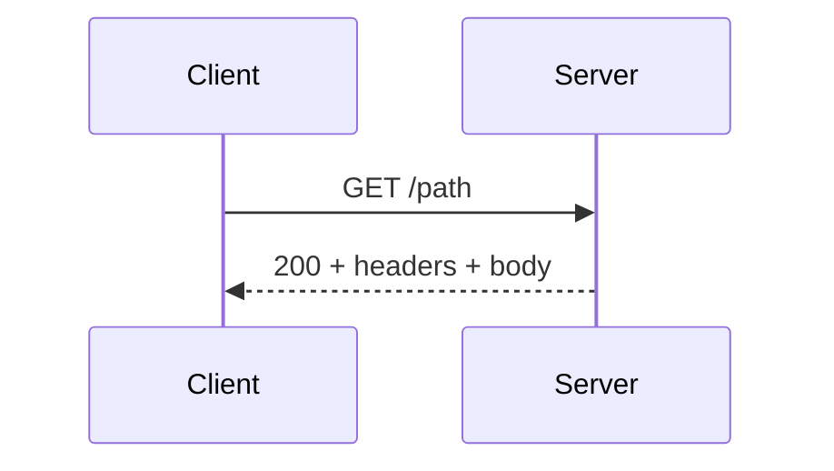

# HTTP

<TopicMeta />

<Prerequisites />

::: tip Published
This page meets the handbook **published** bar: deep explanation, ≥10 common mistakes, and official references. Further engine-level errata welcome via PR.
:::

## Introduction

**HTTP (Hypertext Transfer Protocol)** is the web’s application protocol: clients send **requests** (method, target, headers, optional body); servers send **responses** (status, headers, body). Modern versions are HTTP/1.1, HTTP/2, and HTTP/3 — semantics largely shared ([RFC 9110](https://www.rfc-editor.org/rfc/rfc9110)).

## Why does it exist?

Every SPA, SSR app, and API you build speaks HTTP. Caching, auth, CORS, and REST all hang off HTTP semantics.

## Historical Background

HTTP/0.9 one-line → HTTP/1.0 → HTTP/1.1 persistent connections → HTTP/2 multiplexing → HTTP/3 over QUIC.

## Mental Model

Stateless request/response messages. Servers shouldn’t need prior request memory *at the protocol layer* (sessions are app-level via cookies/tokens). Idempotent methods matter for retries.

## Internal Workflow

1. Client builds request.
2. Transport delivers (TCP/TLS or QUIC).
3. Server routes, handles, responds.
4. Intermediaries may cache/transform per rules.

## Lifecycle



## Browser Perspective

Fetch/XHR implement HTTP with CORS and cache.

## JavaScript Engine Perspective

Not applicable.

## React Perspective

Not applicable.

## Next.js Perspective

Route Handlers and `fetch` cache integrate with HTTP headers.

## Server Perspective

Frameworks map methods/paths to handlers.

## Network Perspective

Semantics over different transports (H1/H2/H3).

## Memory Perspective

Not applicable.

## Performance

Reduce RTTs (fewer requests, push less), compress, cache, choose HTTP/2/3, avoid huge headers/cookies on every call.

## Production Example

Mobile API sent 8KB cookies on each image CDN request to same parent domain — carved out cookie-less static host.

## Code Examples

```http
GET /api/items?limit=10 HTTP/1.1
Host: api.example.com
Accept: application/json
Authorization: Bearer <token>

HTTP/1.1 200 OK
Content-Type: application/json
Cache-Control: private, max-age=0
```

## Diagrams



## Common Mistakes

1. Using GET for state-changing actions
2. Ignoring status code classes
3. Putting secrets in query strings
4. Assuming HTTP is encrypted (need HTTPS)
5. Retrying non-idempotent POSTs blindly
6. Huge cookies on every request
7. Confusing 301/302/307/308 redirect method behavior
8. Ignoring Content-Type / charset and corrupting body parsing
9. Treating all 4xx as identical client bugs (auth vs validation differ)
10. Not versioning or documenting breaking API changes


## Best Practices

- Correct methods & status codes
- Explicit cache headers
- HTTPS everywhere
- Design idempotency keys for writes

## Anti-patterns

- RPC everything as POST /api with 200 on errors

## Comparison

| Version | Transport highlight |
| --- | --- |
| HTTP/1.1 | Text, concurrent conns |
| HTTP/2 | Multiplexed streams on TCP |
| HTTP/3 | QUIC/UDP |

## Interview Questions

### Easy

**Q:** What is HTTP?

**A:** The request/response application protocol used by the web and most web APIs.

### Medium

**Q:** Name safe/idempotent method examples.

**A:** GET/HEAD/OPTIONS are safe; GET/PUT/DELETE are idempotent in standard semantics; POST is neither generally.

### Hard

**Q:** How do intermediaries affect HTTP?

**A:** Caches, proxies, and CDNs may store/reuse responses per Cache-Control/Vary and can alter connection patterns — design headers accordingly.

## Summary

- HTTP = methods + status + headers + body
- Semantics shared across H1/H2/H3
- Stateless protocol; apps add session
- Caching and auth are header-driven

## References

- [RFC 9110 — HTTP Semantics](https://www.rfc-editor.org/rfc/rfc9110)
- [MDN — HTTP](https://developer.mozilla.org/en-US/docs/Web/HTTP)

<RelatedTopics />


Prev: [`02-internet.udp`](/02-internet/udp/) · Next: [`02-internet.https`](/02-internet/https/)
