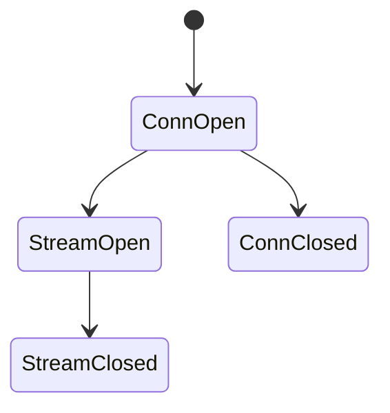
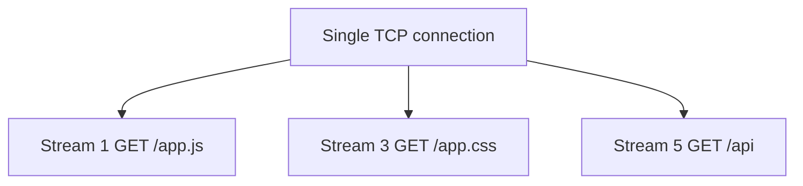

# HTTP/2

<TopicMeta />

<Prerequisites />

::: tip Published
This page meets the handbook **published** bar: deep explanation, ≥10 common mistakes, and official references. Further engine-level errata welcome via PR.
:::

## Introduction

**HTTP/2** replaces HTTP/1.1’s text framing with a **binary framed**, **multiplexed** protocol on one connection (typically TLS). Many requests share streams concurrently, reducing the need for domain sharding and multiple TCP connections.

## Why does it exist?

HTTP/1.1 browsers opened many connections per origin to fight head-of-line blocking at the HTTP message layer. H2 multiplexes streams — though **TCP HOL blocking** remains.

## Historical Background

SPDYs → HTTP/2 (RFC 7540 / 9113). Server push largely retreated in practice.

## Mental Model

One TCP+TLS pipe; many streams with interleaved frames; headers compressed with HPACK.

## Internal Workflow

1. TLS with ALPN `h2`.
2. Magic connection preface + SETTINGS.
3. Streams open for requests.
4. DATA/HEADERS frames flow both ways.

## Lifecycle



## Browser Perspective

DevTools still shows requests; protocol column shows h2. Connection coalescing may share conns across hosts with same IP+cert.

## JavaScript Engine Perspective

Not applicable.

## React Perspective

Not applicable.

## Next.js Perspective

Not applicable.

## Server Perspective

Need H2-capable LB; watch max concurrent streams.

## Network Perspective

Fewer connections; better on lossy nets than H1’s many conns, until TCP loss stalls all streams.

## Memory Perspective

Not applicable.

## Performance

Helps many small assets; still compress & cache. Avoid obsessive sharding that breaks coalescing.

## Production Example

Sharding static1–4.cdn broke H2 coalescing; consolidated hostname improved performance.

## Code Examples

```bash
curl -sI --http2 https://example.com | head
```

## Diagrams



## Common Mistakes

1. Domain sharding as if still on H1
2. Relying on server push
3. Assuming H2 fixes all latency (TTFB/CPU still matter)
4. Enormous headers defeating HPACK gains
5. Ignoring TCP HOL under loss
6. Turning on H2 without TLS where browsers require it
7. Overlooking an edge case #1 specific to 02-internet.http2 in production traffic
8. Overlooking an edge case #2 specific to 02-internet.http2 in production traffic
9. Overlooking an edge case #3 specific to 02-internet.http2 in production traffic
10. Overlooking an edge case #4 specific to 02-internet.http2 in production traffic


## Best Practices

- One strong origin for static when possible
- Compress assets; use caching
- Measure real protocol negotiation rates

## Anti-patterns

- Hundreds of tiny unbundled modules without HTTP caching strategy on H2 as an excuse for infinite waterfalls

## Comparison

| | HTTP/1.1 | HTTP/2 |
| --- | --- | --- |
| Framing | Text | Binary |
| Multiplex | No (1 req/conn) | Yes |
| Header compress | No | HPACK |

## Interview Questions

### Easy

**Q:** What is the headline feature of HTTP/2?

**A:** Multiplexed request/response streams over a single connection.

### Medium

**Q:** Why can HTTP/2 still stall all requests?

**A:** Streams share one TCP connection; TCP loss causes head-of-line blocking across streams.

### Hard

**Q:** What is connection coalescing?

**A:** Browsers may reuse one H2 connection for different hostnames if they resolve to the same IP and the cert authorizes them — impacting cookie/host designs and sharding.

## Summary

- H2 multiplexes over one TCP+TLS connection
- Reduces need for sharding
- TCP HOL remains
- Server push is rarely useful now

## References

- [RFC 9113 — HTTP/2](https://www.rfc-editor.org/rfc/rfc9113)
- [web.dev — HTTP/2](https://web.dev/articles/performance-http2)

<RelatedTopics />


Prev: [`02-internet.sse`](/02-internet/sse/) · Next: [`02-internet.http3`](/02-internet/http3/)
