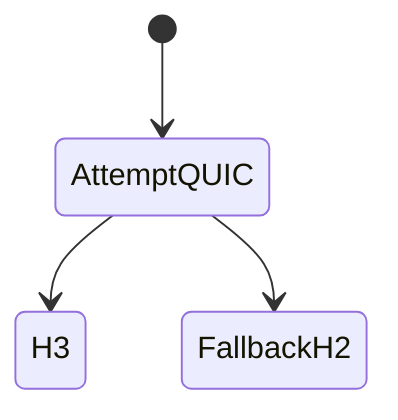

# HTTP/3

<TopicMeta />

<Prerequisites />

::: tip Published
This page meets the handbook **published** bar: deep explanation, ≥10 common mistakes, and official references. Further engine-level errata welcome via PR.
:::

## Introduction

**HTTP/3** runs HTTP semantics over **QUIC** (UDP). Streams are independent at the transport layer, so a lost packet typically stalls one stream rather than every multiplexed request. Browsers often race or fall back to HTTP/2.

## Why does it exist?

Improves performance on lossy mobile networks where TCP HOL hurts HTTP/2.

## Historical Background

Google QUIC experiments → IETF QUIC + HTTP/3 standardization.

## Mental Model

UDP + QUIC crypto/transport + HTTP frames. Connection IDs help survive NAT rebinding (Wi-Fi→LTE).

## Internal Workflow

1. DNS; maybe Alt-Svc / HTTPS RR hints.
2. QUIC handshake (combined with TLS 1.3).
3. HTTP/3 requests on QUIC streams.
4. Fallback to TCP/H2 if UDP blocked.

## Lifecycle



## Browser Perspective

Protocol shows h3 in DevTools when used.

## JavaScript Engine Perspective

Not applicable.

## React Perspective

Not applicable.

## Next.js Perspective

Not applicable.

## Server Perspective

CDN often easiest H3 enablement.

## Network Perspective

UDP 443 must be allowed; some enterprises block it.

## Memory Perspective

Not applicable.

## Performance

Biggest wins under loss/connection migration; not magic for CPU-bound TTFB.

## Production Example

Enabled H3 at CDN; watched success ratio and error logs; kept H2 fallback.

## Code Examples

```bash
curl --http3 -I https://example.com
```

## Diagrams


## Common Mistakes

1. Assuming all users get H3
2. No H2 fallback path testing
3. Ignoring UDP blocking
4. Expecting Lighthouse desktop to show mobile radio benefits
5. Turning on H3 without cert/SNI correctness
6. Confusing H3 with “always faster”
7. Overlooking an edge case #1 specific to 02-internet.http3 in production traffic
8. Overlooking an edge case #2 specific to 02-internet.http3 in production traffic
9. Overlooking an edge case #3 specific to 02-internet.http3 in production traffic
10. Overlooking an edge case #4 specific to 02-internet.http3 in production traffic


## Best Practices

- Enable via mature CDN
- Monitor negotiation + fallback
- Keep optimizing caching/TTFB

## Anti-patterns

- Custom UDP HTTP without QUIC

## Comparison

| | HTTP/2 | HTTP/3 |
| --- | --- | --- |
| Transport | TCP+TLS | QUIC/UDP |
| HOL | TCP HOL | Per-stream |
| Migration | Weak | Connection IDs |

## Interview Questions

### Easy

**Q:** What transport does HTTP/3 use?

**A:** QUIC over UDP.

### Medium

**Q:** Why can HTTP/3 perform better on lossy networks?

**A:** Lost packets don’t stall all multiplexed streams the way TCP HOL blocking does for HTTP/2.

### Hard

**Q:** How do clients discover HTTP/3?

**A:** Often via Alt-Svc headers / HTTPS resource records and cached knowledge from prior connections, with fallback to H2/H1.

## Summary

- H3 = HTTP over QUIC
- Avoids TCP HOL across streams
- Needs UDP; fallback required
- Often CDN-terminated

## References

- [RFC 9114 — HTTP/3](https://www.rfc-editor.org/rfc/rfc9114)
- [MDN — HTTP/3](https://developer.mozilla.org/en-US/docs/Web/HTTP/Guides/Protocol_upgrade_mechanism)

<RelatedTopics />


Prev: [`02-internet.http2`](/02-internet/http2/) · Next: [`02-internet.quic`](/02-internet/quic/)
