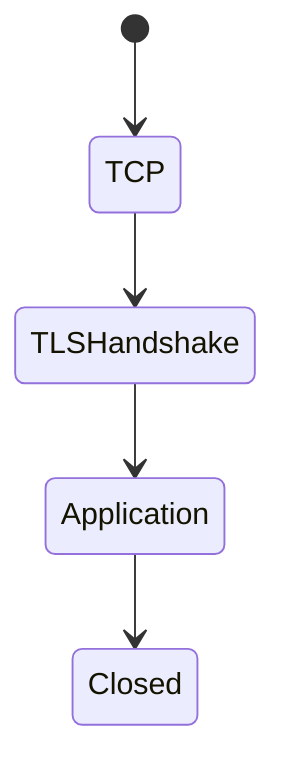
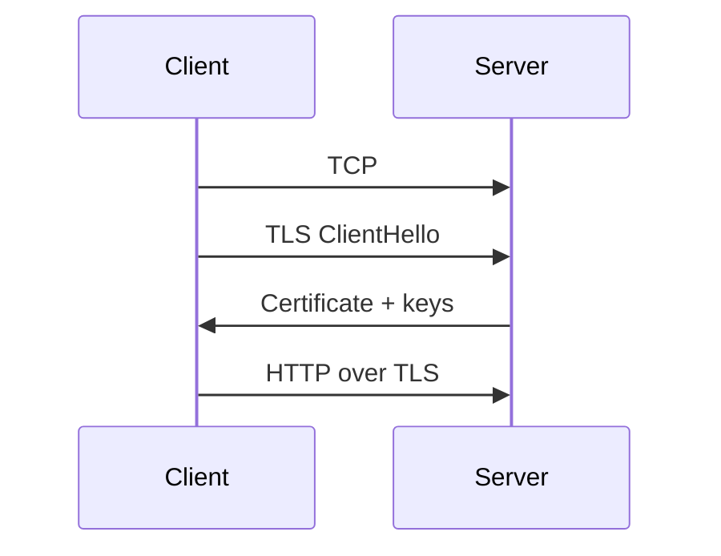

# HTTPS

<TopicMeta />

<Prerequisites />

::: tip Published
This page meets the handbook **published** bar: deep explanation, ≥10 common mistakes, and official references. Further engine-level errata welcome via PR.
:::

## Introduction

**HTTPS** is HTTP over **TLS**. It encrypts the connection, integrity-protects bytes, and authenticates the server (and optionally the client) via certificates. Browsers mark HTTPS pages secure and block mixed active content.

## Why does it exist?

Without TLS, cookies, tokens, and HTML are readable/modifiable on the path (Wi-Fi evil twin, ISP injection).

## Historical Background

SSL → TLS; Let’s Encrypt massively lowered cert cost; HTTPS became default expectation.

## Mental Model

TCP connect → TLS handshake (cert verify) → encrypted HTTP. Certificate must match hostname.

## Internal Workflow

1. Client connects to 443.
2. TLS handshake + cert validation (chain, hostname, time, revocation policies).
3. HTTP request/response inside the encrypted tunnel.

## Lifecycle



## Browser Perspective

Padlock UI; HSTS; mixed content rules.

## JavaScript Engine Perspective

Not applicable.

## React Perspective

Not applicable.

## Next.js Perspective

Vercel/Node terminate TLS at edge/platform.

## Server Perspective

Terminate TLS at LB or origin; manage cert rotation.

## Network Perspective

Middleboxes may intercept with custom CAs on managed devices.

## Memory Perspective

Not applicable.

## Performance

TLS adds CPU and RTTs; session resumption/TLS1.3 1-RTT helps. Still always worth it.

## Production Example

Expired cert → total outage. Automated renewal + monitoring on expiry.

## Code Examples

```bash
curl -vI https://example.com
openssl s_client -connect example.com:443 -servername example.com </dev/null
```

## Diagrams



## Common Mistakes

1. Serving login forms over HTTP
2. Mixed content (HTTP assets on HTTPS page)
3. Ignoring cert hostname mismatch
4. Disabling verification in production clients
5. Assuming HTTPS equals authentication of the user
6. Forgetting HSTS preload caveats
7. Overlooking an edge case #1 specific to 02-internet.https in production traffic
8. Overlooking an edge case #2 specific to 02-internet.https in production traffic
9. Overlooking an edge case #3 specific to 02-internet.https in production traffic
10. Overlooking an edge case #4 specific to 02-internet.https in production traffic


## Best Practices

- HTTPS everywhere + HSTS
- Automate certs
- Redirect HTTP→HTTPS
- Monitor expiry

## Anti-patterns

- Self-signed certs for public prod without pinning story

## Comparison

| | HTTP | HTTPS |
| --- | --- | --- |
| Encryption | No | Yes (TLS) |
| Server auth | No | Cert |
| Port | 80 | 443 |

## Interview Questions

### Easy

**Q:** What is HTTPS?

**A:** HTTP over TLS — encrypted and authenticated transport for HTTP.

### Medium

**Q:** What does the browser verify in a cert?

**A:** Chain of trust to a trusted CA, validity period, hostname match (SAN), and policy/revocation checks as implemented.

### Hard

**Q:** Does HTTPS stop XSS?

**A:** No. TLS protects the transport; XSS is an application injection bug in the browser context.

## Summary

- HTTPS = HTTP + TLS
- Protects confidentiality/integrity; authenticates server
- Cert ops are production-critical
- Not a substitute for app security

## References

- [RFC 9110](https://www.rfc-editor.org/rfc/rfc9110)
- [MDN — HTTPS](https://developer.mozilla.org/en-US/docs/Glossary/HTTPS)

<RelatedTopics />


Prev: [`02-internet.http`](/02-internet/http/) · Next: [`02-internet.ssl`](/02-internet/ssl/)
