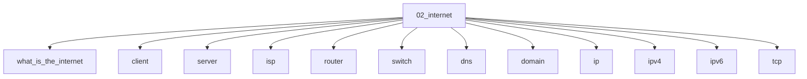

# Internet

## Scope

Networks, DNS, transport, HTTP family, and web auth primitives

## Prerequisites

See the learning paths and each topic's prerequisites in the registry.

## Topics in order

- [What is the Internet](/02-internet/what-is-the-internet/) — beginner, ~25 min
- [Client](/02-internet/client/) — beginner, ~15 min
- [Server](/02-internet/server/) — beginner, ~15 min
- [ISP](/02-internet/isp/) — beginner, ~15 min
- [Router](/02-internet/router/) — beginner, ~20 min
- [Switch](/02-internet/switch/) — beginner, ~15 min
- [DNS](/02-internet/dns/) — junior, ~40 min
- [Domain](/02-internet/domain/) — beginner, ~20 min
- [IP](/02-internet/ip/) — junior, ~25 min
- [IPv4](/02-internet/ipv4/) — junior, ~25 min
- [IPv6](/02-internet/ipv6/) — junior, ~25 min
- [TCP](/02-internet/tcp/) — mid, ~40 min
- [UDP](/02-internet/udp/) — mid, ~30 min
- [HTTP](/02-internet/http/) — junior, ~45 min
- [HTTPS](/02-internet/https/) — junior, ~35 min
- [SSL](/02-internet/ssl/) — mid, ~25 min
- [TLS](/02-internet/tls/) — mid, ~40 min
- [SSH](/02-internet/ssh/) — mid, ~25 min
- [WebSocket](/02-internet/websocket/) — mid, ~35 min
- [Server-Sent Events](/02-internet/sse/) — mid, ~25 min
- [HTTP/2](/02-internet/http2/) — mid, ~35 min
- [HTTP/3](/02-internet/http3/) — senior, ~35 min
- [QUIC](/02-internet/quic/) — senior, ~40 min
- [Cookies](/02-internet/cookies/) — junior, ~35 min
- [Sessions](/02-internet/sessions/) — junior, ~30 min
- [Authentication](/02-internet/authentication/) — mid, ~40 min
- [Authorization](/02-internet/authorization/) — mid, ~35 min
- [REST](/02-internet/rest/) — junior, ~35 min
- [GraphQL](/02-internet/graphql/) — mid, ~40 min
- [HTTP Caching](/02-internet/http-caching/) — mid, ~45 min
- [CDN Basics](/02-internet/cdn-basics/) — junior, ~30 min
- [Load Balancing Basics](/02-internet/load-balancing-basics/) — mid, ~30 min

## Module knowledge graph

## Suggested learning paths

Browse [Learning Paths](/learning-paths/).
