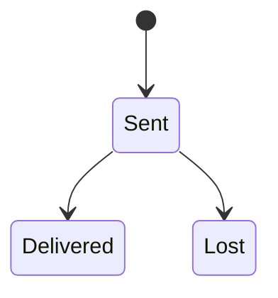
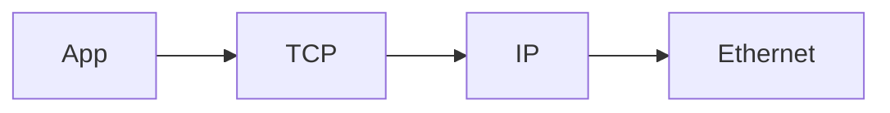

# IP

<TopicMeta />

<Prerequisites />

::: tip Published
This page meets the handbook **published** bar: deep explanation, ≥10 common mistakes, and official references. Further engine-level errata welcome via PR.
:::

## Introduction

**IP (Internet Protocol)** delivers packets from source to destination address best-effort — no guarantee of delivery, order, or integrity beyond a header checksum (and that doesn’t protect payload like TCP does). IPv4 and IPv6 are the two versions you’ll meet.

## Why does it exist?

TCP/HTTP sit on IP. Debugging often ends at “which IP did we hit?” (CDN vs origin).

## Historical Background

IPv4 exhaustion → NAT ubiquity → IPv6 deployment ongoing.

## Mental Model

Postcard with to/from addresses: may be lost; routers forward using the destination address.

## Internal Workflow

1. Transport segment encapsulated in IP packet.
2. Routers hop toward destination.
3. Host demuxes to TCP/UDP via protocol field.

## Lifecycle



## Browser Perspective

Happy Eyeballs races v4/v6.

## JavaScript Engine Perspective

Not applicable.

## React Perspective

Not applicable.

## Next.js Perspective

Not applicable.

## Server Perspective

Bind dual-stack; log client IP carefully behind proxies (X-Forwarded-For trust hops).

## Network Perspective

Core datagram layer.

## Memory Perspective

Not applicable.

## Performance

Packet loss kills TCP throughput. IP itself doesn’t retransmit — upper layers do.

## Production Example

App ACL allowlisted wrong CDN egress IPs after provider change → outage.

## Code Examples

```bash
ping -c 3 1.1.1.1
curl -4 -I https://example.com
curl -6 -I https://example.com
```

## Diagrams



## Common Mistakes

1. Assuming IP is reliable
2. Trusting X-Forwarded-For from clients
3. Hardcoding IPv4-only
4. Confusing private vs public addresses
5. Ignoring NAT
6. Equating domain with single IP forever
7. Overlooking an edge case #1 specific to 02-internet.ip in production traffic
8. Overlooking an edge case #2 specific to 02-internet.ip in production traffic
9. Overlooking an edge case #3 specific to 02-internet.ip in production traffic
10. Overlooking an edge case #4 specific to 02-internet.ip in production traffic


## Best Practices

- Dual-stack where possible
- Trust proxy headers only from known hops
- Use DNS names not raw IPs in apps

## Anti-patterns

- IP allowlists as sole auth

## Comparison

| | IPv4 | IPv6 |
| --- | --- | --- |
| Size | 32-bit | 128-bit |
| NAT | Common | Less needed |
| Notation | dotted decimal | hextets |

## Interview Questions

### Easy

**Q:** What does IP do?

**A:** Addresses hosts and routes packets best-effort between them.

### Medium

**Q:** Why do we still need TCP if we have IP?

**A:** IP won’t ensure delivery/order; TCP adds connections, retransmit, congestion control.

### Hard

**Q:** How should a web app determine client IP behind a CDN?

**A:** Use CDN-specific authenticated headers / hop-count trusted forwarding chain — never raw client-supplied XFF alone.

## Summary

- IP routes packets best-effort
- IPv4 and IPv6 coexist
- Upper layers add reliability
- Logging client IP needs proxy hygiene

## References

- [RFC 791 — IPv4](https://www.rfc-editor.org/rfc/rfc791)
- [RFC 8200 — IPv6](https://www.rfc-editor.org/rfc/rfc8200)

<RelatedTopics />


Prev: [`02-internet.domain`](/02-internet/domain/) · Next: [`02-internet.ipv4`](/02-internet/ipv4/)
